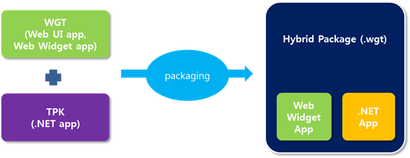
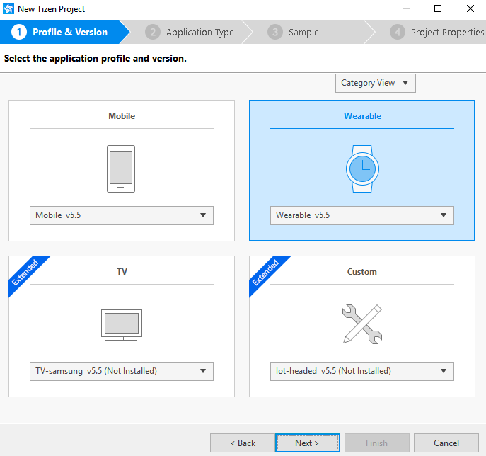
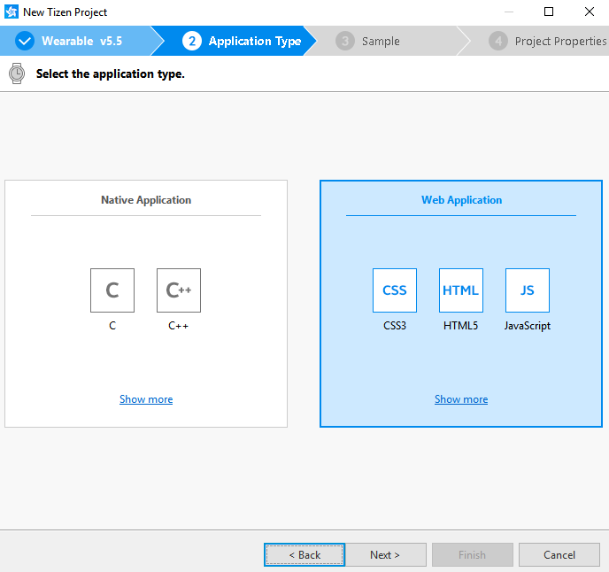
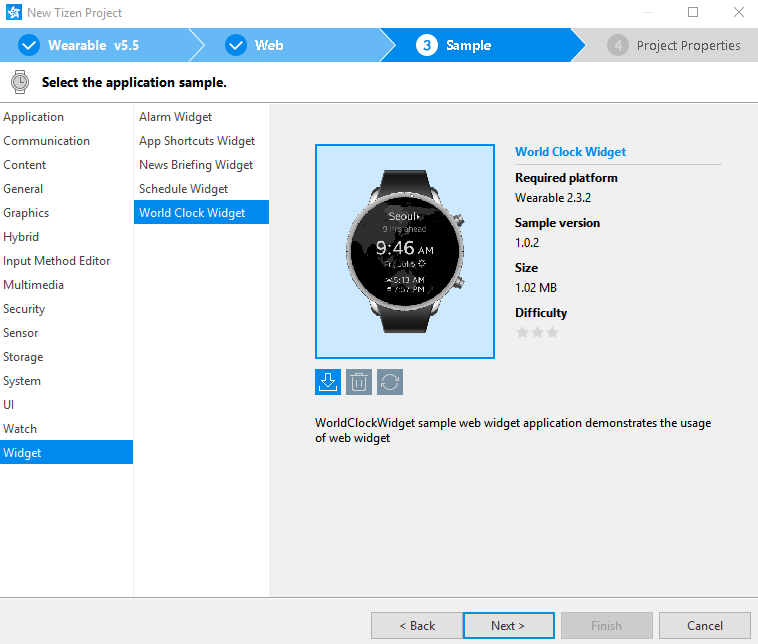
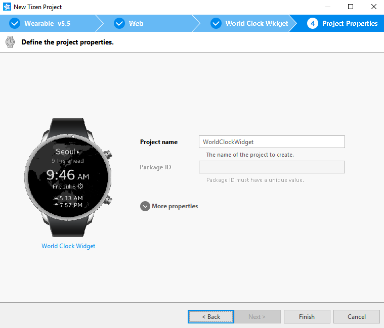
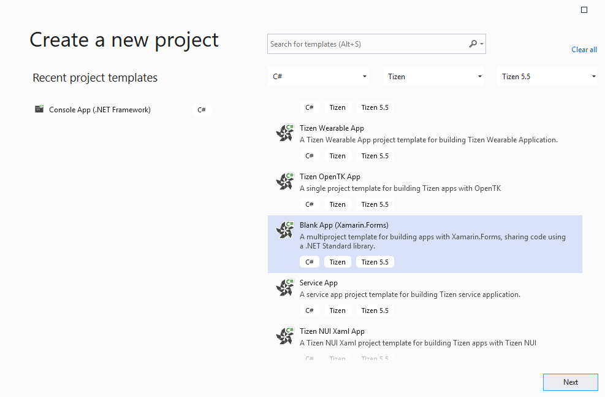
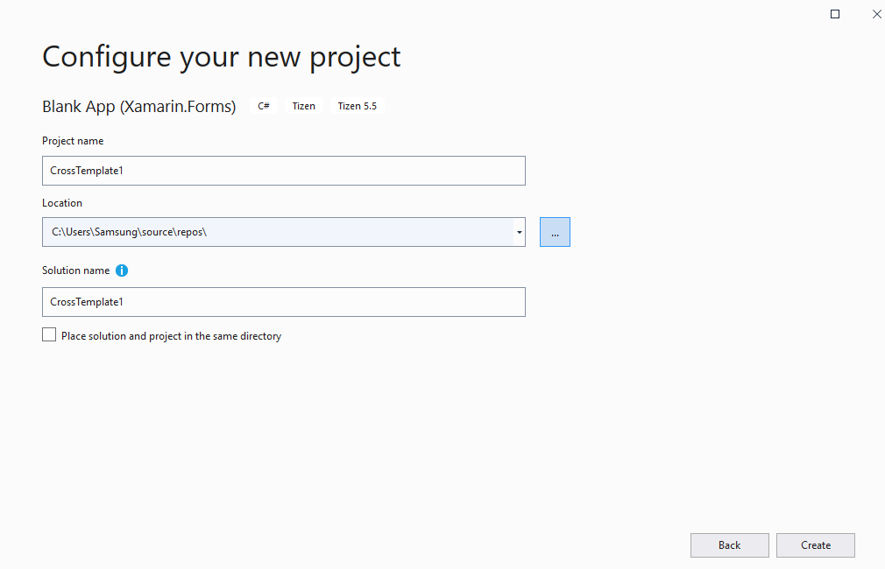
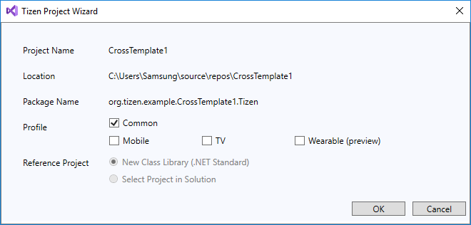

# Hybrid Application

Tizen platform allows you to create hybrid application packages combining .NET application and web application.

You can develop the .NET application using Visual Studio and web application using Tizen Studio. This implies that you cannot create a hybrid application package using the existing project connection method provided by Tizen Studio.

You can create a hybrid application package by merging web application and .NET application packages. You can merge using the CLI tool provided in Tizen Studio.

> [!NOTE]
> Currently, only command-line interface is provided for .NET and web hybrid application package.
> Hybrid application is not supported in the TV profile officially.

**Figure: Create .NET and Web Hybrid Application Package**



The web application package (wgt) file that contains the web widget application and the web UI application, is created with the same .NET and web hybrid application package.

The .NET and web hybrid application package follows the same conventions, which are defined for [Web and Native hybrid application package](../../web/index.md#hybrid-application-package).

The .NET and web hybrid application package is a type of merge between a .NET application based on a web application. Therefore, the package ID of the web application generates the package ID for the hybrid application.

To create hybrid application packages, use the following command:

```bash
$[TIZEN_STUDIO_DIR]/tools/ide/bin$ ./tizen package -t wgt -s [CERTIFICATE_PROFILE_NAME] -r [TPK_FILE_PATH] -- [WGT_FILE_PATH]
```

> [!NOTE]
> `[CERTIFICATE_PROFILE_NAME]` means certificate profile name and not certificate file name.

## Example

1. Launch the latest version of Tizen Studio and create a web widget sample application.

    

    

    

    

2. Check the application's package ID in the **config.xml** file of the web application:

    ```xml
    <?xml version="1.0" encoding="UTF-8"?>
    <widget xmlns="http://www.w3.org/ns/widgets" xmlns:tizen="http://tizen.org/ns/widgets" id="http://yourdomain/WorldClockWidget" version="1.0.0" viewmodes="maximized">
        <access origin="*" subdomains="true"></access>
        <tizen:app-widget id="TestHybrid.WorldClockWidget.WorldClockWidget" primary="true">
            <tizen:widget-label>World Clock Widget</tizen:widget-label>
            <tizen:widget-content src="widget/WorldClockWidget/index.html">
                <tizen:widget-size preview="widget/WorldClockWidget/preview.png">2x2</tizen:widget-size>
            </tizen:widget-content>
        </tizen:app-widget>
        <tizen:application id="TestHybrid.WorldClockWidget" package="TestHybrid" required_version="2.3.2"/>
        <content src="index.html"/>
        <feature name="http://tizen.org/feature/screen.size.all"/>
		<icon src="icon.png"/>
		<name>WorldClockWidget</name>
		<tizen:privilege name="http://tizen.org/privilege/application.launch"/>
		<tizen:profile name="wearable"/>
    </widget>
    ```
    > [!NOTE]
    > The `package` attribute of the `<tizen:application>` element refers to the application's package ID. Ensure that this attribute is set to **TestHybrid**.

3. Launch the latest version of Visual Studio and create a .NET sample application.

    

    
	
	

4. Check the application's package ID in the `tizen-manifest.xml` file of the .NET application:

    ```xml
    <?xml version="1.0" encoding="utf-8"?>
    <manifest xmlns="http://tizen.org/ns/packages" api-version="4" package="org.tizen.example.CrossTemplate1.Tizen" version="1.0.0">
    <profile name="common" />
    <ui-application appid="org.tizen.example.CrossTemplate1.Tizen"
                    exec="CrossTemplate1.Tizen.dll"
                    type="dotnet"
                    multiple="false"
                    taskmanage="true"
                    nodisplay="false"
                    launch_mode="single">
    <label>CrossTemplate1.Tizen</label>
    <icon>CrossTemplate1.Tizen.png</icon>
    </ui-application>
    </manifest>  
    ```

    > [!NOTE]
    > The `package` attribute of the `<manifest>` element refers to the application's package ID. Ensure that this attribute is set to **org.tizen.example.CrossTemplate1.Tizen**.

5. Create a hybrid package using the CLI tool:

    ```bash
    /home/test/tizen-studio/tools/ide/bin$ ./tizen package -t wgt -s test_cert_profile -r /home/test/hybrid/org.tizen.example.CrossTemplate1.Tizen-1.0.0.tpk – /home/test/hybrid/WebWidgetSample.wgt

    Author certficate: /home/test/tizen-studio-data/keystore/author/test_cert_profile.p12
    Distributor1 certificate : /home/test/tizen-studio/tools/certificate-generator/certificates/distributor/sdk-partner/tizen-distributor-signer.p12
    Package( /home/test/hybrid/WebWidgetSample.wgt ) is created successfully.
    ```

    > [!NOTE]
    > The newly generated hybrid application package file overrides the previously generated web application package file.

6. Check the newly created manifest file in the **WebWidgetSample.wgt** file.

    The package name is changed from `org.tizen.example.CrossTemplate1.Tizen` to `TestHybrid`:

    ```xml
    <?xml version="1.0" encoding="UTF-8" standalone="no"?>
    <widget xmlns="http://www.w3.org/ns/widgets" xmlns:tizen="http://tizen.org/ns/widgets" id="http://yourdomain/WorldClockWidget" version="1.0.0" viewmodes="maximized">
        <access origin="*" subdomains="true"/>
        <tizen:app-widget id="TestHybrid.WorldClockWidget.WorldClockWidget" primary="true">
            <tizen:widget-label>World Clock Widget</tizen:widget-label>
            <tizen:widget-content src="widget/Widget/index.html">
                <tizen:widget-size preview="widget/Widget/preview.png">2x2</tizen:widget-size>
            </tizen:widget-content>
        </tizen:app-widget>
        <tizen:application id="TestHybrid.WorldClockWidget" package="TestHybrid" required_version="2.3.2"/>
        <content src="index.html"/>
        <feature name="http://tizen.org/feature/screen.size.all"/>
        <icon src="icon.png"/>
        <name>WorldClockWidget</name>
        <tizen:privilege name="http://tizen.org/privilege/application.launch"/>
        <tizen:profile name="wearable"/>
    </widget>
    ```
