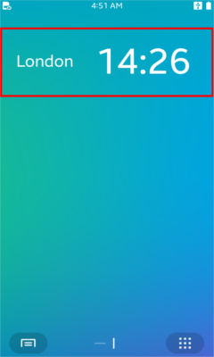
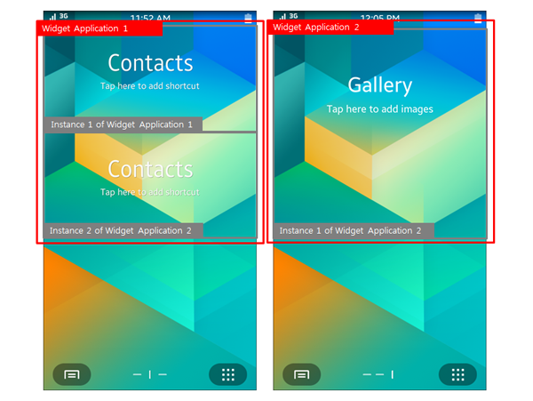
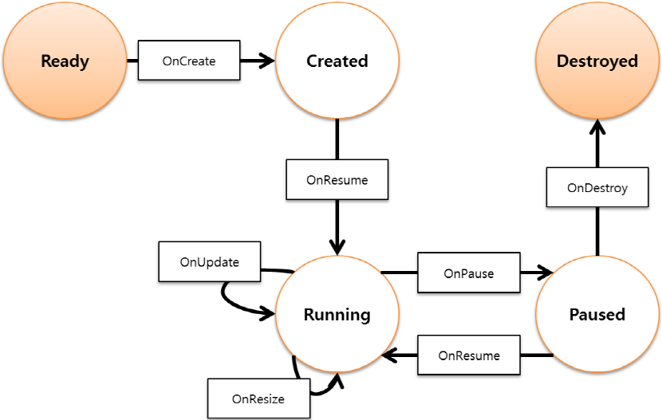

# Widget application

The Widget applications are commonly used in applications like home screen or lock screen. The .NET Tizen API provides two class which allows you to implement widget applications:

1. [NUI Based Widget Application](/application/dotnet/api/TizenFX/latest/api/Tizen.NUI.NUIWidgetApplication.html)
2. [Widget Application](/application/dotnet/api/TizenFX/latest/api/Tizen.Applications.WidgetApplication.html)

An instance of the widget is managed by a [Widget Viewer](./) application. Widget process is created when when a Widget Application is added to the Widget Viewer.

**Figure: Widget application**



## Widget features

The main widget application features include:

- Creating widget applications

  You can [create a widget application](#create), which usually has 1 process for maintaining the main loop. Within the process, the framework can [create multiple widget instances](#app_instance) that can share the same resources. The widget application can also share data with other applications. The widget application can also [share data](#share) with other applications. Multiple instances of the same widget app could be used to create different UI for different size of the Widget instance.

- Managing multiple widget instances

  Whenever a widget instance is requested, the framework creates one. You can manage the widget instances by updating or destroying them, or by retrieving information about them.

- Managing the life-cycle

  You can manage the [widget instance](#instance) life-cycle through callback methods that are triggered as the instance state changes.

- Creating the widget UI

  The widget application can create a user interface that appears on the home screen or other widget viewer application. The UI of the widget application limits a scroll actions to provide a better user experience. It is recommended that you design an UI layout within the given screen size.

<div id="NoteSection">
    <div class="sampletab " id="note_tab">
        <button id="note-nui"  class="tablinks" onclick="openTabSection(event, 'note-nui-content', 'NoteSection') ">NUI Widget</button>
        <button id="note-base" class="tablinks" onclick="openTabSection(event, 'note-base-content', 'NoteSection') ">Widget</button>
    </div>
    <div id="note-nui-content" class="tabcontent">
        <table>
            <tbody>
                <tr>
                    <blockquote class="note">
                        <p>To draw the layout, you have to use the <a href="/application/dotnet/api/TizenFX/latest/api/Tizen.NUI.Window.html"><code>Window</code></a> instance received from the <code>OnCreate</code> callback. If you create additional windows, the stack of widget application windows gets corrupted. This is because the platform handles the widget application window in a particular way.</p>
                    </blockquote>
                </tr>
            </tbody>
        </table>
    </div>
    <div id="note-base-content" class="tabcontent">
        <table>
            <tbody>
                <tr>
                    <blockquote class="note">
                        <p><strong>Note</strong></p>
                        <p>To draw the UI, use a single window as a protected property of the <a href="/application/dotnet/api/TizenFX/latest/api/Tizen.Applications.WidgetBase.html">Tizen.Applications.WidgetBase</a> class. Do not create additional windows. A stack of widget application windows gets corrupted, because the platform handles the widget application window in a special way.</p>
                    </blockquote>
                </tr>
            </tbody>
        </table>
    </div>
</div>

## Widget instances

<div id="ViewerSection">
    <div class="sampletab " id="note_tab">
        <button id="viewer-nui"  class="tablinks" onclick="openTabSection(event, 'viewer-nui-content', 'ViewerSection') ">NUI Widget</button>
        <button id="viewer-base" class="tablinks" onclick="openTabSection(event, 'viewer-base-content', 'ViewerSection') ">Widget</button>
    </div>
    <div id="viewer-nui-content" class="tabcontent">
        <table>
            <tbody>
                <tr>
                    <p><a href="/application/dotnet/api/TizenFX/latest/api/Tizen.NUI.NUIWidgetApplication.html"><code>NUIWidgetApplication</code></a> makes diverse class instances whenever <a href="/application/dotnet/api/TizenFX/latest/api/Tizen.NUI.WidgetView.html"><code>WidgetView</code></a> requests for a widget instance.</p>
                    <p>The widget instance has its own life-cycle similar to that of the widget application. However, the widget instance is an object created by the widget viewer application. Many widget instances can be running on a widget application process.</p>
                    <blockquote class="alert alert-note"><span class="alert-title"><span class="alert-title--icon"></span><span class="alert-title--text">Note</span></span>
                        <p> The case to use many widget instances in one widget application is known as multi-instance. In some devices, the multi-instance may not be supported. If a device does not support multi-instance, an error message is displayed.</p>
                    </blockquote>
                    <p><a href="/application/dotnet/api/TizenFX/latest/api/Tizen.NUI.WidgetView.html"><code>WidgetView</code></a> shows the contents drawn by <a href="/application/dotnet/api/TizenFX/latest/api/Tizen.NUI.Widget.html"><code>Widget</code></a> on the screen.</p>
                    <p>To summarize, you <a href="#create-a-nui-widget-application">create a NUI WidgetApplication</a>, <a href="#create-a-nui-widget-view">create a NUI WidgetView</a>, and use Widget to view layout on the screen.</p>
                </tr>
            </tbody>
        </table>
    </div>
    <div id="viewer-base-content" class="tabcontent">
        <table>
            <tbody>
                <tr>
                    <p>The <a href="/application/dotnet/api/TizenFX/latest/api/Tizen.Applications.WidgetApplication.html">Tizen.Applications.WidgetApplication</a> class provides the <code>WidgetApplication(IDictionary&lt; Type, string &gt; typeInfo)</code> constructor, which allows a widget application to have multiple widget classes. The widget applications with multiple classes can make diverse class instances whenever widget viewer applications, such as the home screen and the lock screen, request for a widget instance.</p>
                    <p>The widget instance has its own life-cycle similar to the widget application. However, the widget instance is only an object shown by the widget viewer applications. Many widget instances can be running on the same widget application process.</p>
                </tr>
            </tbody>
        </table>
    </div>
</div>

**Figure: Each widget application has 1 or more widget instances**



<a name="instance"></a>
## Widget Instance States and Events

The following figure illustrates the widget instance states during the instance life-cycle:

- When the application is in the Ready state, the instance does not exist.
- When the instance is created, it is in the Created state.
- When the instance is visible, it is in the Running state.
- When the instance is invisible, it is in the Paused state.
- When the instance is destroyed, it is in the Destroyed state.

**Figure: Widget instance life-cycle**



<div id="ClassSection">
    <div class="sampletab " id="note_tab">
        <button id="class-nui"  class="tablinks" onclick="openTabSection(event, 'class-nui-content', 'ClassSection') ">NUI Widget</button>
        <button id="class-base" class="tablinks" onclick="openTabSection(event, 'class-base-content', 'ClassSection') ">Widget</button>
    </div>
    <div id="class-nui-content" class="tabcontent">
        <table>
            <tbody>
                <tr>
<span style="display:block">

The following table lists the [callbacks you can use as the instance state changes](#life-cycle).

**Table: Instance state change callbacks**

| Callback      | Description                              |
|---------------|------------------------------------------|
| `OnCreate()`  | Called after the widget instance is created. |
| `OnTerminate()` | Called before the widget instance is destroyed. |
| `OnPause()`   | Called when the widget is invisible.     |
| `OnResume()`  | Called when the widget is visible.       |
| `OnResize()`  | Called before the widget size is changed. |
| `OnUpdate()`  | Called when an event for updating the widget is received. |

You can declare a widget class by inheriting the <a href="/application/dotnet/api/TizenFX/latest/api/Tizen.NUI.Widget.html">Tizen.NUI.Widget</a> class. For example:

```csharp
    class MyWidget : Tizen.NUI.Widget
    {
        public override void OnCreate(string contentInfo, Window window) {}
        public override void OnTerminate(string contentInfo, Widget.TerminationType type) {}
        public override void OnPause() {}
        public override void OnResume() {}
        public override void OnResize(Window window) {}
        public override void OnUpdate(string contentInfo, int isForce) {}
    }
```
</span>
                </tr>
            </tbody>
        </table>
    </div>
    <div id="class-base-content" class="tabcontent">
        <table>
            <tbody>
                <tr>
<span style="display:block">

The following table lists the [callbacks you can use as the instance state changes](#life-cycle).

**Table: Instance state change callbacks**

| Callback      | Description                              |
|---------------|------------------------------------------|
| `OnCreate()`  | Called after the widget instance is created. |
| `OnDestroy()` | Called before the widget instance is destroyed. |
| `OnPause()`   | Called when the widget is invisible.     |
| `OnResume()`  | Called when the widget is visible.       |
| `OnResize()`  | Called before the widget size is changed. |
| `OnUpdate()`  | Called when an event for updating the widget is received. |

You can declare a widget class by inheriting the <a href="/application/dotnet/api/TizenFX/latest/api/Tizen.Applications.WidgetBase.html">Tizen.Applications.WidgetBase</a> class. For example:

```csharp
    class MyWidget : WidgetBase
    {
        public override void OnCreate(Bundle content, int w, int h) {}
        public override void OnPause() {}
        public override void OnResume() {}
        public override void OnResize(int w, int h) {}
        public override void OnUpdate(Bundle content, bool isForce) {}
        public override void OnDestroy(WidgetBase.WidgetDestroyType reason, Bundle content) {}
    }
```

</span>
                </tr>
            </tbody>
        </table>
    </div>
</div>

## Prerequisites

To enable your application to use the widget functionality you have to modify application manifest file by adding proper privileges:

    ```XML
      <privileges>
        <privilege>http://tizen.org/privilege/widget.viewer</privilege>
        <privilege>http://tizen.org/privilege/appmanager.launch</privilege>
      </privileges>
    ```

## Widget application

<div id="CodeSection">
    <div class="sampletab " id="code_tab">
        <button id="code-nui"  class="tablinks" onclick="openTabSection(event, 'code-nui-content', 'CodeSection') ">NUI Widget</button>
        <button id="code-base" class="tablinks" onclick="openTabSection(event, 'code-base-content', 'CodeSection') ">Widget</button>
    </div>
    <div id="code-nui-content" class="tabcontent">
        <table>
            <tbody>
                <tr>
<span style="display:block">

1. To use the methods and properties of [Tizen.NUI](https://samsung.github.io/TizenFX/latest/api/Tizen.NUI.html) namespace, include it in your application:

   ```csharp
   using Tizen.NUI;
   ```

2. Define your widget application class, which is inherited from [NUIWidgetApplication](https://samsung.github.io/TizenFX/latest/api/Tizen.NUI.NUIWidgetApplication.html) class:

   ```csharp
   class Program : NUIWidgetApplication
   ```

3. The widget application starts with `Main()`, which creates and initializes the application. `Run()` method of [NUIWidgetApplication](https://samsung.github.io/TizenFX/latest/api/Tizen.NUI.NUIWidgetApplication.html) class is used to start the application event-loop. `NUIWidgetApplication` class provides two kinds of constructors:

   - For using the `NUIWidgetApplication(Type type)` constructor, in case the widget application's ID is the same as the application ID:

    ```csharp
    static void Main(string[] args)
    {
        var app = new Program(typeof(MyWidget));
        app.Run(args);
    }
    ```

    - For using the `NUIWidgetApplication(Dictionary< Type, string > typeInfo)` constructor, in case your widget applications have multiple widget classes. For multiple instances, add `<widget-class>` in XML as follows:

    ```XML
        <widget-class classid="second" update-period="0">
        <support-size preview="Widget.png">2x2</support-size>
        </widget-class>
    ```

    You can then modify the code as follows:

      ```csharp
        static void Main(string[] args)
        {
           Dictionary<System.Type, string> widgetSet = new Dictionary<Type, string>();
            widgetSet.Add(typeof(MyWidget), "second@org.tizen.example.WidgetTemplate");
            var app = new Program(widgetSet);
            app.Run(args);
        }
      ```

4. Define your widget class, which is inherited from [Widget](https://samsung.github.io/TizenFX/latest/api/Tizen.NUI.Widget.html):

   ```csharp
   class MyWidget : Widget
   ```

5. Override event callback methods of your new class:

    ```csharp
    class MyWidget : Tizen.NUI.Widget
    {
      protected override void OnCreate(string contentInfo, Window window)
      {
        /// Create the UI
        /// ....
        base.OnCreate(contentInfo, window);
      }
    }
    ```

6. Drawing the Widget UI in `OnCreate()`:

    Initialize resources for this widget instance and draw the content on the screen.

    The widget UI is drawn in the `OnCreate()` callback of your widget class:

    ```csharp
    protected override void OnCreate(string contentInfo, Window window)
    {
        View rootView = new View();
        rootView.BackgroundColor = Color.White;
        rootView.Size2D = window.Size;
        rootView.PivotPoint = PivotPoint.Center;
        window.GetDefaultLayer().Add(rootView);

        TextLabel sampleLabel = new TextLabel("Hello World!");
        sampleLabel.FontFamily = "SamsungOneUI 500";
        sampleLabel.PointSize = 71;
        sampleLabel.TextColor = Color.Black;
        sampleLabel.SizeWidth = 200;
        sampleLabel.PivotPoint = PivotPoint.Center;

        rootView.Add(sampleLabel);
    }
    ```

</span>
                </tr>
            </tbody>
        </table>
    </div>
    <div id="code-base-content" class="tabcontent">
        <table>
            <tbody>
                <tr>
<span style="display:block">

The widget application starts with the `Main()` function, which creates and initializes the application. The `Run()` method of the [Tizen.Applications.WidgetApplication](https://samsung.github.io/TizenFX/latest/api/Tizen.Applications.WidgetApplication.html) class is used to start the application event loop. The `Tizen.Applications.WidgetApplication` class provides 2 kinds of constructors:

- If you create the widget application with the `WidgetApplication(Type type)` constructor, that widget application's ID is the same as the application ID.
- Using the `WidgetApplication(IDictionary<Type, string> typeInfo)` constructor, you can make widget applications with multiple widget classes.

1. To use the methods and properties of the [Tizen.Applications](https://samsung.github.io/TizenFX/latest/api/Tizen.Applications.html) namespace, include it in your application:

   ```csharp
   using Tizen.Applications;
    ```

2. Define your widget class, which is inherited from the [Tizen.Applications.WidgetBase](https://samsung.github.io/TizenFX/latest/api/Tizen.Applications.WidgetBase.html) class:

   ```csharp
   class MyWidget : WidgetBase {}
   ```

3. Override the event callback methods of your new class:
   - The `OnCreate()` callback is triggered when the widget instance is created.

     Initialize resources for this widget instance and [draw the UI](#get_window). If bundle content is not `NULL`, restore the previous status.

     ```csharp
     public override void OnCreate(Bundle content, int w, int h)
     {
	     try
	     {
		     base.OnCreate(content, w, h);
		     /// Recover the previous status with the bundle object
		     /// Create the UI
	     }
	     catch (Exception e)
	     {
		     Log.Warn(_logTag, "exception " + e);
	     }
     }
     ```

   - The `OnDestroy()` callback is triggered when the widget instance is destroyed.

     Release all widget resources. If the `reason` for the termination is not `WidgetBase.WidgetDestroyType.Permanent`, store the current status with the incoming bundle.

     ```csharp
     public override void OnDestroy(WidgetBase.WidgetDestroyType reason, Bundle content)
     {
	     if (reason != WidgetBase.WidgetDestroyType.Permanent)
		     /// Save the current status at the bundle object
     }
     ```

   - The `OnPause()` callback is triggered when the widget instance is paused.

     Take the necessary actions when the widget instance becomes invisible. The framework can destroy a paused widget instance.

     ```csharp
     public override void OnPause() {}
     ```

   - The `OnResume()` callback is triggered when the widget instance is resumed.

      Take the necessary actions when the widget instance becomes visible.

      ```csharp
      public override void OnResume() {}
      ```

   - The `OnResize()` callback is triggered before the widget instance is resized.

      Take the necessary actions to accommodate the new size.

      ```csharp
      public override void OnResize(int w, int h) {}
      ```

   - The `OnUpdate()` callback is triggered when a widget update event is received.

      Take the necessary actions for the widget update. If the `isForce` parameter is `true`, the widget can be updated even in the pause state.

      ```csharp
      public override void OnUpdate(Bundle content, bool isForce) {}
      ```

4.  The widget UI is drawn in the `OnCreate()` callback of your widget class:

```csharp
public override void OnCreate(Bundle content, int w, int h)
{
    try
    {
        base.OnCreate(content, w, h);
        Conformant conformant = new Conformant(Window);
        conformant.Show();
        Scroller scroller = new Scroller(Window)
        {
            AlignmentX = -1,
            AlignmentY = -1,
            WeightX = 1,
            WeightY = 1,
            ScrollBlock = ScrollBlock.None,
        };
        scroller.Show();

        Box box = new Box(Window)
        {
            AlignmentX = -1,
            AlignmentY = -1,
            WeightX = 1,
            WeightY = 1,
        };
        box.Show();
        scroller.SetContent(box);
        conformant.SetContent(scroller);

        Button exitButton = new Button(Window)
        {
            Text = "Exit Test",
            AlignmentX = -1,
            AlignmentY = -1,
            WeightX = 1,
            WeightY = 1
        };
        box.PackEnd(exitButton);
        exitButton.Show();
    }
    catch (Exception e)
    {
        Log.Warn(_logTag, "exception " + e);
    }
}
```

</span>
                </tr>
            </tbody>
        </table>
    </div>
</div>


<a name="share"></a>
## Data Sharing Between the Widget Application and Other Applications

You can share data between widget applications and UI (or service) applications. However, you must understand that this kind of data sharing is dependent on the file system. The reason is that the system (home screen) controls the widget application life-cycle, while the UI application life-cycle is mostly explicitly controlled by the user.

For example, consider the differences between a Weather application and a Weather widget:

- The Weather application is launched when the user selects it from the application list.
- The widget is launched when the home screen is on screen and is terminated when the home screen is hidden.

Although the widget wants to share some data from the Weather application (such as the user's favorite city), it is ineffective for the widget to launch the Weather application every time to retrieve such data. This inefficiency makes it difficult to use typical IPC mechanisms, such as sockets and [message ports](../../exchange-data-between-apps/message-port.md), for which both the receiver and sender processes must be alive. To overcome this limitation, the widget application must use a communication method that stores data permanently somewhere in the system.

In the Tizen platform, applications in the same package (including widget applications) can access files in the `data` directory of the package installation path. This means that the UI (or service) application can first write files to the `data` directory, and the widget can later read them, or vice versa.

**Figure: Sharing through the data directory**


To manage data through the `data` directory, you can use the methods and properties of the [Tizen.Applications.Preference](/application/dotnet/api/TizenFX/latest/api/Tizen.Applications.Preference.html) class to store and retrieve key-value pairs.

If an application requires complex control over a widget, such as Music Player, it must implement a service application in the middle and use a data control with the classes and methods of the [Tizen.Applications.DataControl](/application/dotnet/api/TizenFX/latest/api/Tizen.Applications.DataControl.html) namespace.

For example, a music-player-service service application is needed to control the audio device, process audio files, and handle play and stop signals. The music-player-ui and music-player-widget applications display the UI controls, title, album art, and other content retrieved from the music-player-service service application. The service application can export its data using the data control to [provide data to the other applications](../../exchange-data-between-apps/data-control.md) (widget and UI) simultaneously. The following figure illustrates the typical data control flows between the set of UI, service, and widget applications.

**Figure: Sharing through data control**


## Related information
- Dependencies
  - Tizen 4.0 and Higher

<script>
    function openTabSection(evt, profileName, sectionId) {
        var i, tabcontent, tablinks, section;
        let selected = 0;

        section = document.getElementById(sectionId);
        tabcontent = section.getElementsByClassName("tabcontent");

        for (i = 0; i < tabcontent.length; i++) {
            tabcontent[i].style.display = "none";
            if (tabcontent[i].id == profileName) {
                selected = i;
            }
        }

        tablinks = section.getElementsByClassName("tablinks");

        for (i = 0; i < tablinks.length; i++) {
            tablinks[i].className = tablinks[i].className.replace(" active", "");
        }

        tabcontent[selected].style.display = "block";
        evt.currentTarget.className += " active";
    }

    document.getElementById("note-nui").click();
    document.getElementById("viewer-nui").click();
    document.getElementById("class-nui").click();
    document.getElementById("code-nui").click();
</script>