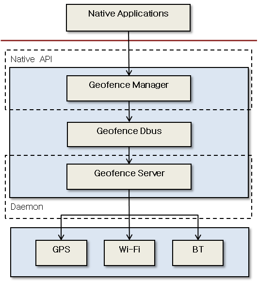
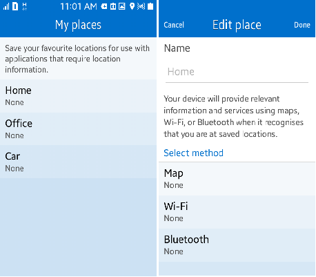

# Geofences

> [!NOTE]
> All geofence APIs have been deprecated since Tizen 8.0 and will be removed after two releases without any alternatives.

A geofence is a virtual perimeter for a real-world geographic area. A geofence is defined by either a geopoint and radius for geopoint geofences or by a MAC address for Wi-Fi and Bluetooth geofences. The geofence feature alerts the user when the geofence state changes (the user crosses the perimeter).

The main features of the Tizen.Location.Geofence namespace include the following:

-   Using the geofence service

    You can [use the geofence service](#manager) to create different types of geofences and retrieve information about them, get the geofence event state, and track the user for alerts.

-   Defining a geofence

    You can [define the type of the geofence](#definition) when creating one.

-   Managing the geofence service

    You can allow the user to [manage the geofence places and fences](#settings) through the My Places application.

**Figure: Geofence architecture**



<a name="manager"></a>
## Geofence service

With the geofence service, you can do the following:

-   [Create different types of geofences](#start)
-   [Get the current state](#status)
-   Get [in and out alerts](#track) and [proximity alerts](#proximity)

    You can get notifications when the user approaches or crosses any geofences they have defined.

-   [Retrieve information about created geofences](#info)

    The device can receive alerts about the geofence when a particular geofence service is started using the `Start()` method of the [Tizen.Location.Geofence.GeofenceManager](/application/dotnet/api/TizenFX/latest/api/Tizen.Location.Geofence.GeofenceManager.html) class.

    If the user revokes permission to use the location information, an `UnauthorizedAccessException` is returned to the application attempting to use the geofence service.

    Asynchronous geofence-related alerts (in or out) and event handling (a fence added or removed) are implemented with event handlers. Geofence alerts are received using the values of the [Tizen.Location.Geofence.GeofenceState](/application/dotnet/api/TizenFX/latest/api/Tizen.Location.Geofence.GeofenceState.html) enumeration.

<a name="definition"></a>
## Geofence definition

Geofence definition refers to defining an instance of the [Tizen.Location.Geofence.Fence](/application/dotnet/api/TizenFX/latest/api/Tizen.Location.Geofence.Fence.html) class.

The 3 types of available geofences are geopoint, Wi-Fi, and Bluetooth. When creating the geofence, define the type using the values of the [Tizen.Location.Geofence.FenceType](/application/dotnet/api/TizenFX/latest/api/Tizen.Location.Geofence.FenceType.html) enumeration.

Creating a geopoint geofence requires a geopoint and a radius, whereas Wi-Fi and Bluetooth geofences require a MAC address. Based on the defined geofence type, the geofence manager creates the fence for the particular application.

<a name="settings"></a>
## Geofence management through My Places

Tizen provides the user with a way of managing geofence places and fences through the My Places application. The following figure shows the default places and supported fence types.

**Figure: My Places**



My Places controls the adding, removing, and updating of places and fences. **Home**, **Office**, and **Car** are the default places. **Map**, **Wi-Fi**, and **Bluetooth** are the supported fence methods. **Car** supports only Wi-Fi and Bluetooth as fence methods.


## Prerequisites


To use the methods and properties of the [Tizen.Location.Geofence](/application/dotnet/api/TizenFX/latest/api/Tizen.Location.Geofence.html) namespace, include it in your application:

```csharp
using Tizen.Location.Geofence;
```

<a name="start"></a>
## Start the geofence service

To start the geofence service, follow these steps:

1.  Create a [Tizen.Location.Geofence.GeofenceManager](/application/dotnet/api/TizenFX/latest/api/Tizen.Location.Geofence.GeofenceManager.html) object:

    ```csharp
    GeofenceManager manager = new GeofenceManager();
    ```

    Each geofence manager is an independent service. The event handlers are set for a given geofence manager and are called only if the service is started by their manager.

2.  Create a place to be used for the geofences:

    ```csharp
    VirtualPerimeter perimeter = new VirtualPerimeter(manager);
    int placeId = perimeter.AddPlaceName("Place");
    ```


    > [!NOTE]
	> A place is used to accommodate a number of geofences and is identified by a place ID. Each place can have a name. A geofence is identified by a geofence ID.


3.  Create the geofences you need:
    -   Geopoint geofence:

        ```csharp
        double latitude = 12.756738;
        double longitude = 77.386474;
        int radius = 100;
        char* address = "India";
        Fence fence = Fence.CreateGPSFence(placeId, latitude, longitude, radius, address);
        ```

    -   Bluetooth geofence:

        ```csharp
        char* bssid = "82:45:67:7E:4A:3B";
        char* ssid = "Cafeteria";
        Fence fence = Fence.CreateBTFence(place_id, bssid, ssid);
        ```

4.  Add the geofence to the geofence manager:

    ```csharp
    int geofenceId = perimeter.AddGeofence(fence);
    ```

5.  Start the geofence service using the `Start()` method of the `Tizen.Location.Geofence.GeofenceManager` class.

    This call is asynchronous and only initiates the process of starting the service. Once the service is started, the added event handlers are invoked when their corresponding events take place. To know when the service becomes enabled, use the `StateChanged` event of the `Tizen.Location.Geofence.GeofenceManager` class:

    ```csharp
    manager.Start(geofenceId);
    ```

6.  Using the geofence service for geopoints adds to power consumption, so if the service is not used, stop the status alerts using the `Stop()` method of the `Tizen.Location.Geofence.GeofenceManager` class. Call the `Start()` method again if the alerts are needed:

    ```csharp
    manager.Stop(geofenceId);
    ```

7.  Destroy all used resources using the `Dispose()` method of the `Tizen.Location.Geofence.GeofenceManager` class:

    ```csharp
    manager.Dispose();
    manager = NULL;
    ```

    If you destroy the `Tizen.Location.Geofence.GeofenceManager` instance, there is no need to call the `Stop()` method to stop the service, as the service is automatically stopped.

<a name="status"></a>
## Monitor geofence state changes

To track the state of the geofence, use the `GeofenceEventChanged` event of the `Tizen.Location.Geofence.GeofenceManager` class. An event handler is invoked whenever there is a request from the user, such as to add a geofence or to start a geofence service.

1.  Add the event handler for the `GeofenceEventChanged` event:

    ```csharp
    manager.GeofenceEventChanged += handler;
    ```

2.  Get the success or failure state of the event in the handler:

    ```csharp
    EventHandler<GeofenceResponseEventArgs> handler = (object sender, GeofenceResponseEventArgs args) =>
    {
        placeId = args.PlaceId;
        FenceId = args.FenceId;
        errorCode = args.ErrorCode;
        eventType = args.EventType;
    };
    ```


    > [!NOTE]
	> The geofence change event handler is used to let the user know whether the request is successful on the server side. This handler is invoked only in the case of an asynchronous method. For a synchronous method, an error is immediately returned.


<a name="track"></a>    
## Track the user for geofence crossing alerts

To get information about whether the user has crossed the boundary of the geofence, follow these steps:

1.  Receive event-based notifications with an event handler.

    You can be notified when the user crosses a particular fence. The handler receives the current state of the user (whether the user is in or out of the virtual boundaries of a geofence) with each call.

    -   Define the event handler:

        ```csharp
        EventHandler<GeofenceStateEventArgs> handler = (object sender, GeofenceStateEventArgs args) => {};
        ```

    -   Register the handler using the `StateChanged` event of the `Tizen.Location.Geofence.GeofenceManager` class.

        ```csharp
        manager.StateChanged += handler;
        ```

2.  Retrieve the current state on request.

    You can get the current state of the user with respect to a geofence, such as their in or out state and the duration of the current state.

    -   Create a [Tizen.Location.Geofence.FenceStatus](/application/dotnet/api/TizenFX/latest/api/Tizen.Location.Geofence.FenceStatus.html) instance:

        ```csharp
        FenceStatus status = new FenceStatus(fenceId);
        ```

    -   To get the current state and duration of that state, use the `State` and `Duration` properties of the `Tizen.Location.Geofence.FenceStatus` class:

        ```csharp
        GeofenceState state = status.State;
        int duration = status.Duration;
        ```

        The duration is provided in seconds.

    -   When no longer needed, destroy the `Tizen.Location.Geofence.FenceStatus` instance with the `Dispose()` method:

        ```csharp
        status.Dispose();
        ```

<a name="proximity"></a>
## Track the user for proximity alerts

To get information about the user's proximity to a geofence, use an event handler that receives the user's proximity with each call:

1.  Define the event handler:

    ```csharp
    EventHandler<ProximityStateEventArgs> handler = (object sender, ProximityStateEventArgs args) => {};
    ```

2.  Register the handler using the `ProximityChanged` event of the `Tizen.Location.Geofence.GeofenceManager` class:

    ```csharp
    manager.ProximityChanged += handler;
    ```

<a name="info"></a>
## Retrieve geofence information

To get information about a geofence, follow these steps:

1.  Get common information (such as the type and place) about any type of geofence:

    ```csharp
    int placeId = fence.PlaceId;
    Fence type = fence.Type;
    ```

2.  Get information specific to a geopoint geofence:

    ```csharp
    double latitude = fence.Latitude;
    double longitude = fence.Longitude;
    int radius = fence.Radius;
    string address = fence.Address;
    ```

3.  Get information specific to a Wi-Fi or Bluetooth geofence:

    ```csharp
    string bssid = fence.Bssid;
    string ssid = fence.Ssid;
    ```


## Related information
* Dependencies
  -   Tizen 4.0 and Higher
