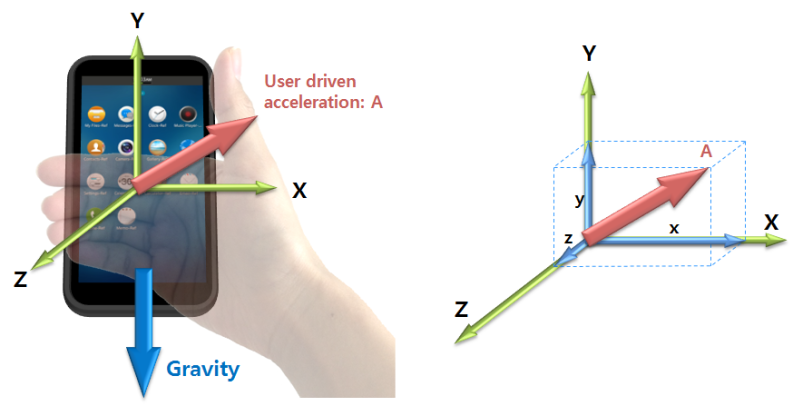
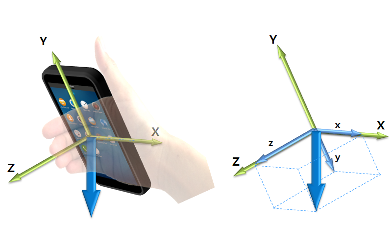
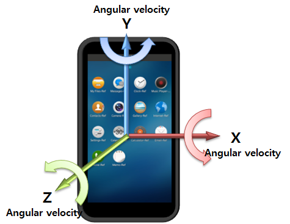
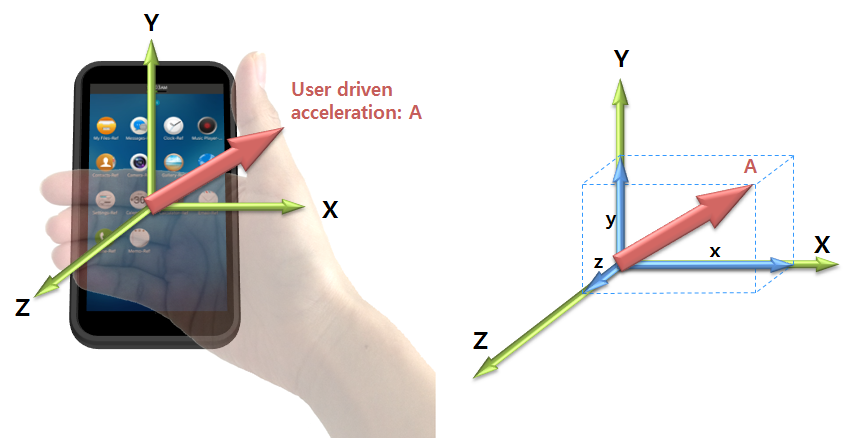
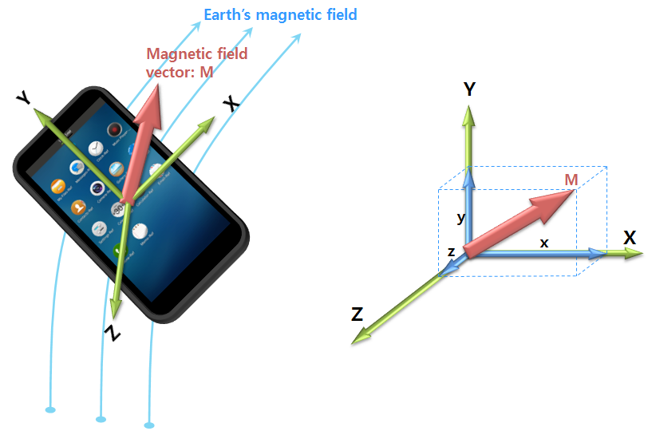
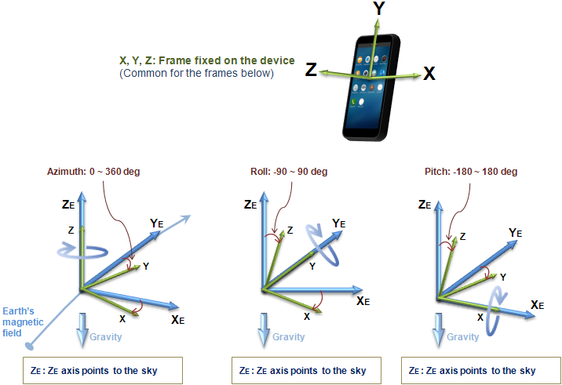

# Device Sensors

You can manage the sensors in the device and receive data from them.

Using the [Tizen.Sensor](/application/dotnet/api/TizenFX/latest/api/Tizen.Sensor.html) namespace, you can [create sensor instances](#sensor), which correspond to physical or software-defined sensor devices. The sensor instance is used to check the availability of and control the corresponding sensor.  

After you have created a sensor instance for a specific sensor and [subscribed to sensor events](#subscribe), you can monitor the device's internal sensors for sensor value changes. The application can receive the sensor data only when the data is modified.

When running an application on the emulator, you can use Emulator Control Panel to simulate sensor data for the application.

A device can have various physical and virtual sensors. The following table lists the sensors supported by Tizen.


> [!NOTE]
> Not all devices support all sensors, so each sensor is not necessarily available on all devices. You can [check whether a sensor is supported](#sensor).

**Table: Supported sensor types**

| Supported sensor types                   |                                          |                                       |
|----------------------------------------|----------------------------------------|-------------------------------------|
| [Accelerometer](#accelerometer)  | [Heart rate monitor batch sensor](#hrm_batch) | [Proximity sensor](#proximity)   |
| [AutoRotation sensor](#auto_rotation) | [Heart rate monitor LED green batch sensor](#hrm_green_batch) | [Rotation vector sensor](#rotation)  |
| [Geomagnetic orientation sensor](#mag_orientation) | [Humidity sensor](#humidity) | [Sleep monitor](#sleep_monitor)  |
| [Geomagnetic rotation vector sensor](#mag_rotation) | [Light sensor](#light) | [Temperature sensor](#temperature)  |
| [Gravity sensor](#gravity)   | [Linear acceleration sensor](#lin_accelerometer) | [Ultraviolet sensor](#ultraviolet)  |
| [Gyroscope](#gyro)  | [Magnetic sensor](#magnetic) | [Uncalibrated gyroscope](#uncal_gyro)  |
| [Gyroscope orientation sensor](#gyro_orientation)   | [Orientation sensor](#orientation) | [Uncalibrated magnetic sensor](#uncal_magnetic) |
| [Gyroscope rotation vector sensor](#gyro_rotation) | [Pedometer](#pedometer)  |  |
| [Heart rate monitor sensor](#hrm) | [Pressure sensor](#pressure)  |  |
## Prerequisites

To enable your application to use the device sensor functionalities:

1.  To use any health-related sensors, the application has to request permission by adding the following privilege to the `tizen-manifest.xml` file:

    ```XML
    <privileges>
        <privilege>http://tizen.org/privilege/healthinfo</privilege>
    </privileges>
    ```

2. Include the [Tizen.Sensor](/application/dotnet/api/TizenFX/latest/api/Tizen.Sensor.html) namespace in your application:

    ```csharp
    using Tizen.Sensor;
    ```

<a name="sensor"></a>
## Create a sensor instance

If an application wants to observe data from a specific sensor, you must create a sensor instance:

-   For a specific supported sensor type, a device can have multiple sensors.

    You can acquire the default sensor (designated by the device vendor) of a given type. The following example shows how to get the default accelerometer of the device by creating a new instance of the [Tizen.Sensor.Accelerometer](/application/dotnet/api/TizenFX/latest/api/Tizen.Sensor.Accelerometer.html) class:

    ```csharp
    try
    {
        var sensor = new Accelerometer();
    }
    catch (NotSupportedException)
    {
        /// Accelerometer is not supported in the current device.
        /// You can also check whether the accelerometer is supported with the following property:
        /// var supported = Accelerometer.IsSupported;
    }
    ```

- If you want to acquire a specific sensor from multiple ones of the same type, set the `index` parameter of the class constructor accordingly:

    ```csharp
    try
    {
        /// You can retrieve the total count of accelerometers by using the following property:
        /// var count = Accelerometer.Count;

        var sensor = new Accelerometer(0); /// Index starts at 0
    }
    catch (NotSupportedException)
    {
        /// Accelerometer is not supported in the current device.
    }
    ```

<a name="subscribe"></a>
## Subscribe to sensor events

If a sensor instance is created successfully, it is able to observe sensor data changes through an event handler. In addition, you can set several parameters, including the update interval of the sensor data and the power-save behavior of the sensor. The following example shows how to set the parameters and listen for changes in sensor data:

1.  To listen for sensor events, define a handler and register for the `DataUpdated` event from the sensor:

    ```csharp
    EventHandler<AccelerometerDataUpdatedEventArgs> handler = null;
    handler = (sender, e) =>
    {
        Log.Info(LOGTAG, "X: " + e.X);
        Log.Info(LOGTAG, "Y: " + e.Y);
        Log.Info(LOGTAG, "Z: " + e.Z);
    };

    sensor.DataUpdated += handler;
    ```

2. Start the sensor with the `Start()` method of the appropriate `Tizen.Sensor.XXX` class (inherited from [Tizen.Sensor.Sensor](/application/dotnet/api/TizenFX/latest/api/Tizen.Sensor.Sensor.html)):

    ```csharp
    sensor.Start();
    ```

    The event handler starts to be called at least once per the given interval. You can start multiple sensors of the same type with different intervals. In this case, the shortest interval is chosen.

    Some sensors are event-driven, meaning that they emit sensor events only if their data changes. For example, the proximity sensor emits its data only if the proximity value changes. For event-driven sensors, the update interval is ignored.

3. While the sensor is running, you can change the sensor settings:
    -   You can change the sensor update interval by adjusting the `Interval` property of the sensor instance:

        ```csharp
        sensor.Interval = 200;
        ```

        The above example changes the update interval of the sensor to 200 ms.

    - You can change the power-save behavior of the sensor.

        By default, the sensor automatically stops listening for the sensor data, if the display is switched off, or if the device goes to the power-save mode. You can override such behavior by setting the `PausePolicy` property of the sensor instance, using values of the [Tizen.Sensor.SensorPausePolicy](/application/dotnet/api/TizenFX/latest/api/Tizen.Sensor.SensorPausePolicy.html) enumeration:

        ```csharp
        sensor.PausePolicy = SensorPausePolicy.DisplayOff;
        ```

        The above example makes the sensor listen for the sensor data regardless of the display state and the power-save mode. However, it does not prevent the device from going to sleep mode. To listen for the sensor data, the device must be awake.

4. When the sensor data is no longer needed, stop the sensor and deregister the event handler:

    ```csharp
    sensor.Stop();
    sensor.DataUpdated -= handler;
    ```

5. When a sensor instance is no longer needed, dispose of its resources explicitly:

    ```csharp
    sensor.Dispose();
    ```

## Accelerometer

The accelerometer measures changes in the velocity of a device. It is a combination of gravity and linear acceleration components. The accelerometer measures the device's accelerometer vector in 3 axes relative to its body frame.

An acceleration of 1g always exists on the axis aligned to Earth's gravity. If the device is at rest, the sensor data reads 1g (the gravity offset) on one of the device axes and tells you which device axis is aligned to the direction of gravity. A falling device that has reached terminal velocity ideally shows the accelerometer value of 0 on all axes. The change in the effect of Earth's gravity is observed on the 3 device axes by rotating the device along any of the 3 axes.

The linear acceleration components which correspond to the measure of the linear motion subjected on the device can be obtained by removing the gravity components from the accelerometer data.

The accelerometer provides 3 components of acceleration (X, Y, and Z), as the following figure illustrates.

**Figure: Accelerometer vector and axes**



The accelerometer outputs 5 values: 3 Cartesian axis values, a timestamp, and a timespan. The accelerometer sensor measures and returns the axes' values in "m/s<sup>2</sup>" (meters per second squared). When a device is moved in the ±X, ±Y, or ±Z direction, the corresponding output increases (+) or decreases (-).

The following table lists the measurement data that the accelerometer provides.

**Table: Measurement data detected by the accelerometer**

| Measurement | Type                 | Range                               | Unit         |
|-----------|--------------------|-----------------------------------|------------|
| Timestamp  | `ulong`    | -                                   | Microseconds |
| TimeSpan   | `TimeSpan` | -                                   | Microseconds |
| X           | `float`              | Min. value = -19.6<br>Max. value = 19.6 | m/s<sup>2</sup>         |
| Y           | `float`              | Min. value = -19.6<br>Max. value = 19.6 | m/s<sup>2</sup>         |
| Z           | `float`              | Min. value = -19.6<br>Max. value = 19.6 | m/s<sup>2</sup>         |

The following table provides information about the accelerometer output for a device at rest.

**Table: Accelerometer output for a device at rest**

| Position       | 1                                        | 2                                        | 3                                        | 4                                        | 5                                        | 6                                        |
|--------------|----------------------------------------|----------------------------------------|----------------------------------------|----------------------------------------|----------------------------------------|----------------------------------------|
| Diagram        |  |  |  |  |  |  |
| X              | 0g                                       | 1g                                       | 0g                                       | -1g                                      | 0g                                       | 0g                                       |
| Y              | 1g                                       | 0g                                       | -1g                                      | 0g                                       | 0g                                       | 0g                                       |
| Z              | 0g                                       | 0g                                       | 0g                                       | 0g                                       | 1g                                       | -1g                                      |
| Axis up (down) | Y                                        | X                                        | -Y                                       | -X                                       | Z                                        | -Z                                       |
| X-polarity     | 0                                        | +                                        | 0                                        | -                                        | 0                                        | 0                                        |
| Y-polarity     | +                                        | 0                                        | -                                        | 0                                        | 0                                        | 0                                        |
| Z-polarity     | 0                                        | 0                                        | 0                                        | 0                                        | +                                        | -                                        |


 <a name="auto_rotation"></a>
## AutoRotation sensor

The AutoRotation sensor is a software sensor that uses an accelerometer to compute the orientation of a device. This sensor helps to determine whether a device is placed in a landscape or portrait orientation.

**Table: Measurement data detected by the AutoRotation sensor**

| Measurement | Type                     | Range                         | Unit         |
|-----------|------------------------|-----------------------------|------------|
| Timestamp  | `ulong`        | -                             | Microseconds |
| TimeSpan   | `TimeSpan`     | -                             | Microseconds |
| Accuracy    | `SensorDataAccuracy` | -                             | int          |
| Rotation   | `AutoRotationState` | -     | -            |

The `AutoRotationState` property is one of the values of the [Tizen.Sensor.AutoRotationState](/application/dotnet/api/TizenFX/latest/api/Tizen.Sensor.AutoRotationState.html) enumeration: `Degree_0`, `Degree_90`, `Degree_180`, or `Degree_270`.

<a name="mag_orientation"></a>

## Geomagnetic orientation sensor

The geomagnetic orientation sensor combines the 3-axis accelerometer and 3-axis magnetic sensor to determine the orientation (rotation angles) of the device. The geomagnetic orientation sensor is similar to the orientation sensor, but does not use a gyroscope. The geomagnetic orientation is the output of a software/hardware-based sensor fusion solution that uses the accelerometer and magnetic sensor. The geomagnetic orientation sensor output is an alternative representation to the geomagnetic rotation vector sensor output used to determine the rotation of the device, and it is calculated in terms of Euler angles:

-   Azimuth
-   Pitch
-   Roll

The following table lists the measurement data that the geomagnetic orientation sensor provides.

**Table: Measurement data detected by the geomagnetic orientation sensor**

| Measurement | Type                 | Range                                 | Unit             |
|-------------|----------------------|---------------------------------------|------------------|
| Timestamp   | `ulong`              | -                                     | Microseconds     |
| TimeSpan    | `TimeSpan`           | -                                     | Microseconds     |
| Azimuth     | `float`              | Min. value = 0<br>Max. value = 360    | Degrees (&deg;)  |
| Pitch       | `float`              | Min. value = -180<br>Max. value = 180 | Degrees (&deg;)  |
| Roll        | `float`              | Min. value = -90<br>Max. value = 90   | Degrees (&deg;)  |

The angular positions are measured using a fixed frame reference (X~E~, Y~E~, Z~E~).

 <a name="mag_rotation"></a>
## Geomagnetic rotation vector sensor

The geomagnetic rotation vector sensor is the output of a software/hardware-based sensor fusion solution that uses the accelerometer and magnetic sensors to compute the orientation of the device. In this sensor, the computed orientation is free of any drift, but it is inaccurate compared to a sensor fusion solution using the gyroscope sensor. The geomagnetic rotation vector sensor represents the orientation of the device as a combination of an angle and an axis on which the device has rotated through a specific angle around an axis (X, Y, or Z).

The following table lists the measurement data that the geomagnetic rotation vector sensor provides.

**Table: Measurement data detected by the geomagnetic rotation vector sensor**

| Measurement | Type                     | Range                         | Unit         |
|-----------|------------------------|-----------------------------|------------|
| Timestamp  | `ulong`        | -                             | Microseconds |
| TimeSpan   | `TimeSpan`     | -                             | Microseconds |
| Accuracy    | `SensorDataAccuracy` | -                             | int          |
| X           | `float`                  | Min. value = -1<br>Max. value = 1 | -            |
| Y           | `float`                  | Min. value = -1<br>Max. value = 1 | -            |
| Z           | `float`                  | Min. value = -1<br>Max. value = 1 | -            |
| W           | `float`                  | Min. value = -1<br>Max. value = 1 | -            |

<a name="gravity"></a>
## Gravity sensor

The gravity sensor is a virtual sensor derived from the 3-axis acceleration sensor. The 3-axis gravity components provide a measure of the effect of Earth's gravity observed on the device reference axes. The gravity components measured on a device vary based on changes in the device orientation, and hence they provide a measure of the rotation to which the device is subjected.

**Figure: Gravity sensor vector and axes**



The gravity sensor outputs 5 values: 3 Cartesian axis values, a timestamp, and a timespan. The gravity sensor measures and returns axes values in "m/s<sup>2</sup>" (meters per second squared). When a device is rotated in the ±X, ±Y, or ±Z direction, the corresponding output increases (+) or decreases (-).

The following table lists the measurement data that the gravity sensor provides.

**Table: Measurement data detected by the gravity sensor**

| Measurement | Type                 | Range                             | Unit         |
|-----------|--------------------|---------------------------------|------------|
| Timestamp  | `ulong`        | -                             | Microseconds |
| TimeSpan   | `TimeSpan` | -                                 | Microseconds |
| X           | `float`              | Min. value = -9.8<br>Max. value = 9.8 | m/s<sup>2</sup>         |
| Y           | `float`              | Min. value = -9.8<br>Max. value = 9.8 | m/s<sup>2</sup>         |
| Z           | `float`              | Min. value = -9.8<br>Max. value = 9.8 | m/s<sup>2</sup>         |

<a name="gyro"></a>
## Gyroscope

The gyroscope detects angular velocity or angular rates of a device. The 3D gyroscope data is considered to be very sensitive in detecting incremental rotation angles. The rotation angles obtained by integrating the angular rates over a longer duration are inaccurate due to the build-up of drift.

**Figure: Gyroscope vector and axes**



The following table lists the measurement data that the gyroscope provides.

**Table: Measurement data detected by the gyroscope**

| Measurement | Type                 | Range                                 | Unit            |
|-----------|--------------------|-------------------------------------|---------------|
| Timestamp  | `ulong`    | -                                     | Microseconds    |
| TimeSpan   | `TimeSpan` | -                                     | Microseconds    |
| X           | `float`              | Min. value = -573.0<br>Max. value = 573.0 | Degrees/s (&deg;/s) |
| Y           | `float`              | Min. value = -573.0<br>Max. value = 573.0 | Degrees/s (&deg;/s) |
| Z           | `float`              | Min. value = -573.0<br>Max. value = 573.0 | Degrees/s (&deg;/s) |

 <a name="gyro_orientation"></a>

## Gyroscope orientation sensor

The gyroscope orientation sensor combines the 3-axis accelerometer and 3-axis gyroscope to determine the orientation (rotation angles) of the device. The gyroscope orientation sensor is similar to the orientation sensor, but it does not use a geomagnetic field. Thus, yaw represents a relative rotation angle, not an absolute reference. The gyroscope orientation is the output of a software/hardware-based sensor fusion solution that uses the accelerometer and gyroscope. The gyroscope orientation sensor output is an alternative representation to the gyroscope rotation vector sensor output used to determine the rotation of the device, and it is calculated in terms of Euler angles:

-   Yaw
-   Pitch
-   Roll

The following table lists the measurement data that the gyroscope orientation sensor provides.

**Table: Measurement data detected by the gyroscope orientation sensor**

| Measurement | Type                 | Range                                 | Unit             |
|-------------|----------------------|---------------------------------------|------------------|
| Timestamp   | `ulong`              | -                                     | Microseconds     |
| TimeSpan    | `TimeSpan`           | -                                     | Microseconds     |
| Yaw         | `float`              | Min. value = 0<br>Max. value = 360    | Degrees (&deg;)  |
| Pitch       | `float`              | Min. value = -180<br>Max. value = 180 | Degrees (&deg;)  |
| Roll        | `float`              | Min. value = -90<br>Max. value = 90   | Degrees (&deg;)  |

The angular positions are measured using a fixed frame reference (X~E~, Y~E~, Z~E~).

 <a name="gyro_rotation"></a>

## Gyroscope rotation vector sensor

The gyroscope rotation vector sensor is the output of a software/hardware-based sensor fusion solution that uses the accelerometer and gyroscope to compute the orientation of the device. In this sensor, the pitch and roll equivalent representations are free of drift while the yaw equivalent component is allowed to drift due to the absence of the magnetic sensor. The gyroscope rotation vector sensor represents the orientation of the device as a combination of an angle and an axis on which the device has rotated through a specific angle around an axis (X, Y, or Z).

The following table lists the measurement data that the gyroscope rotation vector sensor provides.

**Table: Measurement data detected by the gyroscope rotation vector sensor**

| Measurement | Type                     | Range                         | Unit         |
|-----------|------------------------|-----------------------------|------------|
| Timestamp  | `ulong`        | -                             | Microseconds |
| TimeSpan   | `TimeSpan`     | -                             | Microseconds |
| Accuracy    | `SensorDataAccuracy` | -                             | int          |
| X           | `float`                  | Min. value = -1<br>Max. value = 1 | -            |
| Y           | `float`                  | Min. value = -1<br>Max. value = 1 | -            |
| Z           | `float`                  | Min. value = -1<br>Max. value = 1 | -            |
| W           | `float`                  | Min. value = -1<br>Max. value = 1 | -            |

<a name="hrm"></a>
## Heart rate monitor sensor

The heart rate monitor (HRM) sensor measures a person's heart rate in real time.

The following table lists the measurement data that the HRM sensor provides.

**Table: Measurement data detected by the HRM sensor**

| Measurement | Type       | Range                              | Unit         |
|-------------|------------|------------------------------------|--------------|
| Timestamp   | `ulong`    | -                                  | Microseconds |
| TimeSpan    | `TimeSpan` | -                                  | Microseconds |
| Heartrate   | `int`      | Min. value = 0<br>Max. value = 240 | -            |

<a name="hrm_batch"></a>
## Heart rate monitor batch sensor

The heart rate monitor (HRM) batch sensor measures a person's heart rate. The sensor must be power-efficient and support batch processing.

The following table lists the measurement data that the HRM batch sensor provides.

**Table: Measurement data detected by the HRM batch sensor**

| Measurement | Type                                              | Range   | Unit         |
|-------------|---------------------------------------------------|---------|--------------|
| Timestamp   | `ulong`                                           | -       | Microseconds |
| TimeSpan    | `TimeSpan`                                        | -       | Microseconds |
| Data        | `IReadOnlyList<HeartRateMonitorBatchData>`        | -       | -            |

**Table: Measurements contained in HeartRateMonitorBatchData**

| Measurement                           | Type                        | Range                               | Unit         |
|---------------------------------------|-----------------------------|-------------------------------------|--------------|
| Timestamp                             | `ulong`                     | -                                   | Microseconds |
| Accuracy                              | `SensorDataAccuracy`        | -                                   | -            |
| State                                 | `HeartRateMonitorBatchState`| -                                   | -            |
| Heartrate: Beats per minute           | `int`                       | Min. value = 0<br> Max. value = 240 | -            |
| RRInterval: R wave-to-R wave interval | `int`                       | -                                   | Millisecond  |

<a name="hrm_green_batch"></a>
## Heart rate monitor LED green batch sensor

The heart rate monitor (HRM) LED green batch sensor measures the amount of green light that is reflected back from a person's blood vessel. The sensor must be power-efficient and support batch processing.

The following table lists the measurement data that the HRM LED green batch sensor provides.

**Table: Measurement data detected by the HRM LED green batch sensor**

| Measurement | Type                                              | Range   | Unit         |
|-------------|---------------------------------------------------|---------|--------------|
| Timestamp   | `ulong`                                           | -       | Microseconds |
| TimeSpan    | `TimeSpan`                                        | -       | Microseconds |
| Data        | `IReadOnlyList<HeartRateMonitorLEDGreenBatchData>`| -       | -            |

**Table: Measurements contained in HeartRateMonitorLEDGreenBatchData**

| Measurement                      | Type                 | Range                                    | Unit         |
|----------------------------------|----------------------|------------------------------------------|--------------|
| Timestamp                        | `ulong`              | -                                        | Microseconds |
| Accuracy                         | `SensorDataAccuracy` | -                                        | -            |
| Green: HRM green light value     | `uint`               | Min. value = 0<br> Max. value = 4194304  | -            |
| AccelerationX: X                 | `int`                | Min. value = -4096<br> Max. value = 4096 | -            |
| AccelerationY: Y                 | `int`                | Min. value = -4096<br> Max. value = 4096 | -            |
| AccelerationZ: Z                 | `int`                | Min. value = -4096<br> Max. value = 4096 | -            |
| Index                            | `int`                | Sequential index of sensor event         | -            |

<a name="humidity"></a>

## Humidity sensor

The humidity sensor measures the relative ambient air humidity in percentage.

The following table lists the measurement data that the humidity sensor provides.

**Table: Measurement data detected by the humidity sensor**

| Measurement | Type                 | Range | Unit         |
|-----------|--------------------|-----|------------|
| Timestamp  | `ulong`    | -     | Microseconds |
| TimeSpan   | `TimeSpan` | -     | Microseconds |
| Humidity    | `float`              | 100   | %            |

 <a name="light"></a>

## Light sensor

The light sensor detects the brightness of ambient light. It can be used to measure the brightness level.

As an example use case, the light sensor can be used to control the brightness of the screen. In a dark environment, the light sensor detects the brightness of the environment and can be used to increase the device screen backlight brightness level. In a brighter environment, the backlight brightness level is lowered to save battery power.

The following table lists the measurement data that the light sensor provides.

**Table: Measurement data detected by the light sensor**

| Measurement | Type                 | Range                            | Unit         |
|-----------|--------------------|--------------------------------|------------|
| Timestamp  | `ulong`    | -                                | Microseconds |
| TimeSpan   | `TimeSpan` | -                                | Microseconds |
| Level       | `float`              | Min. value = 0<br>Max. value = 45875 | Lux          |

 <a name="lin_accelerometer"></a>

## Linear acceleration sensor

The linear acceleration sensor is derived from the accelerometer by excluding the gravity value, and it measures the user-driven changes in the velocity. The linear acceleration sensor is used to detect the dynamic movement of the device and analyze the user's motion profile. The 3-axis linear acceleration components provide a measure of the combined linear motion subjected to the device in Euclidean space.

The linear acceleration sensor provides 3 components of acceleration (X, Y, and Z), as the following figure illustrates.

**Figure: User-acceleration sensor vector and axes**



The linear acceleration sensor outputs 5 values: 3 Cartesian axis values, a timestamp, and a timespan. The linear acceleration sensor measures and returns axes values in "m/s<sup>2</sup>" (meters per second squared). When a device is accelerated in the ±X, ±Y, or ±Z direction, the corresponding output increases (+) or decreases (-). The acceleration output is shown in the same direction as the user-driven force.

The following table lists the measurement data that the linear acceleration sensor provides.

**Table: Measurement data detected by the linear acceleration sensor**

| Measurement | Type                 | Range                               | Unit         |
|-----------|--------------------|-----------------------------------|------------|
| Timestamp  | `ulong`    | -                                   | Microseconds |
| TimeSpan   | `TimeSpan` | -                                   | Microseconds |
| X           | `float`              | Min. value = -19.6<br>Max. value = 19.6 | m/s<sup>2</sup>         |
| Y           | `float`              | Min. value = -19.6<br>Max. value = 19.6 | m/s<sup>2</sup>         |
| Z           | `float`              | Min. value = -19.6<br>Max. value = 19.6 | m/s<sup>2</sup>         |

 <a name="magnetic"></a>

## Magnetic sensor

The magnetic sensor is a 3-axis electronic compass (sometimes referred to as a "magnetometer" or "geomagnetic sensor"). It can also be used in determining the azimuth component of the device orientation provided that the tilt of the device is already computed. The magnetic sensor measures the Earth's magnetic field strength and fluctuations, and splits the measurement into X, Y, and Z components.

The following factors can have an impact on the sensor readings:

-   The weather or the season of the year
-   Your location on the planet
-   Nearby, strong magnetic fields, such as magnets, electric coils, or objects which contain a ferrite element

The following table lists the measurement data that the magnetic sensor provides.

**Table: Measurement data detected by the magnetic sensor**

| Measurement | Type                 | Unit             |
|-----------|--------------------|----------------|
| Timestamp  | `ulong`    | Microseconds     |
| TimeSpan   | `TimeSpan` | Microseconds     |
| X           | `float`              | µT (microteslas) |
| Y           | `float`              | µT (microteslas) |
| Z           | `float`              | µT (microteslas) |

The magnetic sensor uses the 3-axis Cartesian space coordinate system, as the following figure illustrates.

**Figure: Magnetic field vector and axes**



<a name="orientation"></a>
## Orientation sensor

The orientation sensor combines the 3-axis accelerometer, 3-axis magnetic sensor, and 3-axis gyroscope to determine the orientation (rotation angles) of the device. The orientation is the output of a software/hardware-based sensor fusion solution that uses the accelerometer, magnetic sensor, and gyroscope. The orientation sensor output is an alternative representation to the rotation vector sensor output used to determine the rotation of the device, and it is calculated in terms of Euler angles:

-   Azimuth
-   Pitch
-   Roll

The following table lists the measurement data that the orientation sensor provides.

**Table: Measurement data detected by the orientation sensor**

| Measurement | Type                 | Range                             | Unit         |
|-----------|--------------------|---------------------------------|------------|
| Timestamp  | `ulong`    | -                                 | Microseconds |
| TimeSpan   | `TimeSpan` | -                                 | Microseconds |
| Azimuth     | `float`              | Min. value = 0<br>Max. value = 360    | Degrees (&deg;)  |
| Pitch       | `float`              | Min. value = -180<br>Max. value = 180 | Degrees (&deg;)  |
| Roll        | `float`              | Min. value = -90<br>Max. value = 90   | Degrees (&deg;)  |

The angular positions are measured using a fixed frame reference (X~E~, Y~E~, Z~E~).

**Figure: Angular positions and the fixed frame reference**



## Pedometer

The pedometer detects the user's steps, and returns the number of steps taken by the user since the last reboot, while at least 1 application is using the pedometer. The timestamp of the event denotes the time when the last step was taken. In addition to the number of steps, it also returns other tracking data to further describe the user's activity status. For example, it provides the user's moving distance and burned calories. All the values are reset to zero when the system reboots.

Normally, an event handler is invoked whenever a new step is detected. However, to be power-efficient, the sensor can internally accumulate its detected events while the system sleeps. In this case, the accumulated data is reported when the system wakes up, that is, the display is switched on. In addition, even though the display is not switched on explicitly, the sensor can wake up the device to deliver its accumulated data occasionally.

If you want to track the user's steps continuously, do not stop the sensor, to ensure it keeps running. If there is no application listening to the sensor, it stops counting the steps.

The following table lists the measurement data that the pedometer provides.

**Table: Measurement data detected by the pedometer**

| Measurement           | Range                          | Unit         |
|---------------------|------------------------------|------------|
| Timestamp            | -                              | Microseconds |
| TimeSpan             | -                              | Microseconds |
| StepCount             | Min. value = 0<br>Max. value = 2<sup>24</sup> | Steps        |
| WalkStepCount         | Min. value = 0<br>Max. value = 2<sup>24</sup> | Steps        |
| RunningStepCount      | Min. value = 0<br>Max. value = 2<sup>24</sup> | Steps        |
| MovingDistance        | Min. value = 0                 | Meters       |
| CalorieBurned         | Min. value = 0                 | kcal         |
| LastSpeed             | Min. value = 0                 | km/h         |
| LastSteppingFrequency | Min. value = 0                 | Steps/second |
| LastStepStatus        | -                              | -            |


The `LastStepStatus` property is one of the values of the [Tizen.Sensor.PedometerState](/application/dotnet/api/TizenFX/latest/api/Tizen.Sensor.PedometerState.html) enumeration: `Unknown`, `Stop`, `Walk`, or `Run`.

<a name="pressure"></a>
## Pressure sensor

The pressure sensor measures the atmospheric pressure in the device's surrounding environment.

The following table lists the measurement data that the pressure sensor provides.

**Table: Measurement data detected by the pressure sensor**

| Measurement | Type                 | Range                             | Unit         |
|-----------|--------------------|---------------------------------|------------|
| Timestamp  | `ulong`    | -                                 | Microseconds |
| TimeSpan   | `TimeSpan` | -                                 | Microseconds |
| Pressure    | `float`              | Min. value = 260<br>Max. value = 1260 | hPa          |

<a name="proximity"></a>

## Proximity sensor

The proximity sensor detects the presence of nearby objects in close proximity to the sensor. It can be used to measure the distance between nearby objects and the device.

As an example use case, the proximity sensor can be used to lock or unlock the device screen. When the device user holds the device to their ear, the proximity sensor detects the user as an object and automatically locks the device screen. When the user moves the device away from their ear to input data, the proximity sensor determines that there are no nearby objects, and unlocks the screen.

The following table lists the measurement data that the proximity sensor provides.

**Table: Measurement data detected by the proximity sensor**

| Measurement | Type                  | Range | Unit         |
|-----------|---------------------|-----|------------|
| Timestamp  | `ulong`     | -     | Microseconds |
| TimeSpan   | `TimeSpan`  | -     | Microseconds |
| Proximity   | `ProxmitySensorState` | -     | -            |

The `ProximitySensorState` property is one of the values of the [Tizen.Sensor.ProximitySensorState](/application/dotnet/api/TizenFX/latest/api/Tizen.Sensor.ProximitySensorState.html) enumeration: `Unknown`, `Far`, or `Near`.

<a name="rotation"></a>
## Rotation vector sensor

The rotation vector sensor represents the orientation of the device as a combination of an angle and an axis, in which the device has rotated through a specific angle around an axis (X, Y, or Z). The rotation vector is the output of a software/hardware-based sensor fusion solution, which uses the accelerometer, gyroscope, and magnetic sensor as inputs to compute the orientation of the device.

The following table lists the measurement data that the rotation vector sensor provides.

**Table: Measurement data detected by the rotation vector**

| Measurement | Type                     | Range                         | Unit         |
|-----------|------------------------|-----------------------------|------------|
| Timestamp  | `ulong`        | -                             | Microseconds |
| TimeSpan   | `TimeSpan`     | -                             | Microseconds |
| Accuracy    | `SensorDataAccuracy` | -                             | int          |
| X           | `float`                  | Min. value = -1<br>Max. value = 1 | -            |
| Y           | `float`                  | Min. value = -1<br>Max. value = 1 | -            |
| Z           | `float`                  | Min. value = -1<br>Max. value = 1 | -            |
| W           | `float`                  | Min. value = -1<br>Max. value = 1 | -            |

 <a name="sleep_monitor"></a>

## Sleep monitor

The sleep monitor tracks the user's sleep quality. Once per minute, it reports whether the user sleeps. As this sensor usually needs to track the sleep quality over several hours, it must be power-efficient and work in a batch manner. While the system sleeps, or the display is off, the sensor keeps its detected data internally. When the sensor is unable to keep more data (its internal buffer is full), it wakes up the system and flushes all collected data. When flushing, the event handler is invoked repeatedly. The timestamp of each event can be used to figure out when the user was sleeping.

The following table lists the measurement data that the sleep monitor provides.

**Table: Measurement data detected by the sleep monitor**

| Measurement | Unit         |
|-----------|------------|
| Timestamp  | Microseconds |
| TimeSpan   | Microseconds |
| SleepState  | -            |

The `SleepState` property is one of the values of the [Tizen.Sensor.SleepMonitorState](/application/dotnet/api/TizenFX/latest/api/Tizen.Sensor.SleepMonitorState.html) enumeration: `Unknown`, `Wake`, or `Sleep`.

Depending on the device you are using, the available raw sensors are different and the sleep detection algorithm can also vary. In addition to the sleep state field, some specific device models can provide further data, as defined by the model manufacturer.

<a name="temperature"></a>
## Temperature sensor

The temperature sensor measures the ambient room temperature in the device's surrounding environment.

The following table lists the measurement data that the temperature sensor provides.

**Table: Measurement data detected by the temperature sensor**

| Measurement | Type                 | Range                            | Unit         |
|-----------|--------------------|--------------------------------|------------|
| Timestamp  | `ulong`    | -                                | Microseconds |
| TimeSpan   | `TimeSpan` | -                                | Microseconds |
| Temperature | `float`              | Min. value = -30<br>Max. value = 100 | °C           |

 <a name="ultraviolet"></a>

## Ultraviolet sensor

The ultraviolet (UV) sensor measures the ultraviolet index. The sensor detects and provides a measure of the UV rays the device is exposed to.

The following table lists the measurement data that the ultraviolet sensor provides.

**Table: Measurement data detected by the ultraviolet sensor**

| Measurement      | Type                 | Range                         | Unit         |
|----------------|--------------------|-----------------------------|------------|
| Timestamp       | `ulong`    | -                             | Microseconds |
| TimeSpan        | `TimeSpan` | -                             | Microseconds |
| UltravioletIndex | `float`              | Min. value = 0<br>Max. value = 15 | UV index     |

 <a name="uncal_gyro"></a>

## Uncalibrated gyroscope

The uncalibrated gyroscope detects angular velocity or angular rates of a device. The 3D uncalibrated gyroscope sensor is considered to be very sensitive in detecting incremental rotation angles. The rotation angles obtained by integrating the angular rates over a longer duration are inaccurate due to the build-up of drift. The uncalibrated gyroscope data also consists of drift compensation values for each axis, which can be used to subtract the drift from the detected angular rates. The values of drift for the 3 axes are obtained from the output of a software/hardware-based sensor fusion solution.

The following table lists the measurement data that the uncalibrated gyroscope provides.

**Table: Measurement data detected by the uncalibrated gyroscope**

| Measurement             | Type                 | Range                                 | Unit            |
|-----------------------|--------------------|-------------------------------------|---------------|
| Timestamp              | `ulong`    | -                                     | Microseconds    |
| TimeSpan               | `TimeSpan` | -                                     | Microseconds    |
| X                       | `float`              | Min. value = -573.0<br>Max. value = 573.0 | Degrees/s (&deg;/s) |
| Y                       | `float`              | Min. value = -573.0<br>Max. value = 573.0 | Degrees/s (&deg;/s) |
| Z                       | `float`              | Min. value = -573.0<br>Max. value = 573.0 | Degrees/s (&deg;/s) |
| BiasX | `float`              | Min. value = -573.0<br>Max. value = 573.0 | Degrees/s (&deg;/s) |
| BiasY | `float`              | Min. value = -573.0<br>Max. value = 573.0 | Degrees/s (&deg;/s) |
| BiasZ | `float`              | Min. value = -573.0<br>Max. value = 573.0 | Degrees/s (&deg;/s) |

<a name="uncal_magnetic"></a>
## Uncalibrated magnetic sensor

The uncalibrated magnetic sensor is a 3-axis electronic compass (sometimes referred to as a "magnetometer" or "geomagnetic sensor"). It can also be used in determining the azimuth component of the device orientation provided that the tilt of the device is already computed. It measures the Earth's magnetic field strength and fluctuations, and splits the measurement into X, Y, and Z components. The uncalibrated magnetic sensor is similar in functionality to a magnetic sensor, but does not perform hard iron calibration. Factory calibration and temperature compensation are applied.

The following factors can have an impact on the sensor readings:

-   The weather or the season of the year
-   Your location on the planet
-   Nearby, strong magnetic fields, such as magnets, electric coils, or objects which contain a ferrite element

The following table lists the measurement data that the uncalibrated magnetic sensor provides.

**Table: Measurement data detected by the uncalibrated magnetic sensor**

| Measurement | Type                 | Unit             |
|-----------|--------------------|----------------|
| Timestamp  | `ulong`    | Microseconds     |
| TimeSpan   | `TimeSpan` | Microseconds     |
| X           | `float`              | &micro;T (microteslas) |
| Y           | `float`              | &micro;T (microteslas) |
| Z           | `float`              | &micro;T (microteslas) |
| BiasX | `float`              | &micro;T (microteslas) |
| BiasY | `float`              | &micro;T (microteslas) |
| BiasZ | `float`              | &micro;T (microteslas) |


## Related information
* Dependencies
  -   Tizen 4.0 and Higher
