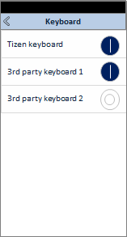

<a name="manager"></a>
# Input Method Manager


You can manage the IMEs (Input Method Editors) installed on the device. After your IME application is installed, you can use the input method manager to open a list of installed IMEs, allow the user to enable an installed IME, and show an IME selector, in which the user can see the enabled IMEs and select one as a default keyboard.

The main features of the Tizen.Uix.InputMethodManager namespace include the following:

-   Showing the IME list

    You can [open the installed IME list menu](#list). If a new IME has been installed, the user can see its name in the IME list, and can use the toggle button to enable the keyboard they want. All keyboards enabled in the IME list are shown in the IME selector to allow the user to select them as the default keyboard.

    **Figure: IME list**

    

-   Showing the IME selector

    You can [open the IME selector menu](#selector). When the user opens the IME selector menu, it shows all the keyboards enabled in the IME list. The user can change the default keyboard by selecting a new one. By clicking **Select keyboard**, the user can return to the IME list menu to enable a new IME.

    **Figure: IME selector**

    

-   Checking the IME status

    You can [check whether a specific IME is enabled or disabled](#enable) in the system keyboard setting. You can also check which IME is currently selected as the default keyboard, or how many IMEs are enabled (usable). These features are useful when the user installs a new keyboard.

## Prerequisites

To enable your application to use the input method management functionality, follow these steps:

1.  To use the [Tizen.Uix.InputMethodManager](/application/dotnet/api/TizenFX/latest/api/Tizen.Uix.InputMethodManager.html) namespace, the application has to request permission by adding the following privilege to the `tizen-manifest.xml` file:

    ```XML
    <privileges>
       <privilege>http://tizen.org/privilege/imemanager</privilege>
    </privileges>
    ```

2.  To use the methods and properties of the Tizen.Uix.InputMethodManager namespace, include it in your application:

    ```csharp
    using Tizen.Uix.InputMethodManager;
    ```

<a name="list"></a>
## Show the IME list

To launch the IME list menu to show the installed IMEs, use the `ShowIMEList()` method of the [Tizen.Uix.InputMethodManager.Manager](/application/dotnet/api/TizenFX/latest/api/Tizen.Uix.InputMethodManager.Manager.html) class:

```csharp
void ShowImeList()
{
    try
    {
        Manager.ShowIMEList();
    }
    catch (Exception e)
    {
        /// Error handling
    }
}
```

<a name="selector"></a>
## Show the IME selector

To launch the IME selector menu to allow the user to select the default keyboard, use the `ShowIMESelector()` method of the [Tizen.Uix.InputMethodManager.Manager](/application/dotnet/api/TizenFX/latest/api/Tizen.Uix.InputMethodManager.Manager.html) class:

```csharp
void ShowImeSelector()
{
    try
    {
        Manager.ShowIMESelector();
    }
    catch (Exception e)
    {
        /// Error handling
    }
}
```

<a name="enable"></a>
## Check the IME state

To check whether a specific IME is enabled, to check the current default keyboard, or to get the number of enabled (usable) IMEs:

-   To check whether a specific IME is enabled, use the `IsIMEEnabled()` method of the [Tizen.Uix.InputMethodManager.Manager](/application/dotnet/api/TizenFX/latest/api/Tizen.Uix.InputMethodManager.Manager.html) class. As a parameter, use the application ID of the IME whose status you want to check:

    ```csharp
    bool IsImeEnabled(string appId)
    {
        try
        {
            bool result = Manager.IsIMEEnabled(appId);
        }
        catch (Exception e)
        {
            /// Error handling
        }

        return result;
    }
    ```

    If the IME is enabled, the method returns `true`.

-   To check which IME is currently selected as the default keyboard, use the `GetActiveIME()` method, which returns the application ID of the currently selected IME as a string:

    ```csharp
    string GetActiveIme()
    {
        string app_id = null;
        try
        {
            app_id = Manager.GetActiveIME();
        }
        catch (Exception e)
        {
            /// Error handling
        }

        return app_id;
    }
    ```

-   To get the number of enabled (usable) IMEs, use the `GetEnabledIMECount()` method:

    ```csharp
    int GetEnabledImeCount()
    {
        int count = Manager.GetEnabledIMECount();

        return count;
    }
    ```


## Related information
* Dependencies
  -   Tizen 4.0 and Higher
