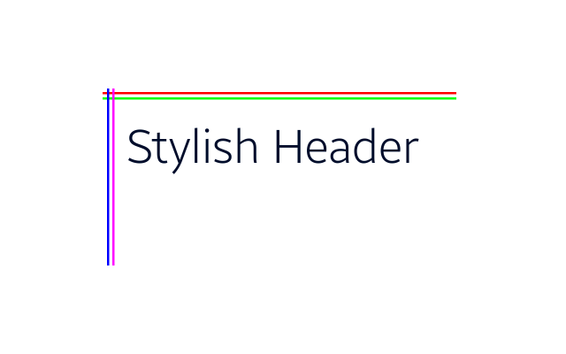

<style>
    .tabcontent img {
        border: 1px solid #555;
        max-width: 100% !important;
        max-height: 100%;
    }
</style>

# Absolute Layout

`AbsoluteLayout` allows positioning of the child components using explicit values. The positions are defined from the top left corner of the layout and can be set using the `View.Positions` property.

| Property | Type | Description |
| --- | --- | --- |
| `Position` | float, float, float | Sets the position of the component in the layout. |
| `Position2D` | int, int | Sets the position of the component in the layout for X and Y axis.  |
| `PositionX` | float | Sets the position of the component in the layout X axis. |
| `PositionY` | float | Sets the position of the component in the layout Y axis |

## Example



The following example shows how to use position views with the `AbsoluteLayout`.

<div id="TabSection1">
    <div class="sampletab " id="ProjectCreateTab">
        <button id="AbsoluteLayout-Example-CSharp" class="tablinks " onclick="openTabSection(event, 'AbsoluteLayout-Example-CSharp', 'TabSection1') ">C#</button>
        <button id="AbsoluteLayout-Example-Xaml" class="tablinks " onclick="openTabSection(event, 'AbsoluteLayout-Example-Xaml', 'TabSection1') ">Xaml</button>
    </div>
    <div id="AbsoluteLayout-Example-CSharp" class="tabcontent">
        <table>
            <tbody>
                <tr>
<span style="display:block">

```csharp
View absoluteLayoutView = new View
{
    WidthSpecification = LayoutParamPolicies.MatchParent,
    HeightSpecification = LayoutParamPolicies.MatchParent,
    BackgroundColor = Color.White,
};

absoluteLayoutView.Layout = new AbsoluteLayout();

TextLabel header = new TextLabel
{
    Text = "Stylish Header",
    PointSize = 25,
    Position2D = new Position2D(290, 270)
};

View redView = new View
{
    BackgroundColor = Color.Red,
    Position2D = new Position2D(232, 220),
    WidthSpecification = 800,
    HeightSpecification = 5
};

View greenView = new View
{
    BackgroundColor = Color.Blue,
    Position2D = new Position2D(232, 208),
    WidthSpecification = 800,
    HeightSpecification = 5
};

View blueView = new View
{
    BackgroundColor = Color.Magenta,
    Position2D = new Position2D(242, 200),
    WidthSpecification = 5,
    HeightSpecification = 400
};

View magentaView = new View
{
    BackgroundColor = Color.Red,
    Position2D = new Position2D(254, 200),
    WidthSpecification = 5,
    HeightSpecification = 400
};

absoluteLayoutView.Add(header);
absoluteLayoutView.Add(redView);
absoluteLayoutView.Add(greenView);
absoluteLayoutView.Add(blueView);
absoluteLayoutView.Add(magentaView);
```

</span>
                </tr>
            </tbody>
        </table>
    </div>
    <div id="AbsoluteLayout-Example-Xaml" class="tabcontent">
        <table>
            <tbody>
                <tr>
<span style="display:block">

```xaml
<View
    WidthSpecification="{Static LayoutParamPolicies.MatchParent}"
    HeightSpecification="{Static LayoutParamPolicies.MatchParent"
    BackgroundColor="White">

    <View.Layout>
        <AbsoluteLayout />
    </View.Layout>

    <TextLabel
        Text="Stylish Header"
        PointSize="25"
        Position2D="290,270"/>

    <View
        BackgroundColor="Red"
        Position2D="232,208"
        WidthSpecification="800"
        HeightSpecification="5"/>

    <View
        BackgroundColor="Green"
        Position2D="232,220"
        WidthSpecification="800"
        HeightSpecification="5"/>

    <View
        BackgroundColor="Blue"
        Position2D="242,200"
        WidthSpecification="5"
        HeightSpecification="400"/>

    <View
        BackgroundColor="Magenta"
        Position2D="254,200"
        WidthSpecification="5"
        HeightSpecification="400"/>

</View>
```

</span>
                </tr>
            </tbody>
        </table>
    </div>
</div>

## Related Information

- Dependencies
  - Tizen 6.5 and Higher

<script>
    function openTabSection(evt, profileName, sectionId) {
        var i, tabcontent, tablinks, section;
        let selected = 0;

        section = document.getElementById(sectionId);
        tabcontent = section.getElementsByClassName("tabcontent");
        for (i = 0; i < tabcontent.length; i++) {
            tabcontent[i].style.display = "none";
            if (tabcontent[i].id == profileName) {
                selected = i;
            }
        }

        tablinks = section.getElementsByClassName("tablinks");

        for (i = 0; i < tablinks.length; i++) {
            tablinks[i].className = tablinks[i].className.replace(" active", "");
        }

        tabcontent[selected].style.display = "block";
        evt.currentTarget.className += " active";
    }
    document.getElementById("AbsoluteLayout-Example-CSharp").click();
</script>
