# Layouts

## Overview

The Layout framework enables [View](/application/dotnet/api/TizenFX/latest/api/Tizen.NUI.BaseComponents.View.html) to be automatically positioned within a parent `View` that has been assigned a layout.
The framework provides a common method to layout Views with just minimal setup in the application.

Especially, NUI Layouts provide advanced reusable laying out capabilities. These capabilities separate the layout logic from Views into distinct layouts so that `View`'s responsibility is reduced to building and rendering the content.

The default NUI layouts are [Absolute Layout](./absolute-layout.md), [Linear Layout](./linear-layout.md), [Grid Layout](./grid-layout.md), [Flex Layout](./flex-layout.md), and [Relative Layout](./relative-layout.md).
When the default layouts are assigned to `View`, the children added to this `View` are positioned and sized according to the layout. The specification and properties set on the parent `View` also affect the position and the size of children.

In addition, the layout framework allows nested layouts. `View` with a layout can be added to another `View` with a layout. A `View` set by one layout can include an additional `View` set by another layout. For example, the following image shows `View` with a horizontal layout, which has a child `View` with the vertical layout:

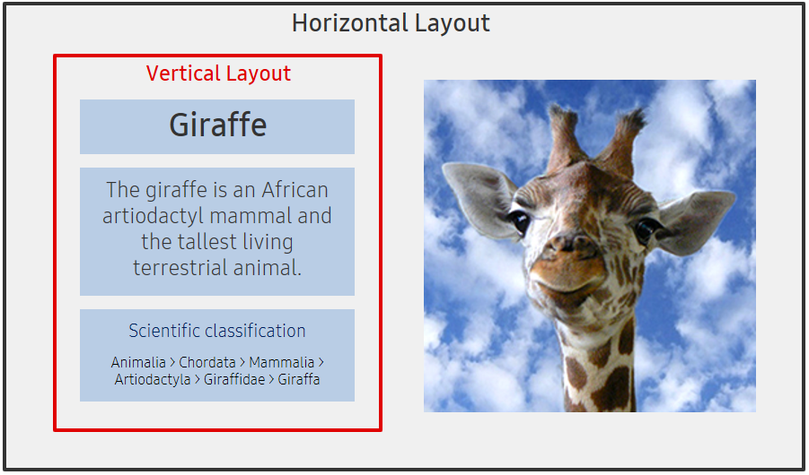

A `View` can be assigned to any layout and then can be re-assigned to a different layout. However, a layout can be used with one `View` at a time.

New layouts can be implemented by deriving them from the layout base class and positioning the children according to the requirement. To create a custom layout, see [Creating Custom Layouts](./custom-layout.md).

## Common layouts

| Type | Description | Look |
| --- | --- | --- |
| [AbsoluteLayout](./absolute-layout.md) | `AbsoluteLayout` is the default `View` layout that allows explicit positioning of child elements. The position of children starts from the top of the layout and can be set using the `Position` property.<br /><br /> [Guide](./absolute-layout.md) / [API Documentation](/application/dotnet/api/TizenFX/latest/api/Tizen.NUI.AbsoluteLayout.html) / [C# code](./nui-example-code/AbsoluteLayoutExample.cs) / [XAML code](./nui-example-code/AbsoluteLayoutExample.xaml) | 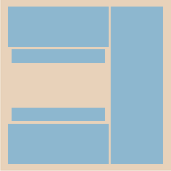 |
| [LinearLayout](./linear-layout.md) | `LinearLayout` is a box layout that arranges the child views vertically or horizontally based on `LinearOrientation` property. `LinearAlignment` defines starting position of the children. `CellPadding` property controls the space between views except for the start, end, top, or bottom of the layout.<br /><br /> [Guide](./linear-layout.md) / [Sample](https://github.com/Samsung/Tizen-CSharp-Samples/tree/master/Mobile/NUI/LinearLayout/NUILinearLayout)  / [API Documentation](/application/dotnet/api/TizenFX/latest/api/Tizen.NUI.LinearLayout.html) / [C# code](./nui-example-code/LinearLayoutExample.cs) / [XAML code](./nui-example-code/LinearLayoutExample.xaml) | [LinearLayout Example](./media/linear-Layout.png) |
| [GirdLayout](./grid-layout.md) | `GridLayout` is a grid box for the two dimensional layout. It constraints the x and y position, width, and height of the child actors. It positions the children in a grid form, where the size of each column and row is set to the largest size of the cells belonging to their axis. <br /><br /> [Guide](./grid-layout.md) / [Sample](https://github.com/Samsung/Tizen-CSharp-Samples/tree/master/Mobile/NUI/GridLayout) / [API Documentation](/application/dotnet/api/TizenFX/latest/api/Tizen.NUI.FlexLayout.html) / [C# code](./nui-example-code/GridLayoutExample.cs) / [XAML code](./nui-example-code/GridLayoutExample.xaml) | 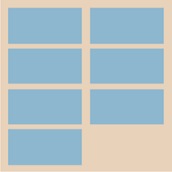 |
| [FlexLayout](./flex-layout.md) | `FlexLayout` is a flexible box layout, that provides a more efficient way to layout, align, and distribute space among items in the container, even when their size is unknown or dynamic. The Tizen layout provides features such as wrapping that automatically positions items that do not fit on axis to another row or column.<br /><br /> [Guide](./flex-layout.md) / [Sample](https://github.com/Samsung/Tizen-CSharp-Samples/tree/master/Mobile/NUI/FlexLayout) / [API Documentation](/application/dotnet/api/TizenFX/latest/api/Tizen.NUI.FlexLayout.html) / [C# code](./nui-example-code/FlexLayoutExample.cs) / [XAML code](./nui-example-code/FlexLayoutExample.xaml) | 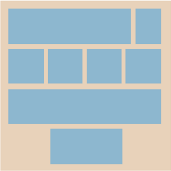 |
| [RelativeLayout](./relative-layout.md) | `RelativeLayout` is a box layout that displays views in the relative positions to the parent or the sibling view.  The area of a RelativeLayout box can be specified by using left, right, top and bottom offsets, and the child elements can be aligned vertically or horizontally.<br /><br /> [Guide](./relative-layout.md) / [API Documentation](/application/dotnet/api/TizenFX/latest/api/Tizen.NUI.RelativeLayout.html) / [C# code](./nui-example-code/RelativeLayoutExample.cs) / [XAML code](./nui-example-code/RelativeLayoutExample.xaml) | 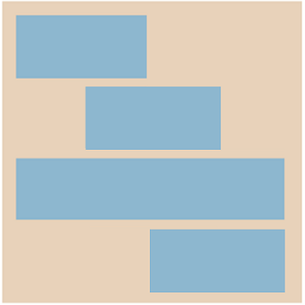 |

## How to lay out view

This section explains how to set the layout to `View` and how to handle the size and position of its children.
In addition, the section explains how to set minimum and maximum size and how padding and margin work in NUI Layout framework.

### Set view layout

To layout the children in a `View` as desired, you must create a layout and set it to the `View`. NUI Layouts support the extra settings. For example, you can set the number of columns for a `GridLayout`.

The following code shows how to create `View` and `LinearLayout`, and how to set the layout on `View`.
`LinearLayout` can be vertical or horizontal. In this example, the linear layout has a horizontal orientation:

```csharp
View parentView = new View();

var layout = new LinearLayout();
layout.LinearOrientation = LinearLayout.Orientation.Horizontal;

parentView.Layout = layout;
```

A `View` can be assigned to a new layout. This change rearranges the children in the View as described by the new layout.
At a time, you can assign only one layout to a single `View`. If you assign the same layout to multiple Views then the layout is applied only to the last `View`.
If a layout is moved from one `View` to another, the default layout is assigned to "View" from which it is moved.

The following code shows how to change the layout from `LinearLayout` to `GridLayout` on an event occurrence:

```csharp
View parentView = new View();

var layoutLinear = new LinearLayout();
layout.LinearOrientation = LinearLayout.Orientation.Horizontal;

parentView.Layout = layoutLinear;

...

someAction.Event += (sender, e) =>
{
  parentView.Layout = new GridLayout();
}
```

### Size specifications

Size specification is used to specify the preferred size of `View` within the layout framework. Height and width are individual values, so each value can have a different specification.

Following are the two size specifications available for `View`:

- Setting **explicit value**
- **Layout parameters**

You can provide an explicit value, either using the existing [Size](/application/dotnet/api/TizenFX/latest/api/Tizen.NUI.Size.html) API or setting a pixel value to the specification.
You can specify the exact measurement for the width and height value.

  Using [Specification](/application/dotnet/api/TizenFX/latest/api/Tizen.NUI.BaseComponents.View.html#Tizen_NUI_BaseComponents_View_HeightSpecification) API

  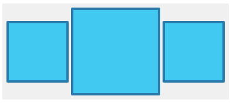

  ```csharp
  View child1 = new View();
  child1.WidthSpecification = 90;
  child1.HeightSpecification = 90;

  View child2 = new View();
  child2.WidthSpecification = 120;
  child2.HeightSpecification = 120;

  View child3 = new View();
  child3.WidthSpecification = 90;
  child3.HeightSpecification = 90;
  ```

You can use the layout parameters `MatchParent` or `WrapContent` to set the width and height values as relative sizes. `MatchParent` extends the size of a child to its parent `View`. `WrapContent` shrinks the size of the parent or child `View` to the size of the child `View`.

- `WrapContent`

  If the height or width specification of `View` is set to `WrapContent`, that size of the `View` changes to wrap around the child.

  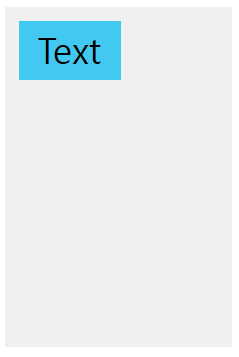

  ```csharp
  View childView = new View();
  childView.WidthSpecification = LayoutParamPolicies.WrapContent;
  childView.HeightSpecification = LayoutParamPolicies.WrapContent;
  ```

- `MatchParent`

  If the height or width specification of `View` is set to `MatchParent`, the height or width extend and fit to parent size.

  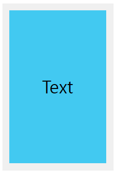

  ```csharp
  View childView = new View();
  childView.WidthSpecification = LayoutParamPolicies.MatchParent;
  childView.HeightSpecification = LayoutParamPolicies.MatchParent;
  ```

### Padding and margin

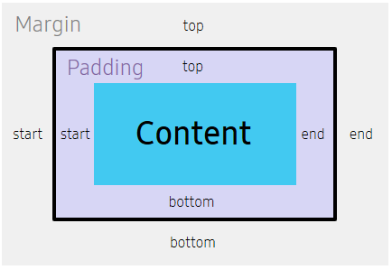

`Padding` and `Margin` provide additional control within a layout to achieve a desired look.

`Padding` and `Margin` use the four properties of the [Extents](/application/dotnet/api/TizenFX/latest/api/Tizen.NUI.Extents.html) class to set their positions. The four [properties](/application/dotnet/api/TizenFX/latest/api/Tizen.NUI.Extents.html#properties) are Start, Top, End, and Bottom.

#### Padding

`Padding` is the internal space between the boundary of `View` and its content.
`View` with a layout will have child Views as content. If you set `Padding` to a parent `View`, then the padding decides the distance from the parent `View` to the child Views.

`Padding` gives an offset to the children in a Layout `View`.

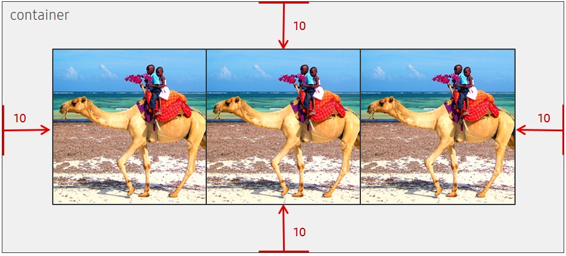

```csharp
View container = new View();
var layout = new LinearLayout();
container.Layout = layout;

container.Padding = new Extents(10, 10, 10, 10);

View childView = new View();
childView.WidthSpecification = LayoutParamPolicies.MatchParent;
childView.HeightSpecification = LayoutParamPolicies.MatchParent;

container.Add(childView);
```

#### Margin

`Margin` is the external space around a `View`. `View` with a layout will have child Views as content.
If you set `Margin` to a child `View`, then the margin decides the distance from the parent `View` to the child `View`.

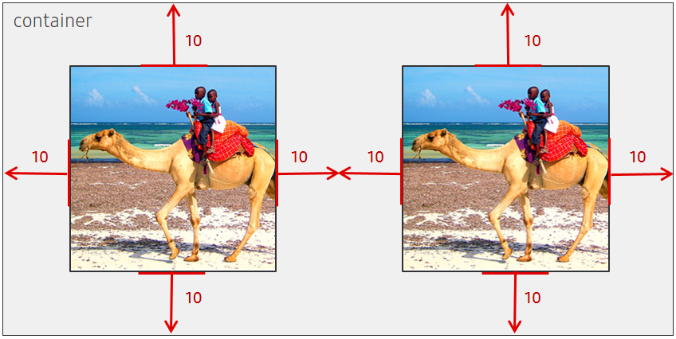

```csharp
View container = new View();
var layout = new LinearLayout();
container.Layout = layout;

View childView = new View();
childView.WidthSpecification = LayoutParamPolicies.WrapContent;
childView.HeightSpecification = LayoutParamPolicies.WrapContent;
childView.Margin = new Extents(10, 10, 10, 10);

View childView2 = new View();
childView2.WidthSpecification = LayoutParamPolicies.WrapContent;
childView2.HeightSpecification = LayoutParamPolicies.WrapContent;
childView2.Margin = new Extents(10, 10, 10, 10);

container.Add(childView);
container.Add(childView2);

```

### Minimum and maximum sizes

The Layout framework controls the size of Views it lays out. The size of a child `View` can be smaller or larger than its natural size or a specified size.

In the NUI Layout framework, a preferred minimum and maximum size is provided if a preference exists. Then, the Layout framework tries to keep the size of `View` within the given values.

The layout parameters such as `MatchParent` and `WrapContent` are used to minimize or maximize the size of `View`.

If you specify an explicit size and set the minimum or maximum size, the NUI Layout framework ensures that the explicit size is within the minimum and maximum boundary.

```csharp
View childView = new View();
childView.WidthSpecification = LayoutParamPolicies.WrapContent;
childView.HeightSpecification = LayoutParamPolicies.WrapContent;

childView.MinimumSize.width = 200;
childView.MinimumSize.height = 200;
childView.MaximumSize.width = 400;
childView.MaximumSize.height = 400;
```

## Related information

- Dependencies
  -  Tizen 5.5 and Higher
