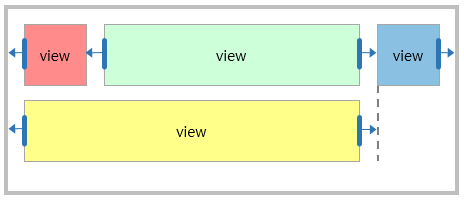
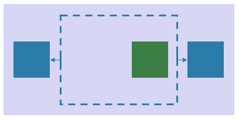
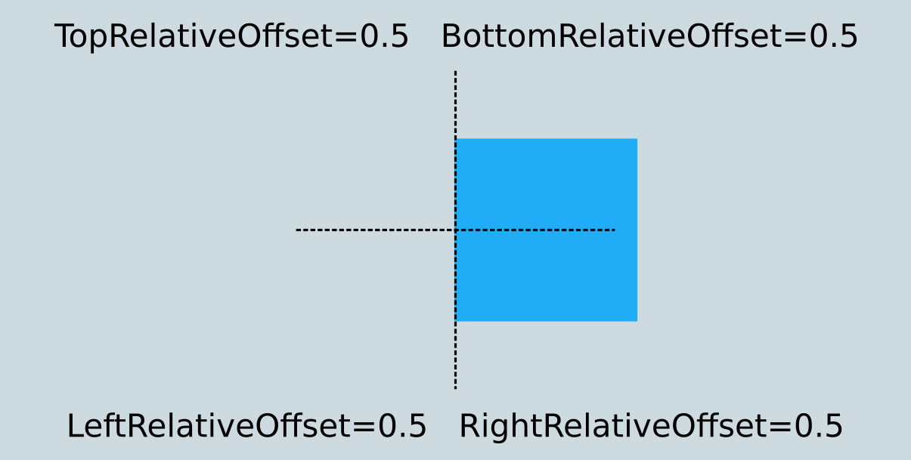
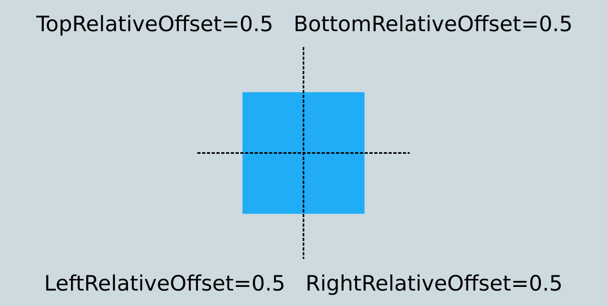
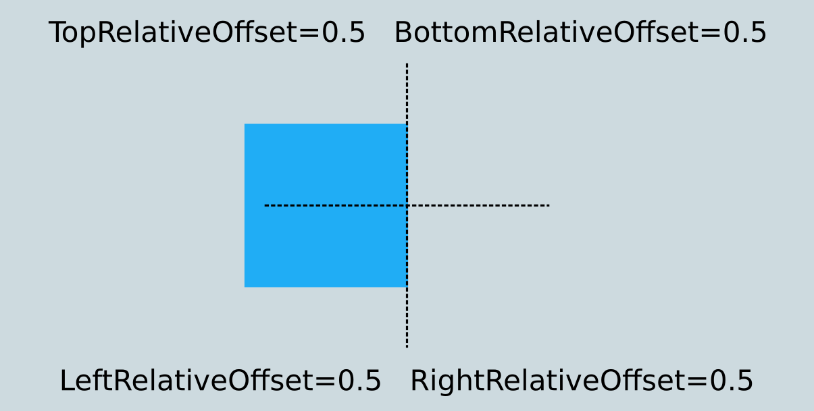
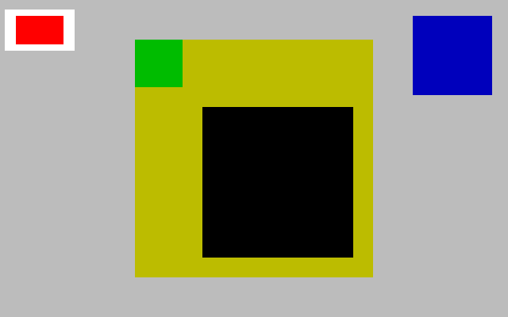
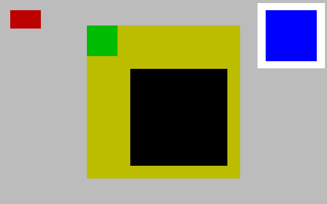
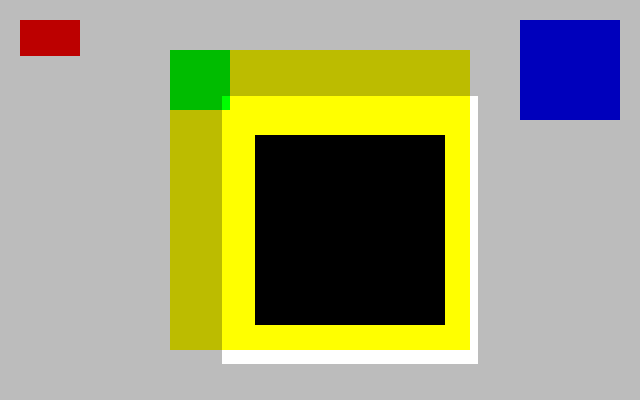

<style>
    .tabcontent img {
        border: 1px solid #555;
        max-width: 100% !important;
        max-height: 100%;
    }
</style>

# Relative layout

The `RelativeLayout` is a layout class in which each side of the child can be specified as relative to the sibling view or the parent. The `Target` and the `RelativeOffset` properties define a relationship with each other.
The following figure shows the relative layout position of rectangles with `Target` and `RelativeOffset`. The arrows in the preview indicate where the `LeftTarget` and the `RightTarget` are pointing:

**Figure: Relative layout example with `Target` and `RelativeOffset`**


```xaml
<View x:Name="Parent">
    <View.Layout>
        <RelativeLayout/>
    </View.Layout>

    <View x:Name="RedRect"
        BackgroundColor="1,0,0,1"
        WidthSpecification="100"
        HeightSpecification="100"/>

    <View x:Name="GreenRect"
        BackgroundColor="0,1,0,1" HeightSpecification="100"
        RelativeLayout.LeftTarget={x:Reference Name=RedRect}"
        RelativeLayout.RightTarget="{x:Reference Name=BlueRect}"
        RelativeLayout.FillHorizontal="true"
        RelativeLayout.LeftRelativeOffset="1.0"/>

    <View x:Name="BlueRect"
        BackgroundColor="0,0,1,1"
        WidthSpecification="100"
        HeightSpecification="100"
        RelativeLayout.RightRelativeOffset="1.0"
        RelativeLayout.LeftRelativeOffset="1.0"
        RelativeLayout.HorizontalAlignment="End"/>

    <View x:Name="YellowRect"
        BackgroundColor="1,1,0,1"
        HeightSpecification="100"
        RelativeLayout.LeftTarget="{x:Reference Name=Parent}"
        RelativeLayout.RightTarget="{x:Reference Name=BlueRect}"
        RelativeLayout.FillHorizontal="true"/>
</View>
```

- When the `Target` and the `RelativeOffset` properties are set as default:
  - The `RedRect` is aligned to the left side of the parent layout.
  - The `BlueRect` is aligned to the right side of the parent layout by the `HorizontalAlignment`.
  - The left side of `GreenRect` is set to be aligned with `RedRect` and the right side is set to be aligned with `BlueRect`.
  - The `GreenRect` fills the space between `RedRect` and `BlueRect` by using `FillHorizontal`.
  - The `YellowRect` represents that each side can be set as sibling view and parent layout.

**Figure: Relative layout with `Target` and `RelativeOffset` on different screen resolutions**



Since the children of the relative layout are laid out depending on their relationship, therefore you can create a responsive UI that keeps the proportions across different screen resolutions without modifications.
The width of `RedRect` and `BlueRect` is set as `100` by specifying the `WidthSpecification` property. However, the width of `GreenRect` and `YellowRect` is resized within the layout space that is set by the `LeftTarget` and `RightTarget`.

The following table describes the properties of `RelativeLayout`:

| Property               | Type            | Description  |
| -----------------------| --------------- | ------------ |
| `LeftTarget`           | View            | Gets or sets the target that the child's left side is referring to.|
| `RightTarget`          | View            | Gets or sets the target that the child's right side is referring to.|
| `TopTarget`            | View            | Gets or sets the target that the child's top side is referring to.|
| `BottomTarget`         | View            | Gets or sets the target that the child's bottom side is referring to.|
| `LeftRelativeOffset`   | float           | Gets or sets the relative offset for the left target. <br /> When the value is `0`, the left edges of the left target and child view are aligned.<br/> When the value is `1`, the left edge of the child view is aligned to the right edge of the left target. |
| `RightRelativeOffset`  | float           | Gets or sets the relative offset for the right target. <br /> When the value is `0`, the right edge of the child view is aligned to the left edge of the right target.<br/> When the value is `1`, the right edges of the right target and child view are aligned.
| `TopRelativeOffset`    | float           | Gets or sets the relative offset for the top target. <br /> When the value is `0`, the top edges of the top target and child view are aligned.<br/> When the value is `1`, the top edge of the child view is aligned to the bottom edge of the top target.
| `BottomRelativeOffset` | float           | Gets or sets the relative offset for the bottom target. <br /> When the value is `0`, the bottom edge of the child view is aligned to the top edge of the bottom target.<br/>When the value is `1`, the bottom edges of the bottom target and child view are aligned.
| `HorizontalAlignment`  | RelativeLayout.Alignment| Gets or sets the horizontal alignment of the child view.|
| `VerticalAlignment`  | RelativeLayout.Alignment| Gets or sets the vertical alignment of the child view.|
| `FillHorizontal`  | bool | Gets or sets the boolean value. It indicates whether or not the child fills its horizontal space.|
| `FillVertical`  | bool | Gets or sets the boolean value. It indicates whether or not the child fills its vertical space.|

## Layout space of child view

The `Target` and the `RelativeOffset` properties determine the size of the layout space. The `Target` property indicates the target view in which each edge of the layout space is aligned. The default value is `null`, which refers to the relative layout.

The `RelativeOffset` moves each edge of layout space in proportion to the target view size:
- If the value is `0.0f`, the edge of the layout space is aligned with the left or top edge of the target view.
- If the value is `1.0f`, the edge of the layout space is aligned with the right or bottom edge of the target view:


## Alignment

The `HorizontalAlignment` and the `VerticalAlignment` properties describe how to align the child view with the layout space. The default value is `Start` for both the axes:
 |`HorizontalAlignment`: Start|`HorizontalAlignment`: Center|`HorizontalAlignment`: End|
 |:---:|:---:|:---:|
 ||||

The alignment property allows to position child view within its parent. Child could be centered horizontally or vertically. It also could be aligned to the top, bottom, left or right edge of the parent.

|`HorizontalAlignment`: Start |`HorizontalAlignment`: Center|`HorizontalAlignment`: End|
| :---: | :---: | :---: |
|  |  |  |

## Fill

 The `FillHorizontal` and the `FillVertical` properties are specified by boolean values. These boolean values specify whether or not to fill the layout space. The default is `false` for both the axes:
 |`FillHorizontal`: false|`FillHorizontal`: true|
 |:---:|:---:|
 |||

> [!NOTE]
>The component can take the size of the parent view only when the `WidthSpecification`/`HeightSpecification` property is set to `WrapContent`.

## Example

RelativeLayout can fill the bounded container with the content of the view. It is possible to fill the container horizontally and vertically.


### RelativeLayout initialization

<div id="TabSection1">
    <div class="sampletab" id="ProjectCreateTab">
        <button id="RelativeLayout-Init-CSharp" class="tablinks " onclick="openTabSection(event, 'RelativeLayout-Init-CSharp', 'TabSection1') ">C#</button>
        <button id="RelativeLayout-Init-Xaml" class="tablinks " onclick="openTabSection(event, 'RelativeLayout-Init-Xaml', 'TabSection1') ">Xaml</button>
    </div>
    <div id="RelativeLayout-Init-CSharp" class="tabcontent">
        <table>
            <tbody>
                <tr>
<span style="display:block">

```csharp
View relativeLayoutView = new View
{
    WidthSpecification = LayoutParamPolicies.MatchParent,
    HeightSpecification = LayoutParamPolicies.MatchParent,
    BackgroundColor = Color.White
};

relativeLayoutView.Layout = new RelativeLayout();
```

</span>
                </tr>
            </tbody>
        </table>
    </div>
    <div id="RelativeLayout-Init-Xaml" class="tabcontent">
        <table>
            <tbody>
                <tr>
<span style="display:block">

```xaml
<View
    WidthSpecification="{Static LayoutParamPolicies.MatchParent}"
    HeightSpecification="{Static LayoutParamPolicies.MatchParent}"
    BackgroundColor="White">

    <View.Layout>
        <RelativeLayout />
    </View.Layout>

</View>
```

</span>
                </tr>
            </tbody>
        </table>
    </div>
</div>

### Red view

The following code shows how to create the red view bounded by offsets:



<div id="TabSection2">
    <div class="sampletab " id="ProjectCreateTab">
        <button id="RelativeLayout-RedView-CSharp" class="tablinks " onclick="openTabSection(event, 'RelativeLayout-RedView-CSharp', 'TabSection2') ">C#</button>
        <button id="RelativeLayout-RedView-Xaml" class="tablinks " onclick="openTabSection(event, 'RelativeLayout-RedView-Xaml', 'TabSection2') ">Xaml</button>
    </div>
    <div id="RelativeLayout-RedView-CSharp" class="tabcontent">
        <table>
            <tbody>
                <tr>
<span style="display:block">

- `RelativeLayout.SetLeftRelativeOffset(redView, 0.0f)` - view's left is at the parent's left.
- `RelativeLayout.SetRightRelativeOffset(redView, 0.1f)` - view's right is at the position of 0.1 width from the parent's left.
- `RelativeLayout.SetTopRelativeOffset(redView, 0.0f)` - view's top is at the parent's top.
- `RelativeLayout.SetBottomRelativeOffset(redView, 0.1f)` - view's bottom bound is at the position of 0.1 width from the parent's top.
- `RelativeLayout.SetFillHorizontal(redView, true)` and `RelativeLayout.SetFillVertical(redView, true)` - Since the view does not have its Width and Height, the view should be filled with the relative position (left, right, top, and bottom).

```csharp
View redView = new View
{
    BackgroundColor = Color.Red
};

RelativeLayout.SetLeftRelativeOffset(redView, 0.0f);
RelativeLayout.SetRightRelativeOffset(redView, 0.1f);
RelativeLayout.SetTopRelativeOffset(redView, 0.0f);
RelativeLayout.SetBottomRelativeOffset(redView, 0.1f);

RelativeLayout.SetFillHorizontal(redView, true);
RelativeLayout.SetFillVertical(redView, true);

relativeLayoutView.Add(redView);
```

</span>
                </tr>
            </tbody>
        </table>
    </div>
    <div id="RelativeLayout-RedView-Xaml" class="tabcontent">
        <table>
            <tbody>
                <tr>
<span style="display:block">

- `RelativeLayout.LeftRelativeOffset="0.0"` - view's left is at the parent's left.
- `RelativeLayout.RightRelativeOffset="0.1"` - view's right is at the position of 0.1 width from the parent's left.
- `RelativeLayout.TopRelativeOffset="0.0"` - view's top is at the parent's top.
- `RelativeLayout.BottomRelativeOffset="0.1"` - view's bottom bound is at the position of 0.1 width from the parent's top.
- `RelativeLayout.FillHorizontal="true"` and `RelativeLayout.FillVertical="true"` - Since the view does not have its Width and Height, the view should be filled with the relative position (left, right, top, and bottom).

```xaml
<View x:name="redView"
    BackgroundColor="Red"
    RelativeLayout.LeftRelativeOffset="0.0"
    RelativeLayout.RightRelativeOffset="0.1"
    RelativeLayout.TopRelativeOffset="0.0"
    RelativeLayout.BottomRelativeOffset="0.1"
    RelativeLayout.FillHorizontal="True"
    RelativeLayout.FillVertical="True"/>
```

</span>
                </tr>
            </tbody>
        </table>
    </div>
</div>

### Blue view

The following code shows how to position the blue view with predefined size and change its position beginning with `HorizontalAlignment`.



<div id="TabSection3">
    <div class="sampletab " id="ProjectCreateTab">
        <button id="RelativeLayout-BlueView-CSharp" class="tablinks " onclick="openTabSection(event, 'RelativeLayout-BlueView-CSharp', 'TabSection3') ">C#</button>
        <button id="RelativeLayout-BlueView-Xaml" class="tablinks " onclick="openTabSection(event, 'RelativeLayout-BlueView-Xaml', 'TabSection3') ">Xaml</button>
    </div>
    <div id="RelativeLayout-BlueView-CSharp" class="tabcontent">
        <table>
            <tbody>
                <tr>
<span style="display:block">

- `WidthSpecification` and `HeightSpecification` - set the size of the view.
- `RelativeLayout.SetLeftRelativeOffset(blueView, 1.0f)` - view's left is on the parent's left.
- `RelativeLayout.SetRightRelativeOffset(blueView, 1.0f)` - view's right is on the parent's right.
- `RelativeLayout.SetTopRelativeOffset(blueView, 0.0f)` - view's top is on the parent's top.
- `RelativeLayout.SetBottomRelativeOffset(blueView, 0.0f)` - view's bottom is on the parent's top.
- `RelativeLayout.SetHorizontalAlignment(blueView, RelativeLayout.Alignment.End)` - position view begins from right to left from the container.

```csharp
View blueView = new View
{
    BackgroundColor = Color.Blue,
    WidthSpecification = 200,
    HeightSpecification = 200
};

RelativeLayout.SetLeftRelativeOffset(blueView, 1.0f);
RelativeLayout.SetRightRelativeOffset(blueView, 1.0f);
RelativeLayout.SetTopRelativeOffset(blueView, 0.0f);
RelativeLayout.SetBottomRelativeOffset(blueView, 0.0f);

RelativeLayout.SetHorizontalAlignment(blueView, RelativeLayout.Alignment.End);
relativeLayoutView.Add(blueView);
```

</span>
                </tr>
            </tbody>
        </table>
    </div>
    <div id="RelativeLayout-BlueView-Xaml" class="tabcontent">
        <table>
            <tbody>
                <tr>
<span style="display:block">

- `RelativeLayout.LeftRelativeOffset="1.0"` - view's left is on the parent's right.
- `RelativeLayout.RightRelativeOffset="1.0"` - view's right is on the parent's right.
- `RelativeLayout.TopRelativeOffset="0.0"` - view's top is on the parent's top.
- `RelativeLayout.BottomRelativeOffset="0.0"` - view's bottom is on the parent's top.
- `WidthSpecification` and `HeightSpecification` set the size of the view.
- `RelativeLayout.HorizontalAlignment="End"` - position view begins from right to left from the container.

```xaml
<View x:name="blueView"
    BackgroundColor="Blue"
    WidthSpecification="200"
    HeightSpecification="200"

    RelativeLayout.LeftRelativeOffset="1.0"
    RelativeLayout.RightRelativeOffset="1.0"
    RelativeLayout.TopRelativeOffset="0.0"
    RelativeLayout.BottomRelativeOffset="0.0"

    RelativeLayout.HorizontalAlignment="End"/>
```

</span>
                </tr>
            </tbody>
        </table>
    </div>
</div>

### Yellow view

The following code shows how to center yellow view with predefined size.


<div id="TabSection4">
    <div class="sampletab " id="ProjectCreateTab">
        <button id="RelativeLayout-YellowView-CSharp" class="tablinks " onclick="openTabSection(event, 'RelativeLayout-YellowView-CSharp', 'TabSection4') ">C#</button>
        <button id="RelativeLayout-YellowView-Xaml" class="tablinks " onclick="openTabSection(event, 'RelativeLayout-YellowView-Xaml', 'TabSection4') ">Xaml</button>
    </div>
    <div id="RelativeLayout-YellowView-CSharp" class="tabcontent">
        <table>
            <tbody>
                <tr>
<span style="display:block">

- `RelativeLayout.SetLeftRelativeOffset(yellowView, 0.5f)` - view's left is on center of the parent's view.
- `RelativeLayout.SetRightRelativeOffset(yellowView, 0.5f)` - view's right is on center of the parent's view.
- `RelativeLayout.SetTopRelativeOffset(yellowView, 0.5f)` - view's top is on center of the parent's view.
- `RelativeLayout.SetBottomRelativeOffset(yellowView, 0.5f)` - view's bottom is on center of the parent's view.
- `WidthSpecification` and `HeightSpecification` set the size of the view.
- `RelativeLayout.SetHorizontalAlignment(yellowView, RelativeLayout.Alignment.Center)` and `RelativeLayout.SetVerticalAlignment(yellowView, RelativeLayout.Alignment.Center)` - position view on the center of container.

```csharp
View yellowView = new View
{
    BackgroundColor = Color.Yellow,
    WidthSpecification = 600,
    HeightSpecification = 600
};

RelativeLayout.SetLeftRelativeOffset(yellowView, 0.5f);
RelativeLayout.SetRightRelativeOffset(yellowView, 0.5f);
RelativeLayout.SetTopRelativeOffset(yellowView, 0.5f);
RelativeLayout.SetBottomRelativeOffset(yellowView, 0.5f);

RelativeLayout.SetHorizontalAlignment(yellowView, RelativeLayout.Alignment.Center);
RelativeLayout.SetVerticalAlignment(yellowView, RelativeLayout.Alignment.Center);
relativeLayoutView.Add(yellowView);
```

</span>
                </tr>
            </tbody>
        </table>
    </div>
    <div id="RelativeLayout-YellowView-Xaml" class="tabcontent">
        <table>
            <tbody>
                <tr>
<span style="display:block">

- `RelativeLayout.LeftRelativeOffset="0.5"` - view's left is on center of the parent's view.
- `RelativeLayout.RightRelativeOffset="0.5"` - view's right is on center of the parent's view.
- `RelativeLayout.TopRelativeOffset="0.5"` - view's top is on center of the parent's view.
- `RelativeLayout.BottomRelativeOffset="0.5"` - view's bottom is on center of the parent's view.
- `WidthSpecification` and `HeightSpecification` set the size of the view.
- `RelativeLayout.HorizontalAlignment="Center"` and `RelativeLayout.VerticalAlignment="Center"` - position view on the center of the container.

```xaml
<View x:Name="yellowView"
    BackgroundColor="Yellow"
    WidthSpecification="600"
    HeightSpecification="600"
    RelativeLayout.LeftRelativeOffset="0.5"
    RelativeLayout.RightRelativeOffset="0.5"
    RelativeLayout.TopRelativeOffset="0.5"
    RelativeLayout.BottomRelativeOffset="0.5"
    RelativeLayout.HorizontalAlignment="Center"
    RelativeLayout.VerticalAlignment="Center"/>
```

</span>
                </tr>
            </tbody>
        </table>
    </div>
</div>

### Green view

The following code shows how to create the green view to relate to yellowView for every target.


<div id="TabSection5">
    <div class="sampletab " id="ProjectCreateTab">
        <button id="RelativeLayout-GreenView-CSharp" class="tablinks " onclick="openTabSection(event, 'RelativeLayout-GreenView-CSharp', 'TabSection5') ">C#</button>
        <button id="RelativeLayout-GreenView-Xaml" class="tablinks " onclick="openTabSection(event, 'RelativeLayout-GreenView-Xaml', 'TabSection5') ">Xaml</button>
    </div>
    <div id="RelativeLayout-GreenView-CSharp" class="tabcontent">
        <table>
            <tbody>
                <tr>
<span style="display:block">

- View's targets are set to the `yellowView`.
- `RelativeLayout.SetLeftRelativeOffset(greenView, 0.0f)` - view's left is at the yellowView's left.
- `RelativeLayout.SetRightRelativeOffset(greenView, 0.2f)` - view's right is at the position of 0.2 width from the yellowView's left.
- `RelativeLayout.SetTopRelative Offset(greenView, 0.0f)` - view's top is at the yellowView's top.
- `RelativeLayout.SetBottomRelativeOffset(greenView, 0.2f)` - view's bottom is at the position of 0.2 width from the yellowView's left.
- `RelativeLayout.SetFillHorizontal(greenView, true)` and `RelativeLayout.SetFillVertical(greenView, true)` - Since the view does not have its Width and Height, the view should be filled with the relative position (left, right, top, and bottom).

```csharp
View greenView = new View
{
    BackgroundColor = Color.Green
};

RelativeLayout.SetLeftTarget(greenView, yellowView);
RelativeLayout.SetRightTarget(greenView, yellowView);
RelativeLayout.SetTopTarget(greenView, yellowView);
RelativeLayout.SetBottomTarget(greenView, yellowView);

RelativeLayout.SetLeftRelativeOffset(greenView, 0.0f);
RelativeLayout.SetRightRelativeOffset(greenView, 0.2f);
RelativeLayout.SetTopRelativeOffset(greenView, 0.0f);
RelativeLayout.SetBottomRelativeOffset(greenView, 0.2f);

RelativeLayout.SetFillHorizontal(greenView, true);
RelativeLayout.SetFillVertical(greenView, true);
relativeLayoutView.Add(greenView);
```

- View's targets are set to the `yellowView`.
- `RelativeLayout.LeftRelativeOffset="0.0"` - view's left is at the yellowView's left.
- `RelativeLayout.RightRelativeOffset="0.2"` - view's right is at the position of 0.2 width from the yellowView's left.
- `RelativeLayout.TopRelativeOffset="0.0"` - view's top is at the yellowView's top.
- `RelativeLayout.BottomRelativeOffset="0.2"` - view's bottom is at the position of 0.2 width from the yellowView's left.
- `RelativeLayout.FillHorizontal="true"` and `RelativeLayout.FillVertical="true"` - Since the view does not have its Width and Height, the view should be filled with the relative position (left, right, top, and bottom).

</span>
                </tr>
            </tbody>
        </table>
    </div>
    <div id="RelativeLayout-GreenView-Xaml" class="tabcontent">
        <table>
            <tbody>
                <tr>
<span style="display:block">

```xaml
<View x:Name="greenView"
    BackgroundColor="Green"
    RelativeLayout.LeftTarget="{x:Reference Name=yellowView}"
    RelativeLayout.RightTarget="{x:Reference Name=yellowView}"
    RelativeLayout.TopTarget="{x:Reference Name=yellowView}"
    RelativeLayout.BottomTarget="{x:Reference Name=yellowView}"
    RelativeLayout.LeftRelativeOffset="0.0"
    RelativeLayout.RightRelativeOffset="0.2"
    RelativeLayout.TopRelativeOffset="0.0"
    RelativeLayout.BottomRelativeOffset="0.2"
    RelativeLayout.FillHorizontal="True"
    RelativeLayout.FillVertical="True"/>
```

</span>
                </tr>
            </tbody>
        </table>
    </div>
</div>

### Black view

The following code shows how to create the black view related to yellowView and greenView.



<div id="TabSection6">
    <div class="sampletab " id="ProjectCreateTab">
        <button id="RelativeLayout-BlackView-CSharp" class="tablinks " onclick="openTabSection(event, 'RelativeLayout-BlackView-CSharp', 'TabSection6') ">C#</button>
        <button id="RelativeLayout-BlackView-Xaml" class="tablinks " onclick="openTabSection(event, 'RelativeLayout-BlackView-Xaml', 'TabSection6') ">Xaml</button>
    </div>
    <div id="RelativeLayout-BlackView-CSharp" class="tabcontent">
        <table>
            <tbody>
                <tr>
<span style="display:block">

- View's left and top targets are set to `greenView`.
- View's right and bottom targets are set to `yellowView`.
- `RelativeLayout.SetLeftRelativeOffset(blackView, 1.0f)` - view's left is on the greenView's right.
- `RelativeLayout.SetRightRelativeOffset(blackView, 1.0f)` - view's right is on the yellowView's right.
- `RelativeLayout.SetTopRelativeOffset(blackView, 1.0f)` - view's top is on the greenView's bottom.
- `RelativeLayout.SetBottomRelativeOffset(blackView, 1.0f)` - view's bottom is on the yellowView's bottom.
- `RelativeLayout.SetFillHorizontal(blackView, true)` and `RelativeLayout.SetFillVertical(blackView, true)` - Since the view does not have its Width and Height, the view should be filled with the relative position (left, right, top, and bottom).

```csharp
View blackView = new View
{
    BackgroundColor = Color.Black,
    Margin = new Extents(50, 50, 50, 50)
};

RelativeLayout.SetLeftTarget(blackView, greenView);
RelativeLayout.SetRightTarget(blackView, yellowView);
RelativeLayout.SetTopTarget(blackView, greenView);
RelativeLayout.SetBottomTarget(blackView, yellowView);

RelativeLayout.SetLeftRelativeOffset(blackView, 1.0f);
RelativeLayout.SetRightRelativeOffset(blackView, 1.0f);
RelativeLayout.SetTopRelativeOffset(blackView, 1.0f);
RelativeLayout.SetBottomRelativeOffset(blackView, 1.0f);

RelativeLayout.SetFillHorizontal(blackView, true);
RelativeLayout.SetFillVertical(blackView, true);
relativeLayoutView.Add(blackView);
```

</span>
                </tr>
            </tbody>
        </table>
    </div>
    <div id="RelativeLayout-BlackView-Xaml" class="tabcontent">
        <table>
            <tbody>
                <tr>
<span style="display:block">

- View's left and top targets are set to `greenView`.
- View's right and bottom targets are set to `yellowView`.
- `RelativeLayout.LeftRelativeOffset="1.0"` - view's left is on the greenView's right.
- `RelativeLayout.RightRelativeOffset="1.0"` - view's right is on the yellowView's right.
- `RelativeLayout.TopRelativeOffset="1.0"` - view's top is on the greenView's bottom.
- `RelativeLayout.BottomRelativeOffset="1.0"` - view's bottom is on the yellowView's bottom.
- `RelativeLayout.FillHorizontal="true"` and `RelativeLayout.FillVertical="true"` - Since the view does not have its Width and Height, the view should be filled with the relative position (left, right, top, and bottom).

```xaml
<View x:name="blackView"
    BackgroundColor="Black"
    RelativeLayout.LeftTarget="{x:Reference Name=greenView}"
    RelativeLayout.RightTarget="{x:Reference Name=yellowView}"
    RelativeLayout.TopTarget="{x:Reference Name=greenView}"
    RelativeLayout.BottomTarget="{x:Reference Name=yellowView}"
    RelativeLayout.LeftRelativeOffset="1.0"
    RelativeLayout.RightRelativeOffset="1.0"
    RelativeLayout.TopRelativeOffset="1.0"
    RelativeLayout.BottomRelativeOffset="1.0"
    RelativeLayout.FillHorizontal="True"
    RelativeLayout.FillVertical="True"
    Margin="50,50,50,50"/>
```

</span>
                </tr>
            </tbody>
        </table>
    </div>
</div>

## Related information

- Dependencies
  -  Tizen 6.5 and Higher

<script>
    function openTabSection(evt, profileName, sectionId) {
        var i, tabcontent, tablinks, section;
        let selected = 0;

        section = document.getElementById(sectionId);
        tabcontent = section.getElementsByClassName("tabcontent");

        for (i = 0; i < tabcontent.length; i++) {
            tabcontent[i].style.display = "none";
            if (tabcontent[i].id == profileName) {
                selected = i;
            }
        }

        tablinks = section.getElementsByClassName("tablinks");

        for (i = 0; i < tablinks.length; i++) {
            tablinks[i].className = tablinks[i].className.replace(" active", "");
        }

        tabcontent[selected].style.display = "block";
        evt.currentTarget.className += " active";
    }

    document.getElementById("RelativeLayout-Init-CSharp").click();
    document.getElementById("RelativeLayout-RedView-CSharp").click();
    document.getElementById("RelativeLayout-BlueView-CSharp").click();
    document.getElementById("RelativeLayout-YellowView-CSharp").click();
    document.getElementById("RelativeLayout-GreenView-CSharp").click();
    document.getElementById("RelativeLayout-BlackView-CSharp").click();
</script>
