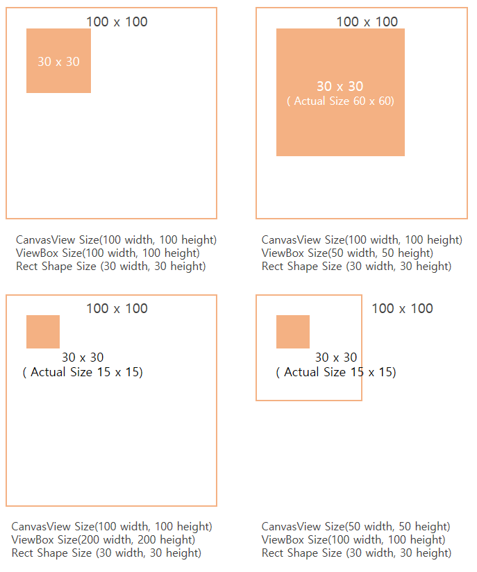

# CanvasView

A CanvasView is an NUI control that displays vector primitives.

## Create a CanvasView

1. To create a canvas view:

    ```cs
    using Tizen.NUI;
    using Tizen.NUI.BaseComponents.VectorGraphics;
    ```

2.  Create an instance of the `CanvasView` class.

    ```cs
    CanvasView canvasView = new CanvasView();
    Window.Instance.Add(canvasView);
    ```

    Create an instance of the `CanvasView` class with viewBox Size

    ```cs
    Size2d viewBox = new Size2D(100, 100);
    CanvasView canvasView = new CanvasView(viewBox);
    Window.Instance.Add(canvasView);
    ```

The `viewBox` is the drawing area inside the `CanvasView`. `Drawable` drawn inside the `CanvasView` is affected by the `size` of the `viewBox`. This is a kind of internal coordinate system.



If the size of `CanvasView` and `viewBox` are the same, the size of the primitive drawn inside is the same as the value set by the application.
However, if the `viewBox` size is larger than the `CanvasView` size, the actual primitive size becomes smaller. Conversely, if the `viewBox` size is smaller than the `CanvasView` size, the primitive is drawn larger.

## Related Information
- Dependencies
  -   Tizen 6.5 and Higher


