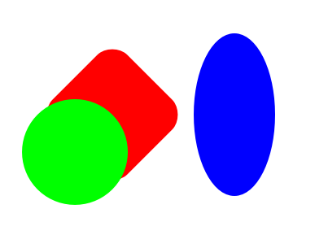
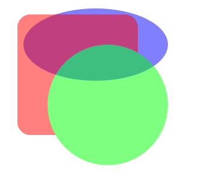
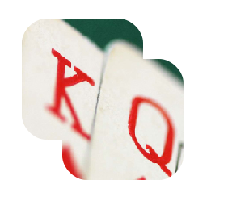
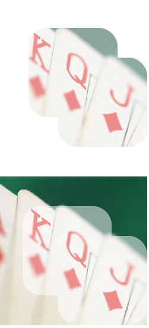

# Transformation and Composition


## Transformation


All Drawable objects can do 2D transformation using `Translate()`, `Scale()` and `Rotate()` APIs.
And it also provides an interface for matrix transformation using a 9-size (3x3 matrix) float type array.

```cs
//generate a drawable group
DrawableGroup drawableGroup = new DrawableGroup();

//generate a round rectangle
Shape rect = new Shape();
rect.AddRect(-50.0f, -50.0f, 100.0f, 100.0f, 20.0f, 20.0f);
rect.FillColor = Color.Red;

//Add the rectangle into the drawable group
drawableGroup.AddDrawable(rect);

//generate a circle
Shape circle = new Shape();
circle.AddCircle(0.0f, 50.0f, 50.0f, 50.0f);
circle.FillColor = Color.Green;

//add the circle into the drawable group
drawableGroup.AddDrawable(circle);

//generate an ellipse
Shape ellipse = new Shape();
ellipse.AddCircle(0.0f, 0.0f, 50.0f, 50.0f);
ellipse.FillColor = Color.Blue;

//transform ellipse using matrix transformation
float[] matrix = new float[] {1.0f, 0.0f, 300.0f,
                              0.0f, 2.0f, 150.0f,
                              0.0f, 0.0f,  1.0f};
ellipse.Transform(matrix);

//add the ellipse into the canvas view
canvasView.AddDrawable(ellipse);

//transform DrawableGroup using transformation APIs
drawableGroup.Rotate(45.0f);
drawableGroup.Scale(1.3f);
drawableGroup.Translate(150.0f, 150.0f);

//add the drawable group into the canvas view
canvasView.AddDrawable(drawableGroup);

```


 


## Composition

All `Drawable` can apply composition for visual effects such as alpha blending, masking(alpha/alpha inverse) and clipping.

### Alpha blending
Alpha blending can be applied by adjusting the `Opacity` property of the `Drawable` object and the alpha values of `FillColor` and `StrokeColor`.
Below is an example of alpha blending in various cases.

```cs
//generate a drawable group
DrawableGroup drawableGroup = new DrawableGroup();

//generate a round rectangle
Shape rect = new Shape();
rect.AddRect(50.0f, 50.0f, 200.0f, 200.0f, 20.0f, 20.0f);
rect.FillColor = Color.Red;

//Add the rectangle into the drawable group
drawableGroup.AddDrawable(rect);

//generate a circle
Shape circle = new Shape();
circle.AddCircle(200.0f, 200.0f, 100.0f, 100.0f);
circle.FillColor = Color.Green;

//add the circle into the drawable group
drawableGroup.AddDrawable(circle);

//set opacity value
drawableGroup.Opacity = 0.5f;

//generate an ellipse
Shape ellipse = new Shape();

ellipse.AddCircle(180.0f, 100.0f, 120.0f, 60.0f);

//set ellipse translucent color
ellipse.FillColor = new Color(0.0f, 0.0f, 1.0f, 0.5f);

//add the ellipse into the canvas view
canvasView.AddDrawable(ellipse);

//add the drawable group into the canvas view
canvasView.AddDrawable(drawableGroup);


```



### Clipping
Clipping is a composition based on path information.
The intersection with clip `Drawable` is determined and only the resulting pixels from own `Drawable` are rendered.

Below is an example of clipping.

```cs
//generate two round rectangles
Shape rect = new Shape();
rect.AddRect(50.0f, 50.0f, 150.0f, 150.0f, 30.0f, 30.0f);
rect.AddRect(100.0f, 100.0f, 150.0f, 150.0f, 30.0f, 30.0f);
rect.FillColor = Color.Red;

//generate a picture
Picture picture = new Picture();
picture.Load( <IMAGE_FILE_PATH> );
picture.SetSize(new Size2D(400, 400));

//clipping picture to rect
picture.ClipPath(rect);

//add the rect into the canvas view
canvasView.AddDrawable(picture);
```



### Masking
As for the `MaskType`, `Alpha` Masking and `InverseAlpha` Masking are provided.

| MaskType       | Description                                                                                |
| -------------- | ------------------------------------------------------------------------------------------ |
| `Alpha`        | Only the part of the own drawable, which intersects with the mask drawable, is visible.    |
| `InverseAlpha` | Only the part of the own drawable, which is not covered by the mask drawable, is visible.  |

Below is an example of masking.

```cs
//generate two round rectangles
Shape rect = new Shape();
rect.AddRect(50.0f, 50.0f, 150.0f, 150.0f, 30.0f, 30.0f);
rect.AddRect(100.0f, 100.0f, 150.0f, 150.0f, 30.0f, 30.0f);
rect.FillColor = Color.Red;
rect.Opacity = 0.5f;

//generate a picture
Picture picture = new Picture();
picture.Load( <IMAGE_FILE_PATH> );
picture.SetSize(new Size2D(250, 250));

//alpha masking picture to rect
picture.Mask(rect, MaskType.Alpha);

//add the rect into the canvas view
canvasView.AddDrawable(picture);

//generate two round rectangles
Shape rect2 = new Shape();
rect2.AddRect(40.0f, 350.0f, 150.0f, 150.0f, 30.0f, 30.0f);
rect2.AddRect(100.0f, 400.0f, 150.0f, 150.0f, 30.0f, 30.0f);
rect2.FillColor = Color.Red;
rect2.Opacity = 0.5f;

//generate a picture
Picture picture2 = new Picture();
picture2.Load( <IMAGE_FILE_PATH> );
picture2.Translate(0.0f ,300.0f);
picture2.SetSize(new Size2D(250, 250));

//inverse alpha masking picture to rect
picture2.Mask(rect2, MaskType.AlphaInverse);

//add the rect into the canvas view
canvasView.AddDrawable(picture2);
```


> [!NOTE]
> A composition may perform an additional render-processing on an off-screen buffer. The excessive usage of a composition may negatively affect processing speed.

## Related Information
- Dependencies
  -   Tizen 6.5 and Higher
