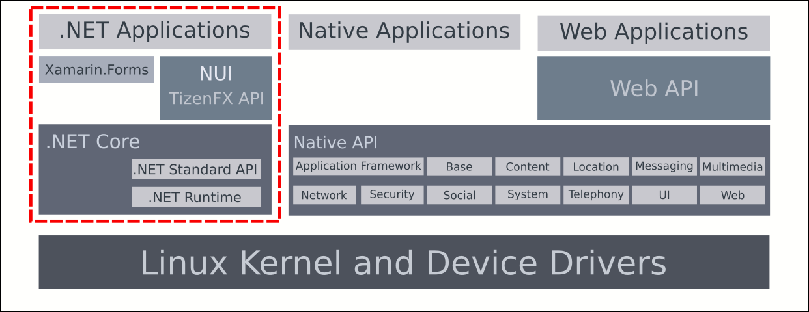

# Learn About .NET

Tizen .NET is an exciting new way to develop applications for the Tizen operating system, running on 50 million Samsung devices, including TVs, wearables, mobile phones, and many other IoT devices around the world.

The existing Tizen frameworks are either C-based with no advantages of a managed runtime or HTML5-based with fewer features and lower performance than the C-based solution. With Tizen .NET, you can use the C# programming language and the Common Language Infrastructure standards, and have benefits from a managed runtime for faster application development and code execution that is efficient and secure.

To start developing Tizen applications using .NET, see [Creating Your First Tizen .NET Application](get-started/first-app.md).

## Managed runtime advantages

Managed runtime offers the following advantages to your application development:

- **Faster development**

  Application development is accelerated as the managed runtime handles many functions that otherwise have to be coded into the application.

- **Safer code**

  Managed runtime can handle bound checking, type safety, garbage collection, memory protection services, and objects that are invoked directly. Tizen Web API already provides some of the mentioned benefits, but does not provide type safety as JavaScript is not a strongly typed language.

- **Lower deployment costs**

  Component-based architecture makes it easier and faster to deploy applications in an enterprise environment characterized by multiple platforms, devices, and legacy systems.

- **Better quality software**

  Managed runtime helps you to focus on the business logic and the code specific to the application while reducing the number of errors in the code.

- **Cross-platform support**

  The managed code is portable. Tizen .NET applications can have large portions of their logic applied to other systems supported by .NET Core and Xamarin.Forms.

## Tizen .NET features and components

Tizen .NET enables you to build .NET applications with NUI and Tizen .NET framework. NUI allows you to easily create a user interface, and TizenFX API provides numerous interfaces 
to much of the hardware that is found in modern TV, mobile, wearable, and IoT devices. NUI (Natural User Interface) is a hardware accelerated C# toolkit which a set of predefined components and layouts for implementing GUI in both 2D and 3D modes. NUI is optimized for speed and low resource usage.

For multiplatform applications Tizen .NET provides Xamarin.Forms framework.

**Figure: Tizen .NET architecture**

Tizen .NET consists of the following main components:

- **.NET Core**

  [.NET Core](https://docs.microsoft.com/en-us/dotnet/core/about) is an [open-source](https://github.com/dotnet/coreclr/blob/master/LICENSE.TXT), general-purpose development platform maintained by Microsoft and the .NET community on [GitHub](https://github.com/dotnet/core). It is cross-platform (supporting Windows, macOS, and Linux) and can be used to build device, cloud, and IoT applications.

  See [About .NET Core](https://docs.microsoft.com/en-us/dotnet/core/about) to learn more about .NET Core, including its characteristics, supported languages and frameworks, and key APIs.

- **Xamarin.Forms**

  [Xamarin.Forms](https://developer.xamarin.com/guides/xamarin-forms/getting-started/) provides cross-platform APIs, which allow you to create user interfaces that can be shared across platforms. Visual Studio Tools for Tizen enable Tizen support for Xamarin.Forms.

- **Tizen.Wearable.CircularUI**

  [Tizen.Wearable.CircularUI](https://samsung.github.io/Tizen.CircularUI/index.html) provides Tizen wearable-specific user interfaces. It is a set of extension APIs of Xamarin.Forms. Tizen.Wearable.CircularUI APIs are supported only on Tizen wearable devices with Tizen .NET support, unlike Xamarin.Forms which support cross platforms.

- **TizenFX API**

  [TizenFX API](api/TizenFX/) allows applications to call into platform-specific functionality from the shared code. This functionality enables Xamarin.Forms applications to do things a native application can do, without causing the portable part of the application to become littered with operating system-specific details.

  TizenFX supports C# APIs, which expose Tizen-specific features such as Tizen application framework, account management, location services, media services, and connectivity.

### Visual Studio Tools for Tizen

Visual Studio Tools for Tizen provides Tizen-specific tools to improve your productivity.

You can create a Tizen .NET application project with Project Wizard tool in Visual Studio Tools for Tizen. When you create a new project with a specific template, Project Wizard uses it to automatically create basic functionalities, and default project files and folders for the application.

Visual Studio Tools for Tizen extension is registered in Visual Studio Marketplace. You can [install the extension](../vstools/install.md) from Visual Studio Marketplace in the Visual Studio IDE. To download Visual Studio 2017 for Tizen, click . To use the latest version of Visual Studio, download [Visual Studio Tools for Tizen for Visual Studio](https://marketplace.visualstudio.com/items?itemName=tizen.VSToolsforTizen).

For more information, see the [Visual Studio Tools for Tizen](../vstools/index.md) guides.
