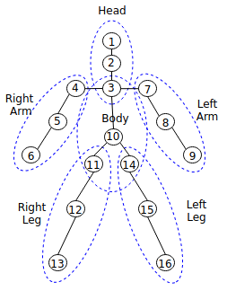
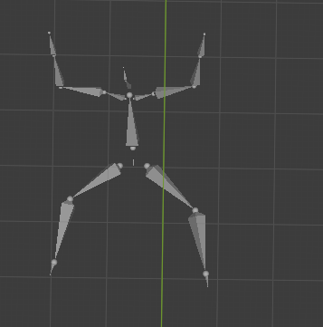

# Pose Detection

Pose Detection is a new feature of Media Vision Inference API since Tizen 6.0. This feature provides landmark detection. Besides, it defines landmarks and parts of a human body to help detect a human pose with Motion Capture (MoCap) file, which you can create or edit using various tools.

## Background

In Tizen, human body pose landmarks and body parts are defined as follows:

**Figure: Definition of human body pose landmarks and body parts**



The Pose landmark detection models are available in Open Model Zoo such as [hosted model zoo](https://www.tensorflow.org/lite/guide/hosted_models#floating_point_models) or public GitHub site such as [public pose model](https://github.com/tyoungroy/PoseEstimationForMobile). The public pose models provide landmark information, such as the number of landmarks and locations. To use them correctly, you must map the information to landmarks based on the definition. For example, you can use the [public pose model](https://github.com/tyoungroy/PoseEstimationForMobile), which provides 14 landmarks as follows:

,

In this model, `-1` denotes that there are no landmarks. Using this landmark information, you can create a mapping file. Suppose you create a mapping file with the name `pose_mapping.txt`, then you can populate the `pose_mapping.txt` file as follows:

```
1
2
-1
3
4
5
6
7
8
-1
9
10
11
12
13
14
```

`1` denotes that the first landmark of the model corresponds to the first definition,  `MV_INFERENCE_HUMAN_POSE_HEAD`. `-1` at third position denotes that there is no corresponding landmark `MV_INFERENCE_HUMAN_POSE_THORAX`. `3` at the fourth position denotes that the third landmark of the model corresponds to the fourth, `MV_INFERENCE_HUMAN_POSE_RIGHT_SHOULDER`. The following table shows how the public model works:

**Table: Example of how  [public pose model](https://github.com/tyoungroy/PoseEstimationForMobile) maps to the definitions**

| Value | Definition | pose_mapping.txt |
| - | - | - |
| 1 | MV_INFERENCE_HUMAN_POSE_HEAD | 1 |
| 2 | MV_INFERENCE_HUMAN_POSE_NECK | 2 |
| 3 | MV_INFERENCE_HUMAN_POSE_THORAX | -1 |
| 4 | MV_INFERENCE_HUMAN_POSE_RIGHT_SHOULDER | 3 |
| 5 | MV_INFERENCE_HUMAN_POSE_RIGHT_ELBOW | 4 |
| 6 | MV_INFERENCE_HUMAN_POSE_RIGHT_WRIST | 5 |
| 7 | MV_INFERENCE_HUMAN_POSE_LEFT_SHOULDER | 6 |
| 8 | MV_INFERENCE_HUMAN_POSE_LEFT_ELBOW | 7 |
| 9 | MV_INFERENCE_HUMAN_POSE_LEFT_WRIST | 8 |
| 10 | MV_INFERENCE_HUMAN_POSE_PELVIS | -1 |
| 11 | MV_INFERENCE_HUMAN_POSE_RIGHT_HIP | 9 |
| 12 | MV_INFERENCE_HUMAN_POSE_RIGHT_KNEE | 10 |
| 13 | MV_INFERENCE_HUMAN_POSE_RIGHT_ANKLE | 11 |
| 14 | MV_INFERENCE_HUMAN_POSE_LEFT_HIP | 12 |
| 15 | MV_INFERENCE_HUMAN_POSE_LEFT_KNEE | 13 |
| 16 | MV_INFERENCE_HUMAN_POSE_LEFT_ANKLE | 14 |


The MoCap file includes the movements of objects or a person. There are various MoCap formats, but a well-known BioVision Hierarchy (BVH) file is supported in Media Vision. BVH file has a hierarchy structure to provide landmark information with landmarks' names, and the structure can be changed. It means that landmark information is different from the definition. To use the BVH file correctly, you have to map the information to the landmarks based on the definitions. For example, the [BVH file](./media/mediavision_pose_bvh_sample.bvh) describes a squat pose as follows:



The example starts with hips and ends with the left foot with 15 landmarks. You can create a mapping file named `mocap_mapping.txt` as follows:

```
Hips,10
Neck,2
Head,1
LeftUpArm,7
LeftLowArm,8
LeftHand,9
RightUpArm,4
RightLowArm,5
RightHand,6
LeftUpLeg,14
LeftLowLeg,15
LeftFoot,16
RightUpLeg,11
RightLowLeg,12
RightFoot,13
```
If there is no mapped landmark, you don't need to list it. For example, index three is missing. It means that, in this BVH file, the third definition, `MV_INFERENCE_HUMAN_POSE_THORAX` is not defined and not used.

## Prerequisites

To enable your application to use the media vision inference functionality:

1. To use the functions and data types of the Media Vision Inference API (in [mobile](../../api/mobile/latest/group__CAPI__MEDIA__VISION__INFERENCE__MODULE.html) and [wearable](../../api/wearable/latest/group__CAPI__MEDIA__VISION__INFERENCE__MODULE.html) applications), include the `<mv_inference.h>` header file in your application.

   In addition, you must include the `<image_util.h>` header file to handle the image decoding tasks, or the `<camera.h>` header file to provide the preview images:

   ```c
   #include <mv_inference.h>

   /* Image decoding for image recognition */
   #include <image_util.h>
   /* Preview images for image tracking */
   #include <camera.h>
   ```
2. Create a structure to store global data.

   For pose detection, use the following `imagedata_s` structure:

   ```c
   struct _imagedata_s {
       mv_source_h g_source;
       mv_engine_config_h g_engine_config;
       mv_inference_h g_inference;
       mv_pose_h g_pose;
   };
   typedef struct _imagedata_s imagedata_s;
   static imagedata_s imagedata;
   ```

## Detect human pose

To detect human pose from an image:

1. Create the source and engine configuration handles:

   ```c
   int error_code = 0;

   error_code = mv_create_source(&imagedata.g_source);
   if (error_code != MEDIA_VISION_ERROR_NONE)
       dlog_print(DLOG_ERROR, LOG_TAG, "error code = %d", error_code);

   error_code = mv_create_engine_config(&imagedata.g_engine_config);
   if (error_code != MEDIA_VISION_ERROR_NONE)
       dlog_print(DLOG_ERROR, LOG_TAG, "error code= %d", error_code);
   ```
2. Decode the image file and fill the `g_source` handle with the decoded raw data.
   In the following example image `sample.jpg`, a person is shown in a squat pose, and the image is in the `<OwnDataPath>` folder:

   

   The `<OwnDataPath>` refers to your own data path:

   ```c
   /* For details, see the Image Util API Reference */
   unsigned char *dataBuffer = NULL;
   unsigned long long bufferSize = 0;
   unsigned long width = 0;
   unsigned long height = 0;
   image_util_decode_h imageDecoder = NULL;

   error_code = image_util_decode_create(&imageDecoder);
   if (error_code != IMAGE_UTIL_ERROR_NONE)
       dlog_print(DLOG_ERROR, LOG_TAG, "error code = %d", error_code);

   error_code = image_util_decode_set_input_path(imageDecoder, "<OwnDataPath>/sample.jpg");
   if (error_code != IMAGE_UTIL_ERROR_NONE)
       dlog_print(DLOG_ERROR, LOG_TAG, "error code = %d", error_code);

   error_code = image_util_decode_set_colorspace(imageDecoder, IMAGE_UTIL_COLORSPACE_RGB888);
   if (error_code != IMAGE_UTIL_ERROR_NONE)
       dlog_print(DLOG_ERROR, LOG_TAG, "error code = %d", error_code);

   error_code = image_util_decode_set_output_buffer(imageDecoder, &dataBuffer);
   if (error_code != IMAGE_UTIL_ERROR_NONE)
       dlog_print(DLOG_ERROR, LOG_TAG, "error code = %d", error_code);

   error_code = image_util_decode_run(imageDecoder, &width, &height, &bufferSize);
   if (error_code != IMAGE_UTIL_ERROR_NONE)
       dlog_print(DLOG_ERROR, LOG_TAG, "error code = %d", error_code);

   error_code = image_util_decode_destroy(imageDecoder);
   if (error_code != IMAGE_UTIL_ERROR_NONE)
       dlog_print(DLOG_ERROR, LOG_TAG, "error code = %d", error_code);

   /* Fill the dataBuffer to g_source */
   error_code = mv_source_fill_by_buffer(imagedata.g_source, dataBuffer, (unsigned int)bufferSize,
                                         (unsigned int)width, (unsigned int)height, MEDIA_VISION_COLORSPACE_RGB888);
   if (error_code != MEDIA_VISION_ERROR_NONE)
       dlog_print(DLOG_ERROR, LOG_TAG, "error code = %d", error_code);

   free(dataBuffer);
   dataBuffer = NULL;
   ```
3. To detect landmark of the pose from the `sample.jpg` image, create a `g_inference` media vision inference handle:

   ```c
   error_code = mv_inference_create(&imagedata.g_inference);
   if (error_code != MEDIA_VISION_ERROR_NONE)
       dlog_print(DLOG_ERROR, LOG_TAG, "error code = %d", error_code);
   ```
4. Configure `g_engine_config` with a body pose model data and its mapping file. Suppose that model data `data.tflite` and its mapping file `data_mapping.txt`, which are described in the [Background](#background) section, are applied and the files are stored in `<OwnDataPath>`. In addition, the model meta file `meta.json` which includes the model information is stored in `<OwnDataPath>`.
In the following example, all error check codes are omitted for the simplicity:

    ```c
    #define MODEL_DATA "<OwnDataPath>/data.tflite"
    #define MODEL_META "<OwnDataPath>/meta.json"
    #define MODEL_MAPPING_FILE "<OwnDataPath>/data_mapping.txt"

    char *inputNodeName = "image";
    char *outputNodeName[] = { "output" };

    error_code = mv_create_engine_config(&imagedata.g_engine_config);

    error_code = mv_engine_config_set_string_attribute(imagedata.g_engine_config,
    MV_INFERENCE_MODEL_WEIGHT_FILE_PATH,
    MODEL_DATA);

    error_code = mv_engine_config_set_string_attribute(imagedata.g_engine_config,
    MV_INFERENCE_MODEL_USER_FILE_PATH,
    MODEL_MAPPING_FILE);

    error_code = mv_engine_config_set_string_attribute(handle,
                      MV_INFERENCE_MODEL_META_FILE_PATH,
                      MODEL_META);

    error_code = mv_engine_config_set_int_attribute(imagedata.g_engine_config,
    MV_INFERENCE_BACKEND_TYPE,
    MV_INFERENCE_BACKEND_TFLITE);

    error_code = mv_engine_config_set_int_attribute(imagedata.g_engine_config,
    MV_INFERENCE_BACKEND_TYPE,
    MV_INFERENCE_TARGET_CPU);
    ```

    For more information on the configuration attributes such as `MV_INFERENCE_MODEL_WEIGHT_FILE_PATH`, see Media Vision Inference API (in [mobile](../../api/mobile/latest/group__CAPI__MEDIA__VISION__INFERENCE__MODULE.html) and [wearable](../../api/wearable/latest/group__CAPI__MEDIA__VISION__INFERENCE__MODULE.html) applications). For more information about model meta files, see [Meta file template](https://review.tizen.org/gerrit/gitweb?p=platform/core/api/mediavision.git;a=tree;f=meta-template;hb=refs/heads/tizen_6.5).

5. Use `mv_inference_configure()` to configure `g_inference` inference handle with `g_engine_config`:

    ```c
    error_code = mv_inference_configure(imagedata.g_inference, imagedata.g_engine_config);
    if (error_code != MEDIA_VISION_ERROR_NONE)
      dlog_print(DLOG_ERROR, LOG_TAG, "error code = %d", error_code);
    ```

6. Use `mv_inference_prepare()` to prepare inference:

    ```c
    error_code = mv_inference_prepare(imagedata.g_inference);
    if (error_code != MEDIA_VISION_ERROR_NONE)
      dlog_print(DLOG_ERROR, LOG_TAG, "error code = %d", error_code);
    ```

7. To detect pose, create `g_pose` media vision pose handle:

    ```c
    error_code = mv_pose_create(&imagedata.g_pose);
    if (error_code != MEDIA_VISION_ERROR_NONE)
      dlog_print(DLOG_ERROR, LOG_TAG, "error code = %d", error_code);
    ```

8. Suppose that the MoCap BVH file `mocap.bvh` and its mapping file `mocap_mapping.txt`, that are described in the [Background](#background) section, are applied and the files are stored in `<OwnDataPath>`. Then, set the files to `g_pose` handle for comparing and detecting the pose:

    ```c
    #define MOCAP_DATA "<OwnDataPath>/mocap.bvh"
    #define MOCAP_MAPPING_FILE  "<OwnDataPath>/mocap_mapping.txt"
    error_code = mv_pose_set_from_file(imagedata.g_pose, MOCAP_DATA, MOCAP_MAPPING_FILE);
    if (error_code != MEDIA_VISION_ERROR_NONE)
        dlog_print(DLOG_ERROR, LOG_TAG, "error code = %d", error_code);
    ```

9. Use `mv_inference_pose_landmark_detect()` to detect landmarks from the image:

    ```c
    error_code = mv_inference_pose_landmark_detect(imagedata.g_source, &imagedata.g_inference, NULL, _on_pose_landmark_detected_cb, NULL);
    if (error_code != MEDIA_VISION_ERROR_NONE)
        dlog_print(DLOG_ERROR, LOG_TAG, "error code = %d", error_code);
    ```

    The `mv_inference_pose_landmark_detect()` invokes the `_on_pose_landmark_detected_cb()` callback.
    The following callback example shows how to detect pose from the detected landmark:

    ```c
    static void
    _on_pose_landmark_detected_cb(mv_source_h source, mv_inference_pose_result_h pose, void *user_data)
    {
      float pose_score = 0.0f;
      error_code = mv_pose_compare(imagedata.g_pose, pose,
            (MV_INFERENCE_HUMAN_BODY_PART_LEG_LEFT |
             MV_INFERENCE_HUMAN_BODY_PART_LEG_RIGHT),
             &pose_score);
      if (error_code != MEDIA_VISION_ERROR_NONE) {
          dlog_print(DLOG_ERROR, LOG_TAG, "error code = %d", error_code);
          return;
      }

      if (pose_score > 0.9f) {
         dlog_print(DLOG_INFO, LOG_TAG, "success to detect pose with score %.3f\n", pose_score);
      } else {
         dlog_print(DLOG_INFO, LOG_TAG, "fail to detect pose with score %.3f\n", pose_score);
      }
    }
    ```

10. After the detection is complete, destroy the source, engine configuration, the inference, and the pose handles using `mv_destroy_source()`, `mv_destroy_engine_config()`, `mv_inference_destroy()`, and `mv_pose_destroy()`:

    ```c
    error_code = mv_destroy_source(imagedata.g_source);
    if (error_code != MEDIA_VISION_ERROR_NONE)
        dlog_print(DLOG_ERROR, LOG_TAG, "error code = %d", error_code);

    error_code = mv_destroy_engine_config(imagedata.g_engine_config);
    if (error_code != MEDIA_VISION_ERROR_NONE)
        dlog_print(DLOG_ERROR, LOG_TAG, "error code = %d", error_code);

    error_code = mv_inference_destroy(imagedata.g_inference);
    if (error_code != MEDIA_VISION_ERROR_NONE)
        dlog_print(DLOG_ERROR, LOG_TAG, "error code = %d", error_code);

    error_code =
    mv_pose_destroy(imagedata.g_pose);
    if (error_code != MEDIA_VISION_ERROR_NONE)
        dlog_print(DLOG_ERROR, LOG_TAG, "error code = %d", error_code);
    ```

## Related information

- Dependencies
  - Tizen 6.0 and Higher for Mobile
  - Tizen 6.0 and Higher for Wearable
