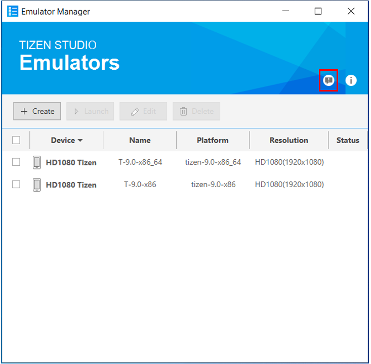
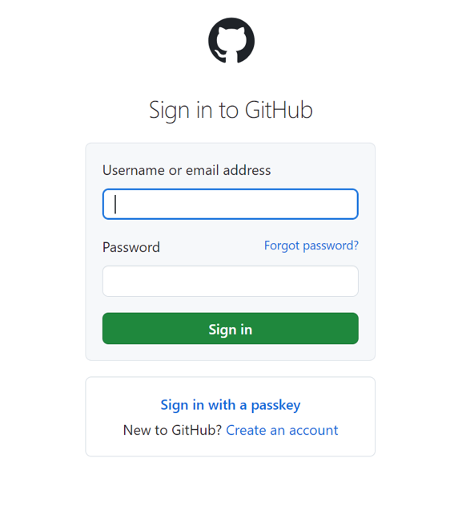
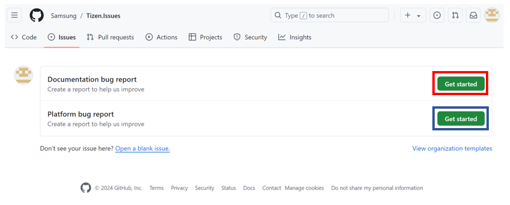

# Managing Emulator Instances

You can use emulators to run your application in a virtual environment.

In order to test the application in a variety of environments, you need a variety of emulators. The Emulator Manager helps you easily create and manage emulator instances. Basically, the Emulator Manager allows you to generate emulator instances from a predefined platform and template. In addition, you can define the settings of the virtual device, such as skin, resolution, and hardware devices.

The main features of the Emulator Manager are:
- Defining a new emulator instance or hardware profile
- Editing an existing emulator instance or hardware profile
- Deleting an emulator instance or hardware profile
- Starting and stopping the emulator instance

## Accessing the Emulator Manager

If you do not have the Emulator Manager installed, you can install it using the Tizen Studio Package Manager.

There are 2 different ways to access the Emulator Manager:

- Click the Emulator Manager icon on the desktop or in the Start menu.

  **Table: Starting the Emulator Manager**

  | Ubuntu                                   | Windows&reg;                                 | macOS                                    |
  |----------------------------------------|----------------------------------------|----------------------------------------|
  | **Desktop > Applications > Emulator Manager:**    | **Start > All Programs > Tizen Studio > Emulator Manager:**    | **Finder > Applications > Tizen Studio > Emulator Manager:**    |

- In Tizen Studio, select **Tools > Emulator Manager** or click the Emulator Manager icon on the toolbar.

  **Figure: Launch the Emulator Manager in Tizen Studio**

  

## Creating an Emulator Instance

The Emulator Manager can help you to select the recommended platform and template. When you need another device environment, you can edit an existing emulator instance, or create a new one with a more suitable platform and template. You can also create new platforms and templates to suit your needs.

**Figure: Emulator Manager**

To create a new emulator instance:

1. In the Emulator Manager, click **Create**.

2. Select the platform (system image), and click **Next**.

3. Select the template (device definition), and click **Next**.

4. Modify the properties as needed, and click **Finish**.

   The emulator instance appears in the Emulator Manager.

   To view the emulator instance details, right-click the instance and select **Detail**.

   > **Note**
   >
   > To run the application faster, switch on CPU VT and GPU. If CPU VT is disabled, check [Increasing the Application Execution Speed](emulator.md#speed) for more information. If GPU is disabled, [install the latest vendor-provided graphic driver](../setup/prerequisites.md#emulator).

### Creating Platforms

To create an emulator, you must first select the platform. You can create, modify, and delete a custom platform, and view the generated platforms. Most application developers do not need a custom platform, but it can be useful for a platform developer.

**Figure: Platform list**

To create a custom platform:

1. In the Emulator Manager, click **Create**.

2. Click **+**.

3. In the **Platform Configuration** dialog, select a base platform and platform image file.

   You can create a custom platform using a qcow2 or raw format image. Qcow2 is a platform image format that is released with Tizen Studio. You can also create a qcow2 image by [exporting an emulator](#export).

   A platform image in the development stage is in raw format. If you launch an emulator with a raw image, you can see the current state of the image. This can be useful for platform developers.

4. Click **OK** to save your configuration.

   The new platform is added to the list.

   **Figure: Platform Configuration dialog**

   

To manage the created platforms:

- To edit a platform, click **Edit** (), make the desired changes, and click **OK**. You can only edit the custom platforms you have created.
- To delete a platform, click **Delete** (). You can only delete the custom platforms you have created.

### Creating Templates

The Emulator Manager provides several device template types. A device template defines, for example, the screen resolution and size, and the sensors in the device specification. You can make an emulator instance based on the desired template.

**Figure: Device templates**

You can create a custom template in 2 ways:

1. In the Emulator Manager, click **Create**.

2. Select a platform and click **Next**.

3. To create a new template:

   - To create a new template from the beginning:
     1. Click **+**.
     2. Define the features for the template.
     3. Click **OK**.

        The new template is added to the list with a settings icon.

   - To create a new template based on an existing one:
     1. Select the template you want to clone.
     2. Click **clone template** ().
     3. Make the desired changes.
     4. Click **OK**.

        The new template is added to the list with a settings icon.

        **Figure: Template Configuration dialog**

        

To manage the created templates:

- To edit a template, click **edit template** (), make the desired changes, and click **OK**. You can only edit the custom templates you have created.
- To delete a template, click **delete** (). You can only delete the custom templates you have created.

## Managing and Launching Emulator Instances

In the Emulator Manager, you can launch, edit, delete, reset, and export emulator instances:

1. Launch the Emulator Manager.

2. Select an emulator instance from the list.

3. Manage the instance:
   - To launch the emulator, click **Launch**.
   - To edit an emulator, click **Edit**, make the desired changes, and click **Confirm**.
   - To delete an emulator, click **Delete**.
   - To reset an emulator, right-click it and select **Reset**.
     
   - To export an emulator, right-click it and select **Export as**. Specify the new image file location.

     When you export the emulator instance, the state of the platform image is replicated.

## Controlling the Emulator Manager from the Command Line

You can create, modify, delete, and list your VMs through the command line interface commands. The CLI binary is located in:

- Ubuntu:

  `<TIZEN_STUDIO>/tools/emulator/bin/em-cli`

- Windows&reg;:

  `<TIZEN_STUDIO>\tools\emulator\bin\em-cli.bat`

For more information, see the CLI help messages.

**Figure: Emulator Manager command line**

In the following figure, you can see the details of a specific command using the `-h` command option.

**Figure: Emulator Manager command details**

The following figure shows an example of how to create and launch an emulator using the CLI.

**Figure: Launching the emulator using the command line**

In the `create` command, the `–p` option is the platform name. You can see the available platforms using the `list -vm` command.

## Report an issue in Emulator Manager
The **Issue Reporter** button can be used to report any issue that can arise while using **Emulator Manager**. This button is placed inside the main window of **Emulator Manager** and makes the process of reporting an issue straightforward. To report an issue, follow these steps:
1. Launch **Emulator Manager** and view the top right region where two buttons appear: **Issue Reporter** (red rectangle), and **About** buttons are found, as illustrated in the following figure:

2. Click on the **Issue Reporter** button to be redirected to a **GitHub** page that will open in your default browser. Then use your GitHub username or email address, and password to Sign in:

    
3. After signing in, a new page will open. It can be used to report two types of bugs/issues:

    a. **Documentation bug report** - Click on the **“Get started”** button (red rectangle), to report any issue associated with the documentation of Emulator Manager.

    b. **Platform bug report** - Click on the **“Get started”** button (blue rectangle) below, to report any issue that arises while using Emulator Manager.

    

## Related information
* Dependencies
  - Tizen Studio 1.0 and Higher
