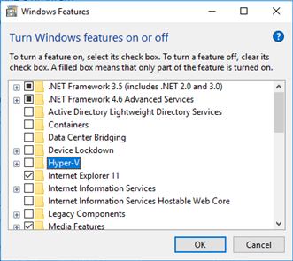

# Prerequisites of Visual Studio Code Extension for Tizen

Visual Studio Code Extension for Tizen enables you to develop Tizen .NET and Tizen Web applications easily using Visual Studio Code. To work with VS Code Extension for Tizen, your computer must have below prerequisites:

- Supported host platform

  VS Code Extension for Tizen supports the following operating systems:

  - Windows 10 (64 bit)
  - Ubuntu 18.04/20.04 (64 bit)
  - macOS 11.4(Big Sur)/12.3(Monterey)

- Required tools

  To use VS Code Extension for Tizen, you must install the following tools:

  - .NET Core SDK 2.0 or later **for Tizen .NET only**

    Download from <https://www.microsoft.com/net/download/>.

  - Node.js

    Download from <https://nodejs.org>.

  - Python 2.7 (only for macOS)

    Download from <https://www.python.org/ftp/python/2.7.18/python-2.7.18-macosx10.9.pkg>.

  - Tizen Baseline SDK or Tizen Studio

    If neither of these is found, VS Code Extension for Tizen installs the Baseline SDK.

  - Microsoft C\# extension for Visual Studio Code **for Tizen .NET only**

    Install from the Visual Studio Code Marketplace.

## Emulator requirements

Tizen Emulator for VS Code Extension for Tizen has the same requirements as the emulator in Tizen Studio. To check the detailed hardware and software requirements for Tizen Emulator, see [Emulator Requirements](../tizen-studio/setup/prerequisites.md#emulator).

### Option 1

- Intel&reg; Hardware Acceleration Execution Manager (Intel&reg; HAXM) speeds up the Tizen emulation on Intel-VT-enabled systems. For more information, see [Hardware Accelerated Execution Manager](../tizen-studio/setup/hardware-accelerated-execution-manager.md).

> [!NOTE]
> This option will not be applicable to and will not work on AMD processors.

- Make sure **Hyper-V** is disabled (in Windows 10 or higher):
  1. Input **Control Panel** on the **Search** box in Windows 10.

  2. Click **Control Panel > Programs and Features > Turn Windows features on or off**.

  3. Disable **Hyper-V** and click **OK**.

     Additional note: make sure **Virtual Machine Platform** should be disabled as well to use HAXM.

     

  4. Reboot the computer.

### Option 2

- Microsoft's Hyper-V and the Windows Hypervisor Platform (WHPX). Hyper-V is a virtualization feature of Windows that makes it possible to run virtualized computer systems on a physical host computer.

- Make sure **Hyper-V** is enabled (PowerShell in Windows 10 or higher):
  1. Check the configuration

     > Get-WindowsOptionalFeature -FeatureName Microsoft-Hyper-V-All -Online

     FeatureName      : Microsoft-Hyper-V-All\
     DisplayName      : Hyper-V\
     Description      : Provides services and management tools for creating and running virtual machines and their resources.\
                      RestartRequired  : Possible\
                      State            : Disabled\
                      CustomProperties :

  2. Enable Hyper-V & HypervisorPlatform

     > Enable-WindowsOptionalFeature -Online -FeatureName Microsoft-Hyper-V -All\
     > Enable-WindowsOptionalFeature -Online -FeatureName HypervisorPlatform -All

     

  3. Reboot the computer.
