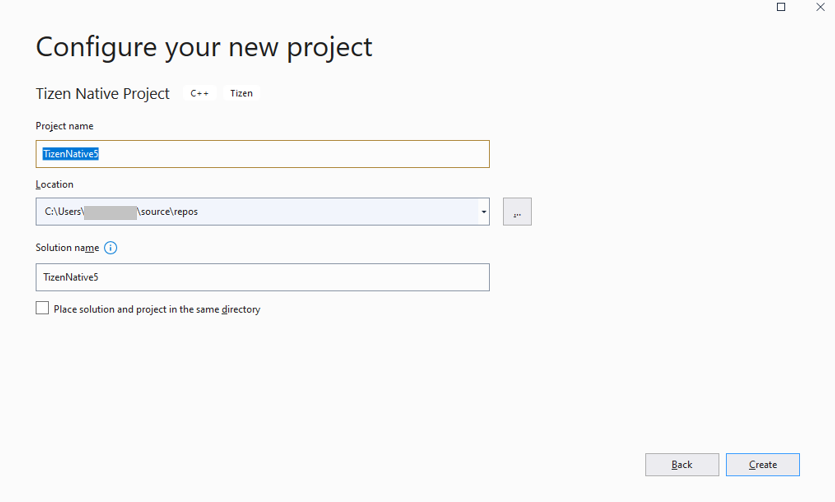
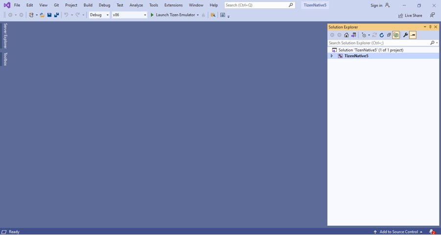
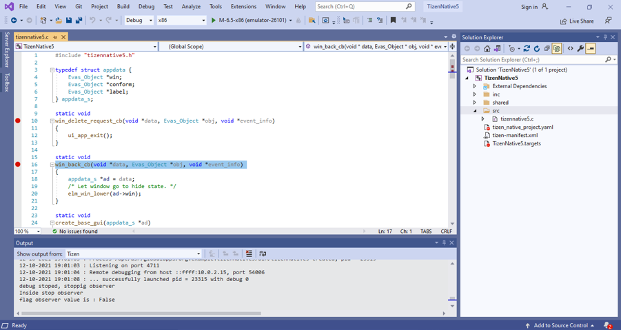
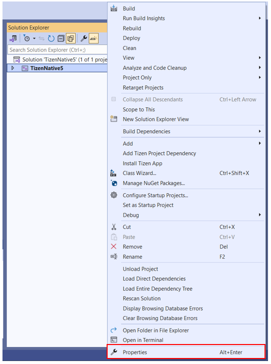
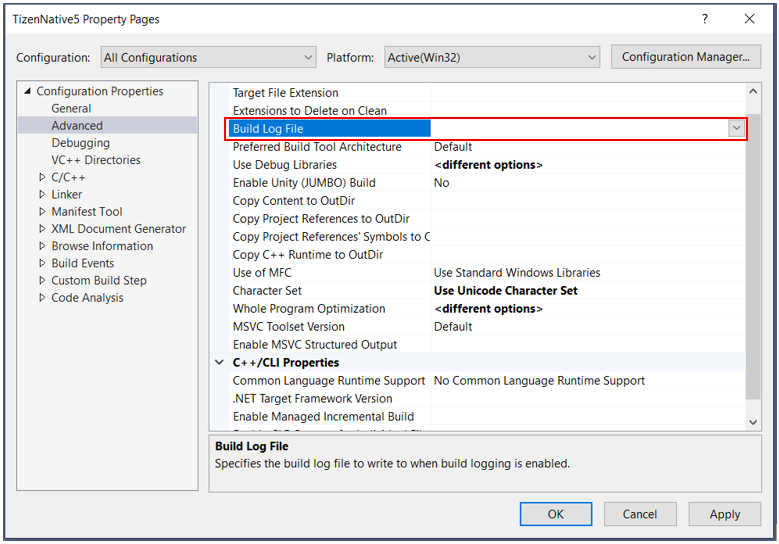

# Native application development

## Develop application

The following sections explain how to use Visual Studio for Tizen to develop your applications.

### Create Tizen Native project

To create a Tizen Native project:

1. In the Visual Studio menu, select **File &gt; New &gt; Project**.

2. For creating Native application, select **C++** and **Tizen** options in the dropdown list. Then, select **Tizen Native project** and click **Next**.

   

3. In the configure window, type the name for your project and click **Create**.

   

4. In the **Tizen Profile Select** window, select the required profile, platform version, and template for your project, then click **OK**.

5. The visual studio window with newly created project appears on the screen.

   

### Build your project

1. To build your project, select **Build Solution** in the **Solution Explorer** window.

   

2. To deploy and run your application, select **Debug &gt; Start without Debugging**.

   > [!NOTE]
   > Ensure the emulator is running in your system.

   

   

### Debug your application in emulator

1. Open .c file in your visual studio application.

2. Add a break point in your source code.

   

3. Start the debugging session by selecting **Debug &gt; Start Debugging** in the menu bar, or pressing **F5**, or by clicking the **Debug** button in the menu bar.

> [!NOTE]   
> If you are facing errors when trying to clean the solution:   
> - Locate the Tizen Native project on the Solution Explorer of Visual Studio and right click on it. Then, find **Properties** at the end of the menu and click on it. As illustrated in the following figure:    

> - A new window will open where you need to go to **Configuration Properties -> Advanced -> Build Log File**.
> - Next, clear the text on the box for **Build Log File**. Now, the **clean solution** function should work properly. As illustrated in the following figure:
