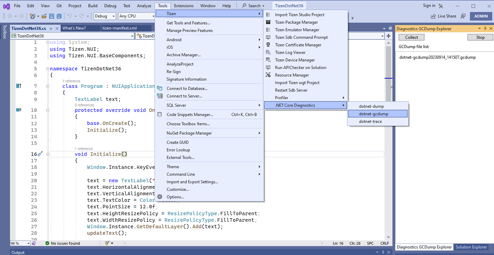
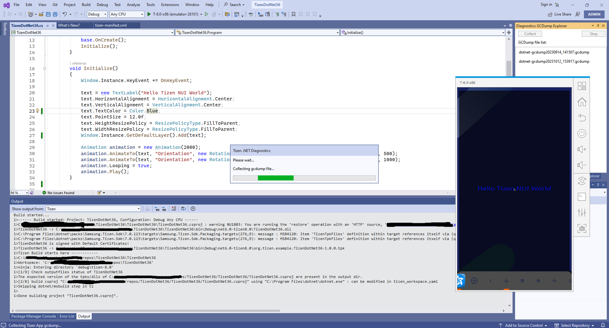
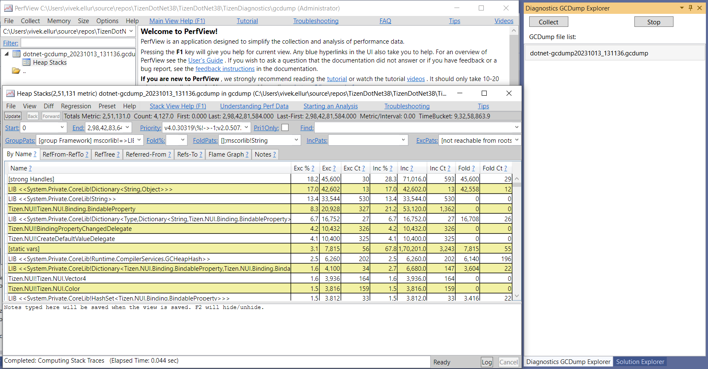
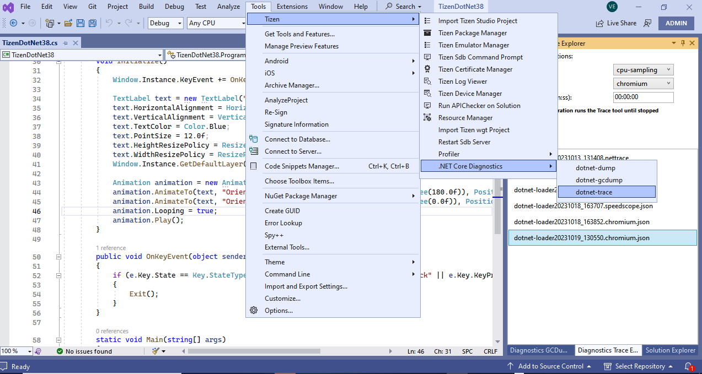
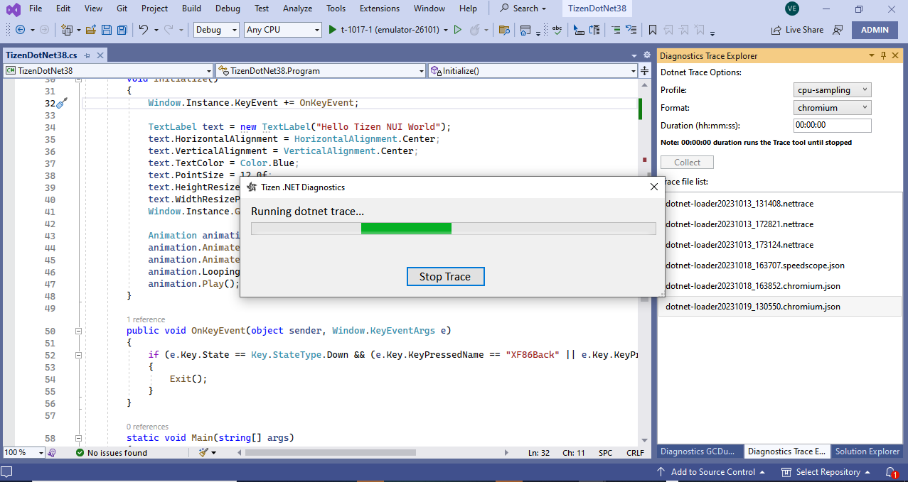
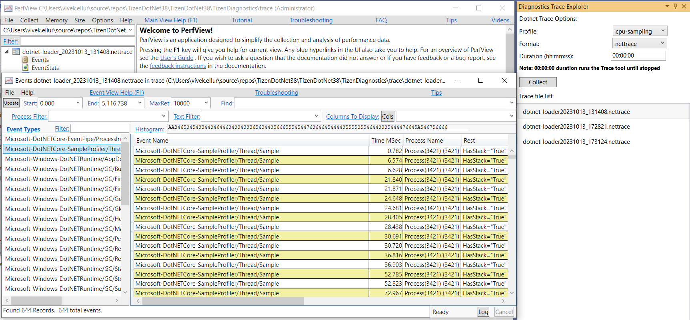
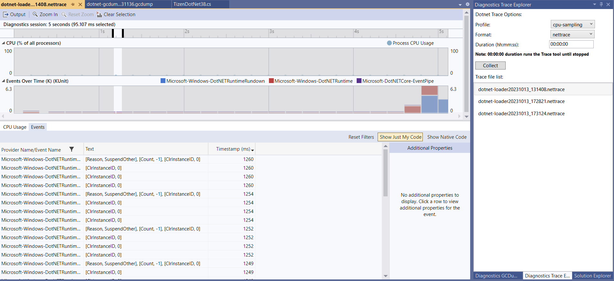
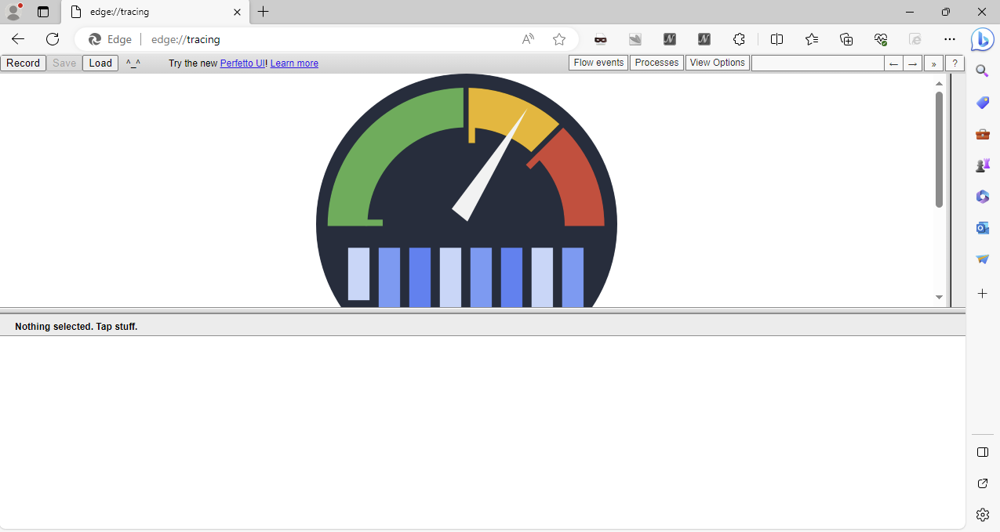
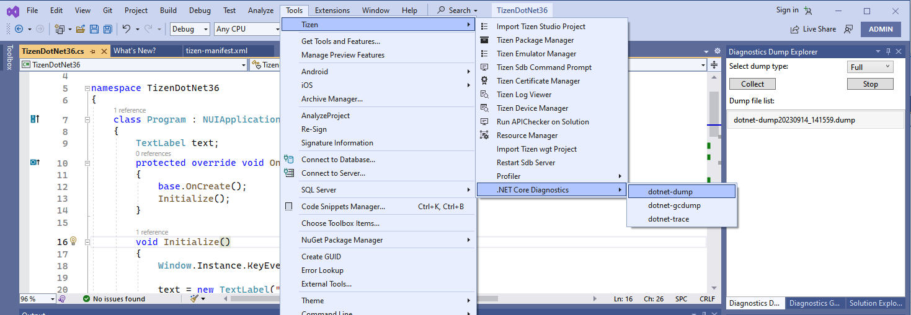
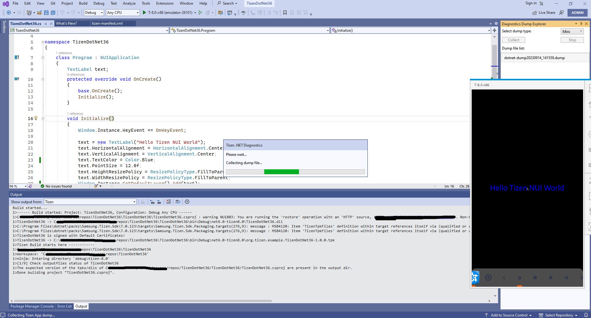

# Get Started with .NET Core Diagnostics

.NET Core Diagnostics supports a number of tools that can be used to diagnose the Tizen .NET applications.
It includes dotnet-gcdump, dotnet-dump, and dotnet-trace tools to aid .NET developers in diagnosing their applications.

## Prerequisites

Below are the prerequisites for using Tizen .NET Core Diagnostics in Visual Studio:

- Make sure that Tizen Studio Version 5.5 or above is installed.
- Make sure to set the Tool Path (Tizen SDK) in **Tools > Options > Tizen > Tools** with the installed 5.5 or above Tizen Studio path.

## Tizen .NET Core Diagnostics tools

## dotnet-gcdump

### Step 1. Run dotnet-gcdump tool
   - If no Tizen device is connected and no Tizen emulators are running then launch the type of emulator you want to use for diagnosing your application.

     

   - In the menu, choose **Tools > Tizen > .NET Core Diagnostics > dotnet-gcdump**.   
    Now click the **Collect** button provided in **Diagnostics GCDump Explorer** window.

     

   - If everything is ok then the application starts and it starts collecting the gcdump file.

     

   - Once the gcdump file is collected, a message popup is shown to inform the user, and the file is added to the gcdump file list in **GCDump Explorer** window.

   - User can collect the gcdump file multiple times by clicking the **Collect** button, until the application is closed by pressing "Home" or "Back" buttons, or by clicking the **Stop** button given in **GCDump Explorer** window.

### Step 2. Analyze the gcdump file
   - The GUI application provides two tools to view the gcdump diagnostics data. The views include:

       - Double click the gcdump file in **GCDump Explorer** window. It will open the file in **PerfView** tool.
       
       - Right click the gcdump file in **GCDump Explorer window** and select **Open With Editor**. It will open the file in **Visual Studio**.

## dotnet-trace

### Step 1. Run dotnet-trace tool
   - If no Tizen device is connected and no Tizen emulators are running then launch the type of emulator you want to use for diagnosing your application.

     

   - In the menu, choose **Tools > Tizen > .NET Core Diagnostics > dotnet-trace**.   
    Now select the trace **Profile**, **Format** and **Duration** options and click the **Collect** button provided in **Diagnostics Trace Explorer** window.

     

   - If everything is ok then the application starts and it starts collecting the trace.  
       - If application is not already running in the device/emulator then trace will be collected from application startup.
       - If application is already running in the device/emulator then trace will be collected from there on.

     

   - Press **Stop Trace** button above to stop and generate the trace file.

   - Once the trace file is generated, a message popup is shown to inform the user, and the file is added to the gcdump file list in **Dump Explorer** window.

### Step 2. Analyze the trace file
   - The GUI application provides different tools for different **Format** to view the trace diagnostics data.
   - **nettrace**
       - Double click the trace (.nettrace) file in **Trace Explorer** window. It will open the file in **PerfView** tool.
       
       - Right click the trace file in **Trace Explorer** window and select **Open With Editor**. It will open the file in **Visual Studio**.
       
   - **speedscope**
       - Double click the trace (.speedscope.json) file in **Trace Explorer** window. It will open the file in **speedscope web** tool.
         
   - **chromium**  
   Open Google Chrome and type **chrome://tracing** or Microsoft Edge browser and type **edge://tracing**.  
   Now click on **Load** button which fill open file explorer and select the **.chromium** file and click **Open**.
       

## dotnet-dump

### Step 1. Run dotnet-dump tool
   - If no Tizen device is connected and no Tizen emulators are running then launch the type of emulator you want to use for diagnosing your application.

     

   - In the menu, choose **Tools > Tizen > .NET Core Diagnostics > dotnet-dump**.   
    Now select the **dump type** from drop down list and click the **Collect** button provided in **Diagnostics Dump Explorer** window.

     

   - If everything is ok then the application starts and it starts collecting the dump file.

     

   - Once the dump file is collected, a message popup is shown to inform the user, and the file is added to the gcdump file list in **Dump Explorer** window.

   - User can collect the dump file multiple times by clicking the **Collect** button, until the application is closed by pressing "Home" or "Back" buttons, or by clicking **Stop** button given in **Dump Explorer** window.

### Step 2. Analyze the dump file
   - Open the **sdb shell**
   - Go to the folder (**/home/owner/share/tmp/sdk_tools**) containing the dump file
   - Run the command **dotnet dump analyze {file_name}**

**Note:** Please delete the dump file after analyze as it takes lot of memory space.

