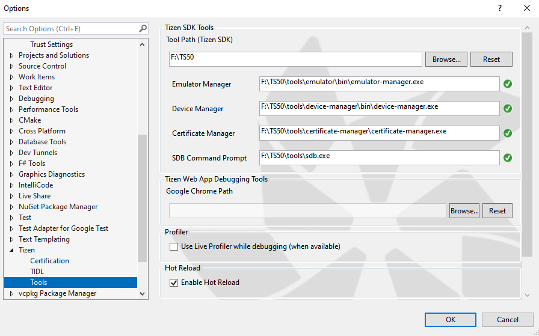

# What is Tizen .NET Hot Reload

With Hot Reload you can now modify your apps managed source code while the application is being debugged, without the need to stop and restart the debugging.
After starting the debugging of the application on the emulator or real device, you can apply the changed file without stopping the debugging of the application.
With "Hot Reload" changes are applied only on the second entrance to the function. If the change you made is supported your app will now be patched while its running with your new logic and you should see the changes in your app’s behavior the next time the updated code is re-executed by either your action or by something like a timer triggering the code.

# Enabling Tizen .NET Hot Reload

Go to **Tools** Menu in Visual Studio, select **Tools > Options..** from the dropdown menu. **Option** window will open.

**1.** Go to **Tizen &gt; Tools** and Check the **Enable Hot Reload** checkbox.

**Figure: Tizen options page to enable .NET Hot Reload**

**2.** Go to **Debugging &gt; .NET / C++ Hot Reload** and Check all the checkboxes.

**Figure: VS options page to enable .NET Hot Reload**

# Supported/Unsupported changes and architecture
Currently Tizen .NET Hot Reload is supported on aarch64 and armv7l.
No matter how you use .NET Hot Reload please be aware that some changes are not supported at runtime and will prompt you with a rude edit dialog and require you to restart your app in order to apply. [Supported Edits in Tizen .NET Hot Reload](https://github.com/dotnet/roslyn/blob/main/docs/wiki/EnC-Supported-Edits.md)
