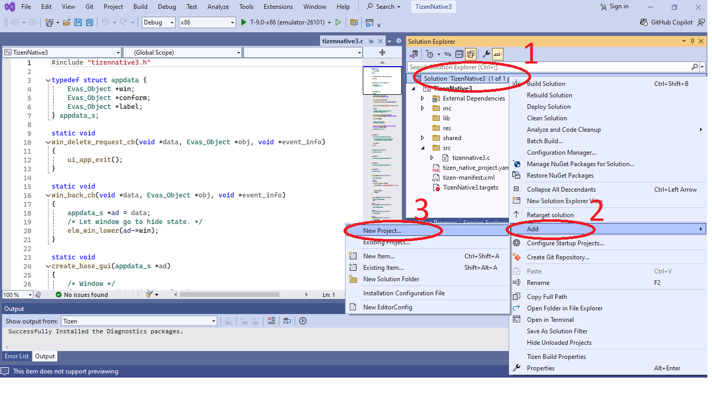
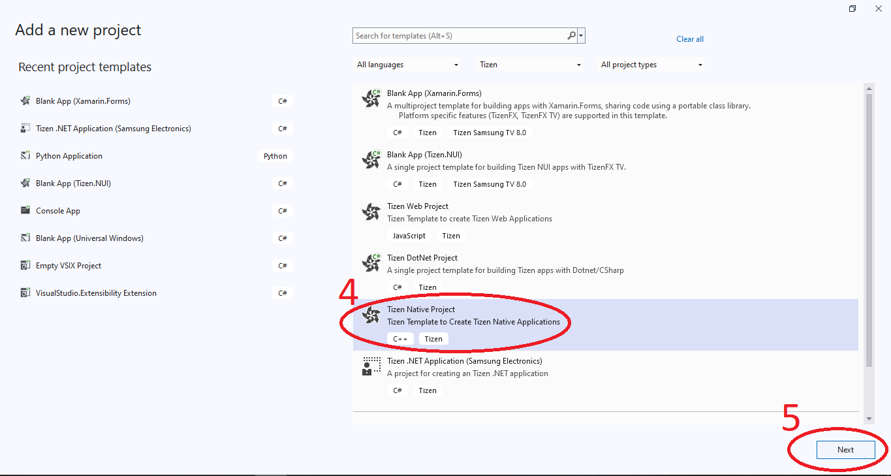
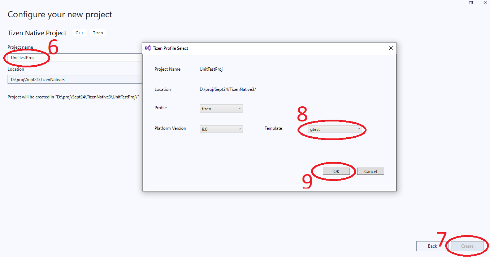
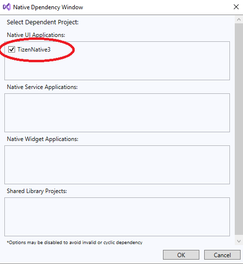
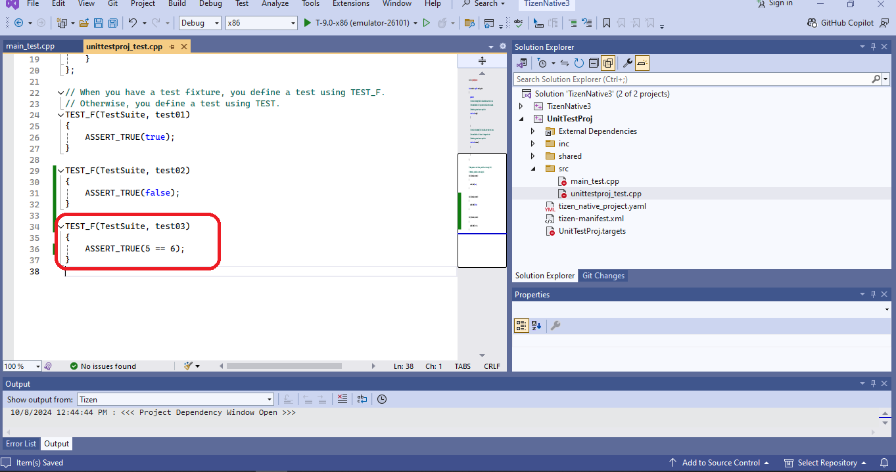
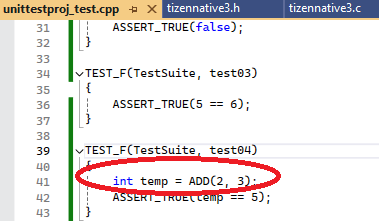
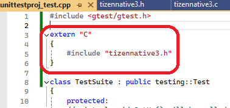
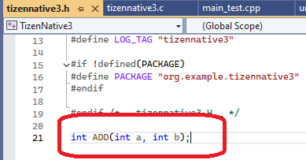

# To get Unit Test information with Code Coverage

The Code Coverage is a profiling tool used to determine the coverage details of Tizen Native Applications. It helps you to understand the code quality of your application. The Code Coverage tool finds the parts of the code covered during the execution of the unit test cases. A program with high code coverage (measured in percentage) implies that most of the source code is covered during testing, and the source code has a lower chance of containing undetected software bugs.

The Code Coverage tool is based on the `llvm-cov` tool. Using the Code Coverage tool, you can detect parts of code that are not covered by a unit test, and ensure that the uncovered code does not cause errors at runtime. The Code Coverage tool supports functional, statement, and branch coverage.


> [!NOTE]
>
> Before you run the Unit Test and Code Coverage, follow the steps below:
  > - Make sure that you have an Emulator or a connected target device running.
  > - If you want to try out the tool and do not have an applicable project to test, create a project with the **Project Wizard** using a template or a sample. For more information on creating a project, check [Native Application Development](../Tizen/native).


## To build a Unit Test project
With a Unit Test, you can verify that your code works well, and increases its reliability. Tizen Studio Extension for VS Code provides the creating, building, and editing tools for unit tests, and a view for checking and analyzing the test results.

It uses the **gtest** framework to make and launch the test cases. To manage your test cases, you can use the **Test Explorer** view.

## To create a Unit Test project
  You can create a test project for **Tizen Native Project** through the **Tizen Native Unit Test Project Wizard**. The wizard provides the test project for each Tizen Native project type, such as UI application, service application, shared library, and static library.

  To create a test project, follow these steps:
  1. In the Visual Studio Solution Explorer, right-click on the solution name, select **Add > New Project > Tizen Native Project**, and click on **Next** button. As illustrated in the following figure:
      
      
      
      <!--  -->

      
    
      <!--  -->
    
  2. In the **Configure your new project** window, select a name for the **Unit Test** project > click on **create** button > select **gtest** template > press **OK** as illustrated in the following figure:
      
      
      
      <!--  -->

## To configure the Unit Test project for Native App
1. Right-click on the **Unit Test** project > select **Add Tizen Project Dependency** > Select the **Native App** > press **OK** as illustrated in the following figure:

    

    <!--  -->

2. Again right-click on the **Unit Test** project > select **Set as Startup Project**

3. To use the test project, follow these steps:

    * `<TEST_PROJECT_HOME>/<TEST_PROJECT_NAME>/src/<TEST_PROJECT_NAME>_test.cpp` file.

    * Add a `TEST_F()` test case.
    
      Each `TEST_F()` test case is independent. If the `TEST_F()` test case is associated with a fixture class name, the test case runs based on that fixture class.
    
    * Add assertions:

        

        <!--  -->

      The Unit Test tool supports basic assertions, binary comparison, and string comparison in the **gtest**. For more information, check [Google Test Advanced Guide](https://github.com/google/googletest/blob/main/docs/advanced.md).

    * Call a method of the main Native project in the test case:

        

        <!--  -->

      The header of the Native App should be included in the Unit Test project cpp file (in this example: the `ADD()` method is described in `tizennative3.c`, so the header `tizennative3.h` is included). As illustrated in the following figure:
      
      In case if the Native project is written in C code, use extern to include the header (To know more details about extern, visit [extern (C++)](https://learn.microsoft.com/en-us/cpp/cpp/extern-cpp?view=msvc-170)). 
      
        

        <!--  -->

      The method declaration should be mentioned in the header file.

        

        <!--  -->

    * Enclose the main() function of the Native project with `TEST_BUILD`:
      ```cpp
      #ifndef TEST_BUILD
      //main method
      #endif
      ```
        
        

        <!--  -->

## To run the Unit Test project on devices

To launch the Unit Test project, click the **Run(ctrl + f5)** icon in the toolbar.

After the test cases are executed, the results are displayed on the **Native Unit Test Result** in **Explorer View** and the **Code Coverage** information is displayed in the default browser in the form of HTML.

 * ### Explorer view
    * Upon double click on the failed test case, the cursor will navigate to the line the test case failed. As illustrated in the following figure:
      
      

      <!--  -->

 * ### HTML Code Coverage report
    * The **index.html** page is opened in the browser to view the Code Coverage Report, as illustrated in the following figure:
      
      

      <!--  -->

    * Click on any of the projects to get the coverage at the file level, as illustrated in the following figure:

      

      <!--  -->