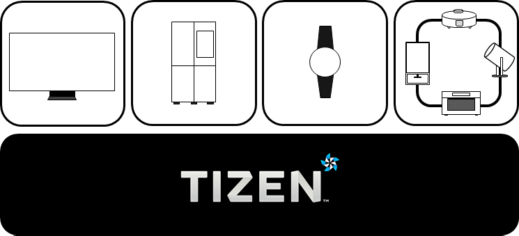

# Introduction to Tizen

Tizen is an open source operating system based on Linux, hosted by the Linux Foundation, and open to all developers.  Tizen has evolved to connect everything, from smart TVs, smartphones, and wearable devices to IoT (Internet of Things) devices. Devices powered by Tizen can provide seamless connectivity to Tizen developers and device users among various device types.

## Connect everything

As diverse devices are getting smarter and more connected, there is a strong need for a software platform for integrated services with connected products. Tizen is designed for this and has been evolving to connect everything.

To support different types of devices with a seamless user experience, Tizen provides the features and functions for various kinds of devices. Tizen supports both headed and headless products. In the near future, lots of internet-connected devices are anticipated to be on the market and IoT services are expected to pervade everyone's daily life. Tizen is moving forward to the future of everything connected.

**Figure: Connecting different devices**

## Openness, optimization, and opportunities

Tizen is a Linux-based, open source software platform. Anyone can contribute and freely develop the system software and applications, which is beneficial for both device manufacturers and application developers. Furthermore, by supporting web applications with open web technologies and C# applications with .NET technologies, Tizen provides developers flexibility and extensibility. Based on the open ecosystem, the user can expect various experiences from Tizen devices and services. With its openness, Tizen can pursue continuing progress and expand the ecosystem.

Tizen is built to work on the following diverse devices:

- [TV device](profiles/tv.md)
- [Tizen custom device](profiles/tizen_custom.md)
- [Wearable device](profiles/wearable.md)
- [Mobile device](profiles/mobile.md)

Tizen devices provide product-optimized functionality and performance.

Tizen allows developers to make various kinds of devices and develop applications for the devices.
Tizen provides a building block pool of components mainly based on the Tizen API sets.

Tizen custom devices can be created by combining API building blocks in various ways as per the requirements. Required packages are installed based on the dependencies related to the specified building blocks.

For more information, please reference [Tizen custom device](profiles/tizen_custom.md).

Devices and features under new categories or devices can be easily added for emerging technologies. Therefore, Tizen is adaptable and customizable for new products. In the foreseeable future, for example, IoT devices and services are expected to be prevalent and Tizen is taking proactive steps toward the opportunities in these new markets.

**Figure: Tizen for the various devices**

.
## Convergence platform for the emerging era

Since 2012, Tizen has been expanding as smart gadgets have become generalized and connected. By accommodating various device types, Tizen is gearing up for the new era of convergence. As of now, there is a wide variety of Tizen devices on the market:

- TV & Audio: Samsung Smart TVs, Samsung Lifestyle TV, Samsung Smart monitor, Samsung sound Bar
- Display: Samsung Smart Signage, Samsung Flip, Samsung Kiosk
- Smart appliances: Samsung family hub fridge, Samsung air conditioner, Samsung washing machine
- Wearables: Samsung Galaxy Watch series (Galaxy Watch, Galaxy Watch Active, Galaxy Watch Active2, Galaxy Watch3), Gear series (Gear 2, Gear 2 Neo, Gear S, Gear S2, Gear S3)
- Mobile phones: Samsung Z series (Z1(3G), Z3(3G/LTE), Z2(LTE), Z4)
- Tablets: Digma Plane 8501 3G
- Cameras: Samsung NX series (NX300, NX30, NX2000, NX1, NX500), Gear 360
- OBD: Samsung Connect Auto

Samsung holds the highest market share in the global TV market and its recent models are all based on the Tizen platform. It is expected that the Tizen platform to broaden its ecosystem with increasing market requirements and user demands.

## Productivity

To facilitate developing Tizen applications, [Tizen Studio](../../application/tizen-studio/index.md) is provided as an integrated development environment (IDE). It helps you to develop, build, debug, profile, and emulate Tizen applications. Tizen Studio is equipped with useful developer tools, including Emulator, Package Manager, Device Manager, Certificate Manager, and Dynamic Analyzer for profiling. In the integrated environment, you can enjoy the comfortable and productive development of Tizen Native and Web applications. Also, we provide two extensions for Visual Studio and Visual Studio Code. In [Visual Studio Tools for Tizen](../../application/vstools/index.md) and [Visual Studio Code extension for Tizen](../../application/vscode-ext/index.md), you can develop not only Tizen Web and Native applications but also Tizen .NET applications easily and rapidly with tools that Tizen Studio provides.

## Versions

The latest versions of the Tizen platform include the following:

<!--- This will be uncommented when Tizen 8.0 M2 is released
- [Tizen 8.0](versions/tizen-8-0-m2.md)
-->
- [Tizen 7.0](versions/tizen-7-0-m2.md)
- [Tizen 6.5](versions/tizen-6-5-m2.md)
- [Tizen 6.0](versions/tizen-6-0-m2.md)
- [Tizen 5.5](versions/tizen-5-5-m2.md)
- [Tizen 5.0](versions/tizen-5-0-m2.md)
- [Tizen 4.0 M2](versions/tizen-4-0-m2.md)
- [Tizen 4.0 M1](versions/tizen-4-0-m1.md)
- [Tizen 3.0](versions/tizen-3-0.md)
