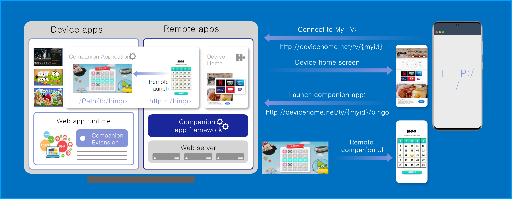

# Tizen 6.5

The second milestone (M2) release of Tizen 6.5 was announced in October 2021.
Tizen is an open-source operating system (OS) maintained by Samsung, it is developed and optimized for smart devices since 2012.

In Tizen 6.5, new multi-device experience frameworks are introduced. With Tizen 6.5 you can now connect more devices and create intelligent services on those connected devices. Also, Tizen app development has now become more easier and familiar with the introduction of the new popular cross-platform framework Flutter for Tizen. Tizen 6.5 includes enhancements for .NET and web, and it is also more flexible and adaptable for IoT devices. With enhanced Tizen Image Creator, you can create custom Tizen image with just a few clicks on Tizen 6.5.

## Multi device experiences

- **Advanced Companion Framework**:

  The Advanced Companion Framework facilitates multi-device application development,
providing interactive communication among devices in a local network.

  It provides services to develop companion applications. The following services are listed below:
  - Search & connect devices in local network
  - Share data & interact with companion applications
  - TIDL supports C, C++, C#, and Java interfaces
  - Cross-platform APIs (Tizen & Android)

  **Figure: Advanced Companion Framework**

  

- **AI Inference offloading**:

  AI Inference offloading service framework enables low-end IoT devices to provide AI services
  without a cloud network connection.
  For example, if you want to provide an AI-based home training service on TV with low computing power,
  you can make it happen with the help of AI Inference Offloading framework.

  It provides AI services by leveraging high-end devices in the edge network. The following services are listed below:
    - Automatic discovery of an optimal high-end device
    - Optimized communication protocol for exchanging inputs and results
    - Secure communication
    - Cross-platform APIs (Tizen & Android)

  **Figure: AI Inference offloading**

  

- **Application offloading service framework**:

  Application offloading service framework remotely executes APIs and operations using in-home edge device

  Application offloading frameworks includes computation and resource offloading.

    - With computation offloading, calculation-intensive code blocks can be executed on a remote device and as a result, it achieves a faster response time.
    - With resource offloading, even if your application requires a resource not available on your device. For features that require hardware support, automatically find and match devices, and remotely execute required functions.

  **Figure: Application offloading service framework**

  

- **UI Offloading service framework**:

  UI Offloading service framework supports for consumption of host device’s services through the remote device web browser

  It provides a way to create host application and remote application as one companion web application.
  A web server is running on a host device and provides web content to a remote device.
  A remote application can be used as supplementary UIs to the host application for user convenience.

  **Figure: UI Offloading service framework**

  

## User Interface enhancements

- **Natural User Interface**:

  NUI(Natural User Interface) is the UI toolkit for building rich applications even on low-end IoT devices. It provides intuitive C# APIs, Powerful animation effects, and Responsive UI. You can easily extend features and styles as you want.

    - Interactive animation & seamless transition effect
    You can add interactive animations and seamless transition effects to your NUI applications.

    - Rive vector animation: Vector animation has been enhanced. The advantage of Rive animation is it can interact with users. It also provides animation mixing and runtime customization.

    - 2D & 3D unified interface: The biggest advantage of NUI is that it is based on a 3D graphics engine, so there is no need to use external libraries or engines to display 3D.

    - UI Automation: Accessibility framework based test automation for Native & Web UI. It provides programmatic access to UI elements and manipulates the UI by means other than the standard input. You can make automated UI test scripts using the Tizen UI Automation system.

  **Figure: Natural User Interface**

  

- **Flutter for Tizen**:

  Flutter is one of the most popular cross-platform frameworks, and it can run on many OSes,
  such as Android, iOS, Windows, Linux, and Mac.

  With Flutter for Tizen, application developers can deploy faster, get native performance,
  and easily port Flutter applications to Tizen.

  Tizen embedder is implemented in order to connect the Tizen platform with the Flutter engine as well as plug-in support for native capabilities such as battery, connectivity, video player, webview, and more.

    - Development tools support: Flutter for Tizen supports Flutter's developer tools for performance analysis and debugging. It also includes hot reload, which is a convenient tool for app developers.

  **Figure: Flutter for Tizen**

  

## Full hardware abstraction

- **Easy version up & Easy device porting**:

  The internal structure of the platform image has been improved by completely separating the hardware dependent implementation.
  It offers a new, independently maintainable structure.

  It is now possible to upgrade only the platform part.
  Conversely, when migrating to a new device, it is possible to develop only the Hal and kernel area independently.

  Tizen platform can be easily updated and ported to other devices.
  This can reduce the product development cost.

  **Figure: Full Hardware Abstraction**

  

- **Tizen image creator**:

  Tizen image creator creates your own platform image with building blocks

  It provides more than 450 pre-built building blocks, you can combine these blocks to build the desired platform quickly.
  It is provided in a form of a Docker image, so a custom image creation system can be built on your PC with very simple commands.

  **Figure: Tizen image creator**

  

For more information, see [Tizen 6.5 M2 release note](../../release-notes/tizen-6-5-m2.md).
