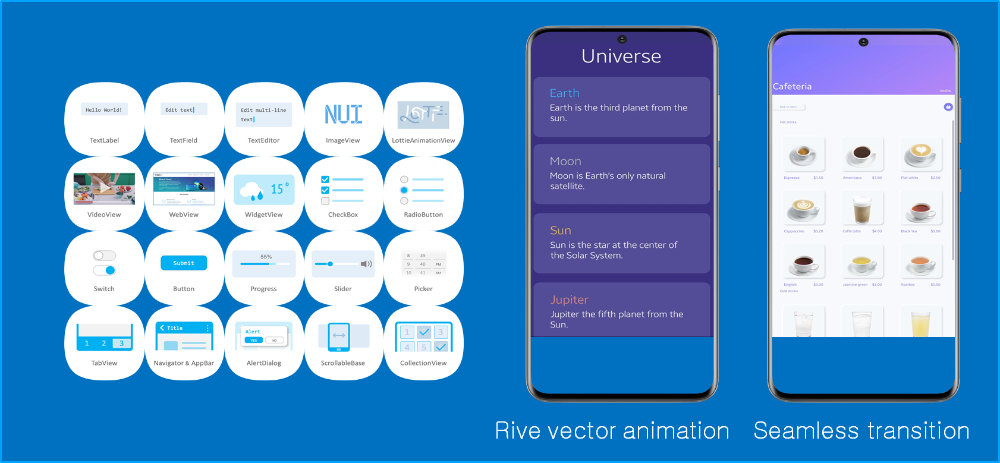
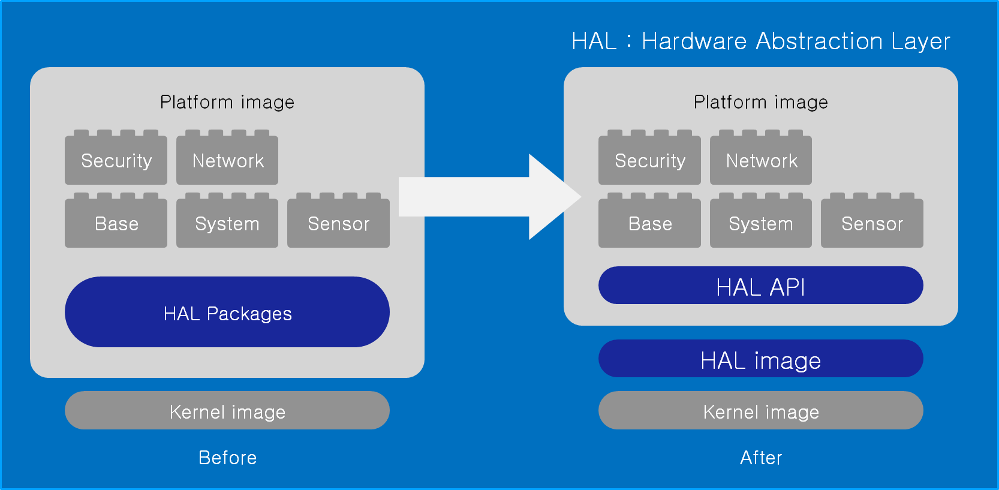

# Tizen 6.5

The second milestone (M2) release of Tizen 6.5 was announced in October 2021.
Tizen is an open-source operating system (OS) maintained by Samsung and is developed and optimized for smart devices since 2012.

Tizen 6.5 achieved to connect more devices and create intelligent services on those connected devices.
New multi-device experience frameworks are introduced in Tizen 6.5.
On top of that, Tizen app development becomes easier and more familiar by introducing new popular cross-platform framework, flutter for Tizen.
We are also enhancing previously introduced .NET and web with new updates.
We made Tizen 6.5 more flexible and adaptable to IoT devices.
With enhanced Tizen Image Creator, you can create custom Tizen image with just a few clicks.

## Multiple device experiences

- **Advanced companion framework**:

Support interaction between devices connected to a local network
Provide services to develop companion applications
Search & connect devices in local network
Share data & interact with companion applications
TIDL supports C, C# and Java interfaces
Cross platform APIs (Tizen & Android)

For example, The AI-embedded fridge can recommend recipes to provide a healthy yet convenient meal
out of available ingredients from the leftover foods.
The members of the family receive the recipes on their phones and select one by voting,
hence, a fun moment for the entire family.

**Figure: Advanced Companion Framework**

- **AI Inference offloading**:

Enabling edge AI for all kinds of IoT devices
Provide AI services by leveraging high-end devices
in the edge network
Automatic discovery of optimal high-end device
Optimized communication protocol for exchanging inputs and results
Secure communication
Cross platform pAPIs (Tizen & Android)

Next AI Inference offloading service framework enables low-end IoT devices to provide AI services
without cloud network connection.
For example, if you want to provide AI-based home training service on TV with low computing power,
you can make it happen with the help of AI Inference Offloading Framework.

**Figure: AI Inference offloading**

- **Application offloading service framework**:

Application offloading service framework remotely execute APIs and operations using in-home edge device

Next one is Application offloading Frameworks which includes computation and resource offloading.
With computation offloading, calculation-intensive code blocks can be executed on a remote device and
as a result, it achieves faster response time.
With resource offloading, even if your application requires a resource not available on your device

- Computing offloading :
A new feature of the platform allows compute-intensive codeblock to run on remote device => Improves the response performance of the application through distributed processingsing edge terminals

Resource offloading :
For features that require hardware support, automatically findand match device, and remotely execute required functions.=> Provide a simple way to share the resources through seamless connections between devices

**Figure: Application offloading service framework**

- **UI Offloading service framework**:

UI Offloading service framework supports for consuming of host device’s services through the remote device web browser

Tizen 6.5 platform provides a way to connect to a host device from a remote device web browser via URL scheme.=>  Provides service clip and d2d companion app support technologies centered on HOST terminals With remote device connection technology

Finally, UI offloading framework provides a way to create host app and remote app as one companion web application.
A web server is running on a host device and provides web contents to a remote device.
A remote app can be used as supplementary UIs to the host app for user convenience.

**Figure: UI Offloading service framework**

#User Interface enhancements

Natural User Interface

UI toolkit for building rich applications
even on low-end IoT devices
Intuitive interfaces (C#/XAML)
Powerful animation & effects
2D & 3D unified interfaces
Responsive UI

It contains a UI toolkit for building rich applications, even on low-end IoT devices called NUI.
It will be released as Tizen’s official native UI for even easier development.
It provides intuitive C# APIs, and you can easily extend features and styles as you want.
In fact, NUI is widely used in Tizen-based Samsung products already.

- Interactive animation & seamless transition effect
You can add interactive animations and seamless transition effects in your NUI applications.

  - Rive vector animation

Vector animation has been enhanced.
The advantage of Rive animation is it can interact with users.
It also provides animation mixing and runtime customization.

The biggest advantage of NUI is that it is based on a 3D graphics engine, so there is no need to use external libraries or engines to display 3D.
UI elements are rendered on a single plane as default, but they are already operating in 3D space.
Go ahead and experiment with NUI and see what you can come up with!.

- UI Automation
Accessibility framework based test automation for Native & Web UI

features
  - Access & manipulate UI object
  - User action simulation
  - Access device status

We have added a UI automation framework for Web & Native applications.
It provides programmatic access to UI elements and manipulates the UI by means other than the standard input.
You can make automated UI test scripts using the Tizen UI Automation system.

**Figure: Natural User Interface**

## Flutter for Tizen
Flutter for Tizen
New cross platform support for Tizen devices

Connect Tizen platform with Flutter engine
Support Tizen native and C# application host
Newly added service type application

Provide native capability to Flutter application
Support most official Flutter plugins
Battery, connectivity, device_info, video player, etc

Bring Flutter’s essence to Tizen
Fast application development
Native performance
Cross platform UI

Now, Flutter is one of the most popular cross-platform frameworks, and it can run on many OSes,
such as Android, iOS, Windows, Linux, Mac and now we introduce Flutter to Tizen by flutter-tizen.

With flutter-tizen, app developers can deploy faster, get native performance,
and easily port Flutter app from other platforms to Tizen.

We implemented Tizen embedder in order to connect Tizen platform with Flutter engine as well as plugin support for native capabilities such as battery, connectivity, video player, webview, and more.

Development tools support
For convenience of development, Flutter Tizen supports existing flutter tools
Hot reload
Hot reload helps developers quickly and easily experiment,build UIs, add features and fix bugs => Support hot reload using flutter-tizen tool
DevTools
DevTools is a suite of performance and debugging tools for
   Dart and Flutter
   => Inspect UI layout, CPU profiling, network profiling, debugging

How to make Flutter based Tizen App
Flutter-Tizen supports making and distributing TV applications using Flutter

Flutter Application
Provide template codes & packages that can install on Tizen devices and build tools
Support Tizen device specific plugins (e.g. video plugins)

Developers can use flutter-tizen commands to create/install/run flutter applications on Tizen TV devices
or emulator.

Flutter-tizen also added Tizen TV specific features, for example focus management by remote control,
automatic screen size adaptation for TV, and video plugin using high performance video plane.
Flutter-tizen provides a new way for 3rd party developers to create beautiful Tizen applications easily.

**Figure: Flutter for Tizen**

#Full Hardware Abstraction
Easy version up & Easy device porting
As well, Tizen Platform can be easily updated and ported to other devices.

The internal structure of the platform image has been improved by completely separating the hardware dependent implementation.
It offers a new, independently maintainable structure.

possible to upgrade only the platform part.
Conversely, when migrating to a new device, / it is possible to develop only the Hal and kernel area independently.
This can dramatically reduce the product development cost.

**Figure: Full Hardware Abstraction**

##Tizen image creator
Create your own platform image with building blocks
It provides more than 450 pre-built building blocks, you can combine these blocks to build a desired platform quickly.

**Figure: Tizen image creator**

For more information, see [Tizen 6.5 M2 release note](../../release-notes/tizen-6-5-m2.md).
