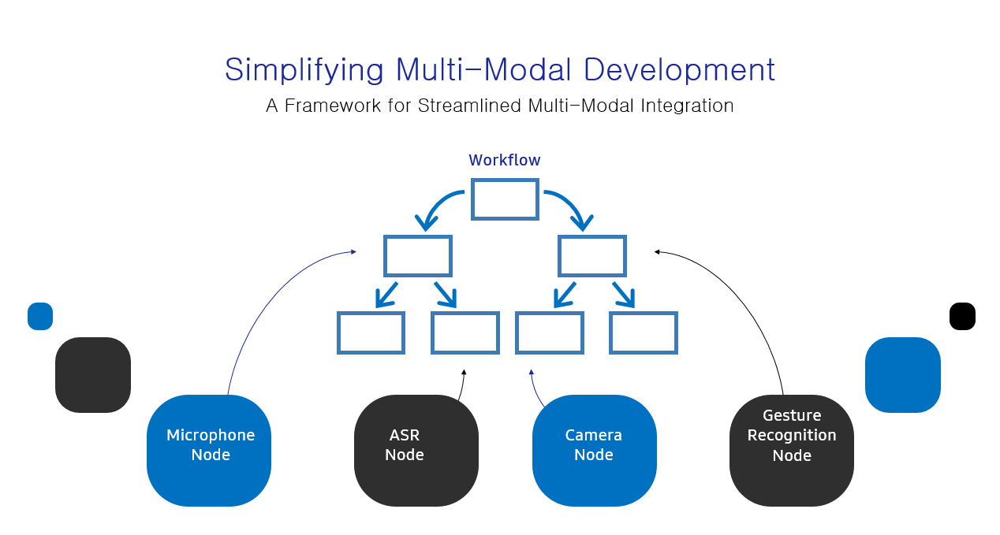
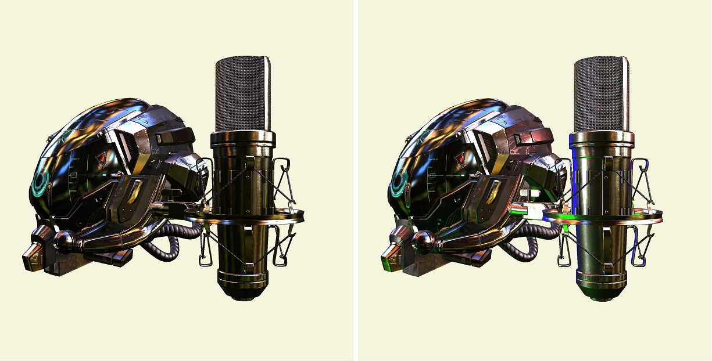
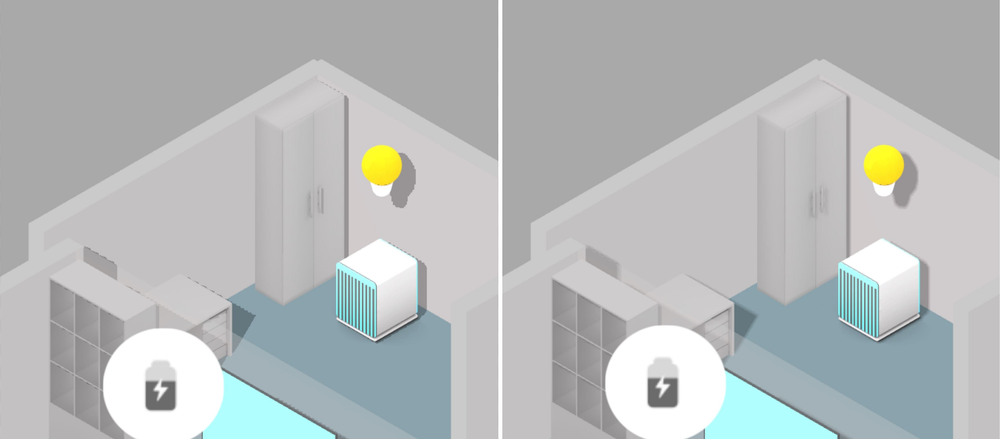
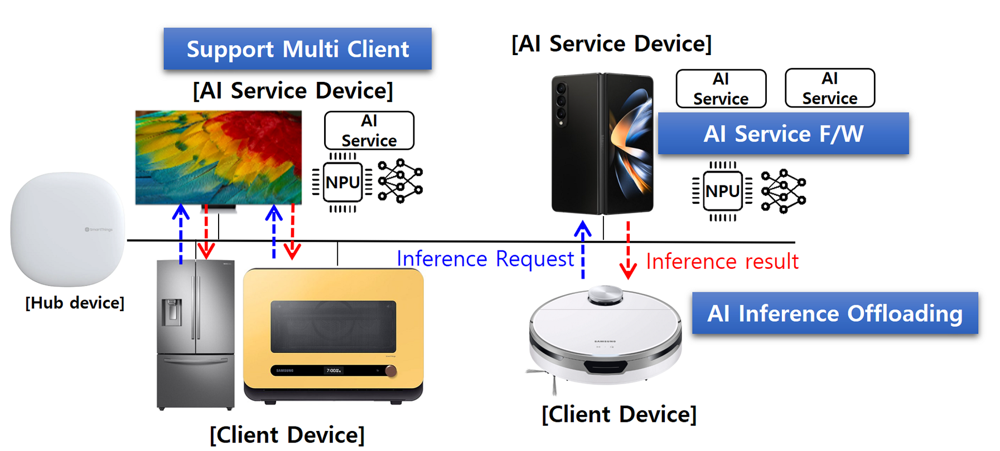
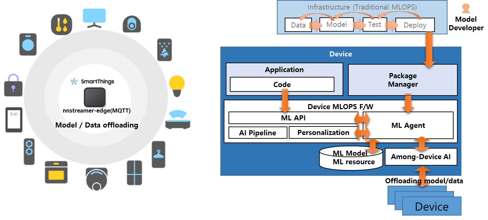
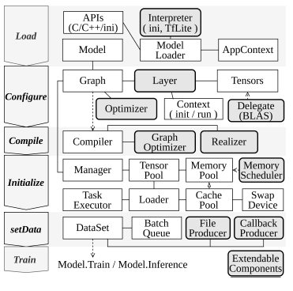

# Tizen 8.0

The second milestone (M2) release of Tizen 8.0 was announced in October 2023. Tizen is an open-source operating system (OS) maintained by Samsung, and it has been developed and optimized for smart devices since 2012.

The main progress of Tizen 8.0 includes the work that has been done to expand the ecosystem of home appliances. Tizen 8.0 is also updated and optimized to unlock even more experiences for our developers. These new enhancements include a multi-modal interaction framework, 3D UI, machine learning, build infra, and more.

## Multi-modal Interaction Framework

- **Multi-modal Interaction Framework**

  Multi-modal interaction involves using various communication channels or modes, such as voice, gestures, and more, to interact with digital devices. It offers natural, intuitive, and flexible interactions, catering to user preferences.

  The Multi-modal Interaction Framework simplifies the implementation of multi-modal interactions. It achieves this by providing a structured way to create workflows that represent multi-modal scenarios. These workflows are composed of nodes that encapsulate core functionalities.

   Application developers can leverage the provided prebuilt workflows, which reduces the complexities of implementing multi-modal interactions in their applications. This simplifies the development process, allowing them to incorporate multi-modal capabilities without difficulties.    

  **Figure: Simplifying Multi-modal Development**

  

## 3D UI

- **Creating and Rendering 3D Scenes Using NUI**

  Tizen includes simple features that allow developers to create and render 3D scenes using NUI. Tizen 8.0 adds more powerful 3D features and useful APIs for creating 3D content.
	
	- Model files can be loaded asynchronously and are cached to reduce redundant memory. Materials for Physically Based Rendering(PBR) can now be modified at runtime. Newly added 3D-friendly classes make things easier. And compressed texture formats are now supported.   
	
	- In addition to Image Based Lighting (IBL), a new type of light source has become available. Directional lighting can be easily installed in a scene. NUI supports up to 5 directional light sources. And one of the lights installed in the scene can make shadows. Shadows are drawn using Shadow Mapping. Hard shadows by default, but optional filtering to soften edges is also provided.   
	
  **Figure: Directional Lighting Results (Left: IBL only, Right: IBL and multiple directional light)**

  

  **Figure: Shadow and Edge Softening Results (Left: hard shadow, Right: edge softening applied)**
  
  
  
  - The particle system is now supported in Tizen 8.0. The particle system is structured with easy to use APIs for particle emitter and updater. We look forward to seeing a variety of use cases using visual effects.
  
  - For physics simulation, Chipmunk and Bullet are adopted for 2D physics simulation and 3D physics simulation, respectively. The physics simulation pipeline is internally optimized for NUI rendering.

- **3D AI Avatars**

  One of the useful new 3D features in Tizen 8.0 is AI avatars. Controlling an avatar's body/face motion has become easier. Tizen avatars support AI LipSync, which is inferred from the device.
  
  **Figure: AI LipSync Results With Motion**

  
  
## AI and Machine Learning (ML)

- **Device MLOps**

  - ML Service
  
    To support AI inference offloading between the leaf device such as TizenRT and Tizen, NNStreamer and NNStreamer-Edge are updated as below:
  
    - Optimize the size of NNStreamer-Edge library (<25KiB).
    - Support various communication protocols such as MQTT, MQTT-Hybrid, AITT, and TCP.

    **Figure: Example of Inference Offloading Between Multi Devices**

  

  - Model/Data Repository
  
    - New feature to provide methods to share and control AI models or data files between different applications. With this feature, developers can separate the model file from the application package, and deploy the newly updated AI model independently.
	- AI applications can fetch and control the version of an AI model without code-level modification, and access ML resources, which contain images, audio, video, and binary files for model retraining.
	
	**Figure: Sharing ML Model and Resource Data**

  

- **ML Inference (NNStreamer)**

  - Training in Pipeline
  
    - Offloading training data and trained models between edge devices connected to the nnstreamer-edge network environment.
	- Offloading the data required to train the model on a device with superior computing resources and operation speed.
	- Once training is complete with the offloaded data, the trained model or the inference result using the trained model is returned.
	
	  - NNstreamer-edge network : TCP + MQTT, AITT.
	  - Operation 1: service discovery, creating a session, data offloading, model training with offloaded data.
	  - Operation 2: service discovery, creating a session, model offloading with remote service register.
	  
  **Figure: Offloading Data and Model Between Edge Devices**

  
  
  - Increased Rank Limit & Number of Tensors
  
     - To infer large models such as LLM, the size of the rank limit is increased from 4 to 16, and the number of tensors is increased from 16 to 256 in NNStreamer.
	 
- **Light-weight On-device Training Framework: NNTrainer**

  There have been increased requests to provide personalized intelligence services by updating neural networks with user data without exposing the data in the devices. However, the limited resources of devices incur significant difficulties. NNTrainer enables "On-Device Training" features in Tizen efficiently by providing the following:

  - Highly memory-efficient on-device training technique without sacrificing accuracy and latency.
  - Rich training features.
  
    - Support various layer types : embedding, LSTM, attention, transformers and various normalization layers.
    - Support various activation functions: relu, sigmoid, gelu, swish and more.
    - Support easy way to describe neural network models.
	
      - ini file format which enables to build model with key-value combination.
      - C/C++ APIs for the users who are used to server-side conventional training framework.
      - C# APIs especially for the Tizen users.
	  
    - Provide proactive swapping for better memory utilization.
    - Provide various neural network models including object detection.

  **Figure: NNtrainer SW Architecture** 	 
  
  

## Changing Build Infra 

- **From OBS to GBS-based Quick Build**

  In the Tizen development process, we switched the build infra which is used for the build and snapshot creation from the OBS to the GBS-based Quick Build. This change has the following merits:   
  
  First, it is possible to increase the efficiency of project management and operation through parallel build, text-based project list, and package list management, etc.
It is more efficient for more people to collaborate and work on more projects together than before.   

  Second, when building a build system or when creating or changing a project, it becomes more convenient than before. It will also be more helpful for external companies or organizations to set up build infra for Tizen and operate the Tizen project.   
  
  The following figure shows a brief comparison of the structure or process differences between the two build infra.

  **Figure: Comparison Of OBS and Quick Build** 	 
  
    
  
For more information, see [Tizen 8.0 M2 Release Note](../../release-notes/tizen-8-0-m2.md).
