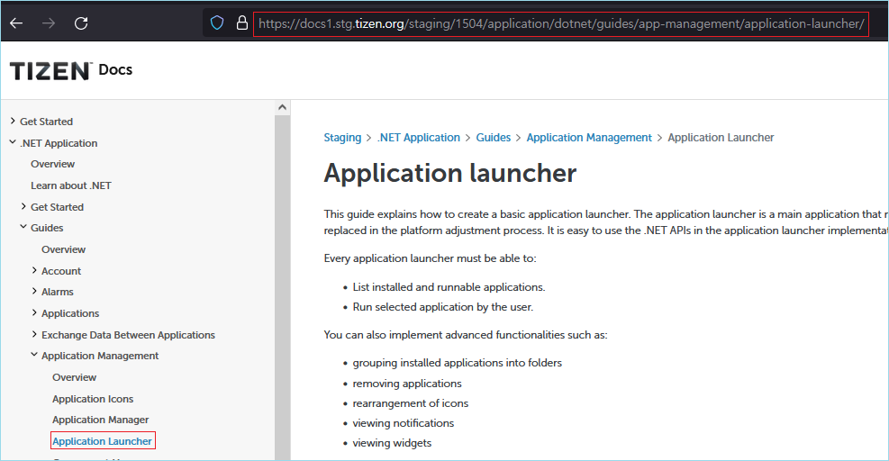
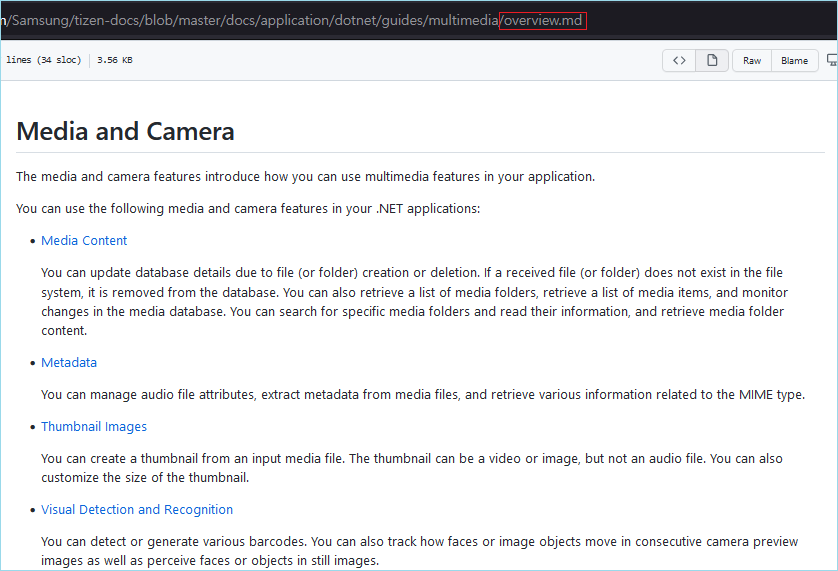
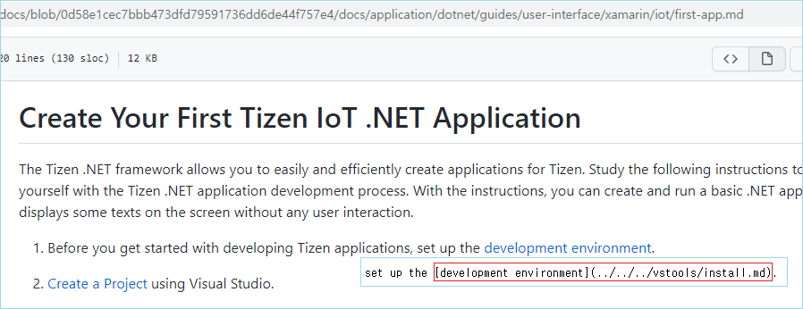
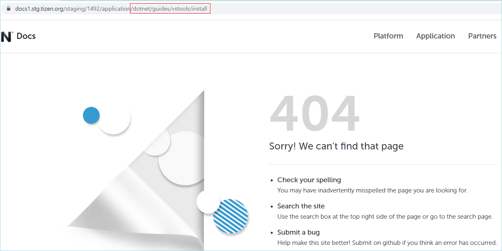
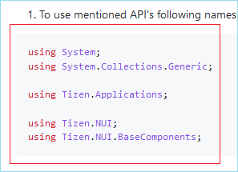
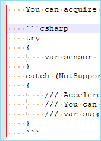
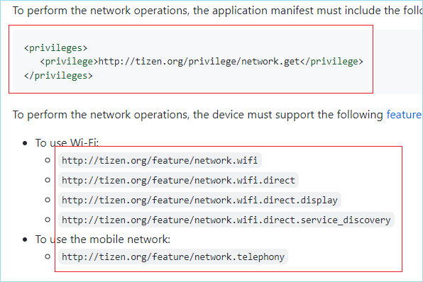
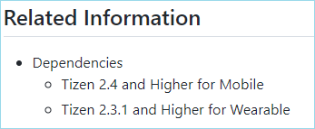
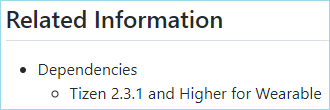

# Review points in Guide

This page describes the review points that were often asked to be updated.

When you review a guide page, check these points and get the page consistency.

- [Branches](#branch)
- [Headings](#headings)
- [Add new page](#create)
   - [toc_all.md](#create_toc_all)
   - [overview.md](#create_overview)
- [Change file name / delete the page](#change_delete)
- [Change the file location](#change_move)
- [Tag](#tag)
   - [Note tag](#tag_note)
   - [Code and bold](#tag_code_bold)
- [Code block](#codeblock)
   - [Indentation of the code block](#codeblock_inden)
   - [Code block type](#codeblock_type)
   - [Consistency between code block and description](#codeblock_check)
- [Hyper link](#hyperlink)
   - [Page in docs.tizen.org](#hyperlink_guide)
   - [Native or Web API](#hyperlink_not_dotnet)
   - [.NET API](#hyperlink_dotnet)
   - [Outside of docs.tizen.org](#hyperlink_out)
   - [Feature and privileges](#hyperlink_not_link)
- [Images](#images)
- [Related information](#related_info)
   - [Dependencies](#related_info_dependencies)

## Branches

There are several branches in tizen-docs repository. When a PR is created, check what branch the PR is targeting. Guide the author to use apposite branch according to the purpose of the PR.

- **master** branch

   To handle the document for the latest published Tizen Platform version. The updates in this branch is to be displayed on docs.tizen.org. If document for current Tizen version needs to be updated, use this branch.
- **live** branch

   To update the docs.tizen.org with the update on master branch.
- **tizen\_\<VERSION>\_prepare** branch

   To prepare the next Tizen document. It holds the updates till the next Tizen version is published. When the next Tizen is published, merge this branch into master, and resolve the conflicts.

## Headings

- Follow the sentence case :

  **Ref. :** https://github.com/Samsung/tizen-docs/pull/1501#discussion_r723023920

- The heading uses verb or noun, but not gerund :

   **Example :** Use "Check points" instead of "Checking points".
   
- Make the heading simple, and add a simple description sentence for the additional information and basic knowledge. 

   

## Add new page

When a new  page is added, check the **toc_all.md** and **overview** of the created page.

- **Ref. :** https://github.com/Samsung/tizen-docs/pull/1504#discussion_r707019761
- **Ref. :** https://github.com/Samsung/tizen-docs/pull/1504#issuecomment-905646111

### toc_all.md

This file is to update the LNB menu when a new pages is added. LNB of docs.tizen.org is listed  as in order of `toc_all.md`.

**Example :** 

**Added page** : application-launcher.md

As `application-launcher.md` file is added, update `toc_all.md` file to locate the page in the LNB of docs.tizen.org.

Check the validation of the toc_all.md using the stg build.

### overview.md

If a new file is added, add a simple description and a hyper link to `overview.md` of the section that the new page is included. Each `overview.md` gives simple description of sub pages and hyper links to the sub page.

**Example :**

If a new page is added under `/dotnet/guides/multimedia`,  `/dotnet/guides/multimedia/overview.md` must be updated also.

## Change file name / delete the page

When a page is deleted or changed the file name,
1. Check the **toc_all.md** and **overview** of the page and update the files, referencing [Add new page](#create) section.
2. Search the name of deleted or renamed file and remove the **links**, to prevent the broken link.

**Example :** `application/dotnet/guides/uiapplication/widget-app.md` file is linked in `application/uiapplication/nui-widget-app.md` and `application/uiapplication/overview.md`

So in case `application/dotnet/guides/uiapplication/widget-app.md` file is removed or renamed, the links in `application/uiapplication/nui-widget-app.md` and `application/uiapplication/overview.md` must be removed or updated also.

Also, if a file is deleted, check the images used it the file. If there are images that are not used any more, remove the images also.

## Change the file location

When a file is moved its location, check the links in the file. The hyper links are in relative path, so the links should be also check the path and updated. Otherwise broken links can be happen.

**Example :** 

In this PR, `/dotnet/get-started/iot/first-app.md` file is changed to `/dotnet/guides/user-interface/xamarin/iot/first-app.md`. file. So from `/dotnet/` folder, the depth required to get to `first-app.md` is changed from 4 to 6.

In the `first-app.md` file, there is a link to other page, there is a link to `/vstools/install.md` file. 

As the link is in relative path and the folder depth of `first-app.md` file is changed, if we don't update the hyper link, it goes to the broken link `/dotnet/guides/vstools/install.md`, while it actually should goes to `/vstools/install.md`.

## Tag

There are some note and font style that can be used.

### Note tag
Follow the [note style for tizen-docs repository](https://github.com/Samsung/tizen-docs/blob/master/styleguide/custom-style.md#alerts-note-tip-important-caution-warning).

### Code and bold
**Ref. :** https://github.com/Samsung/tizen-docs/blob/master/styleguide/style.md#text-styling

## Code block

When a code block is used, check below points : 

- [Indentation of the code block](#codeblock_inden)
- [Code block type](#codeblock_type)
- [Consistency between code block and description](#codeblock_check)

### Indentation of the code block

Check the code block layout. If the indentation is wrong, the layout doesn't array well.

|Wrong indentation |Correct indentation |
| ------------------------------------------------------------ | ------------------------------------------------------------ |
|  |  |

To arrange the indentation, check the spaces. 

|In md file|In browser|
| ------------------------------------------------------------ | ------------------------------------------------------------ |
|||

### Code block type

Always check language identifier when a code block is used.

**Ref. :** https://github.com/Samsung/tizen-docs/blob/master/styleguide/style.md#inline-code-blocks-with-language-identifier

### Consistency between code block and description

Check whether if there is a difference between the code block and the description

**Ref. :** https://github.com/Samsung/tizen-docs/pull/1503#discussion_r747340097

**Example :** There is a difference as `Prefrence.Keys` in description, but `Preference.Keys` in the code block.

## Hyper link
There are links to other pages. Mostly the hyper links are going to below locations : 
- [page in docs.tizen.org](#hyperlink_guide)
- API link
  - [Native or Web API](#hyperlink_not_dotnet)
  - [.NET API](#hyperlink_dotnet)
-  [Other page from outside of docs.tizen.org](#hyperlink_out)

### Page in docs.tizen.org

Relative Path is suggested.

**Example :** 

### Native or Web API
Use the relative path, including the "latest" symbolic link

**Example :** 
- Native API : 
   `../../api/<PROFILE>/latest/group__NOTIFICATION__MODULE.html`
- Web API : 
   `../../api/latest/device_api/<PROFILE>/tizen/feedback.html#FeedbackPattern`

This symbolic link should be checked on stg build of each PR, as it doesn't work on github preview.

### .NET API

Use the /application/dotnet/api/TizenFX/latest/api/... form, including the "latest" symbolic link.

**Example :** 

This link should checked on stg build of each PR, as it doesn't work on github preview.

### Outside of docs.tizen.org
Check whether if the link is not broken.

### Feature and privileges

Tizen features and privileges looks like a kind of URL, but not. As they are easy to be confused as a URL, always use code tag to features and privileges to prevent the hyper link.

## Images

When an image is inserted, please check if the image is not broken.

Also, check the image itself so not to include the author's personal information.

**Example :** In the path of the project or in the login UI, user name must not be included.

 

If an image is not used any more, delete the image for the maintenance. 

## Related information
Related information section is to list up the additional link that user can read more, and Dependencies section that shows the least support version of Tizen. This section is used in guide and Tizen Studio pages.

### Dependencies

  This section shows **the least support Tizen Platform version**.

  - .NET guides

    .Net guide doesn't require profile, so only 1 line is needed.

     - Tizen X.X and Higher

       **Example :**

       
  - Native / Web guides

    There are 2 profiles, Mobile and Wearable. So 2 lines are needed.

    - Tizen X.X and Higher for Mobile

    - Tizen X.X and Higher for Wearable

      **Example :**

      

      When only one profile is needed, listing that profile only is enough.

      **Example :**

      