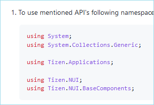
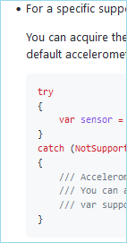
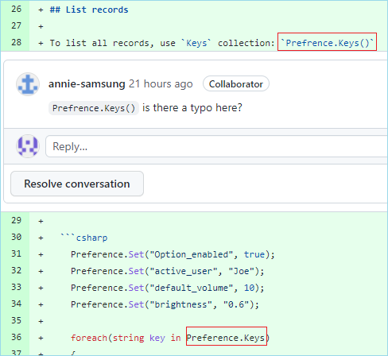
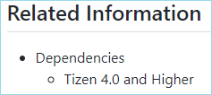

# Review points in Guide

This page describes the review points that were often asked to be updated.

When you review a guide page, check these points and get the page consistency.

- [Headings](#headings)
- [Created page](#create)
   - [toc_all.md](#create_toc_all)
   - [overview.md](#create_overview)
- [Changed file name / delete the page](#change_delete)
- [Code block](#codeblock)
   - [Indentation of the code block](#codeblock_inden)
   - [Code block type](#codeblock_type)
   - [Consistency between code block and description](#codeblock_check)
- [Hyper link](#hyperlink)
   - [Page in docs.tizen.org](#hyperlink_guide)
   - [Native or Web API](#hyperlink_not_dotnet)
   - [.NET API](#hyperlink_dotnet)
   - [Outside of docs.tizen.org](#hyperlink_out)
- [Images](#images)
- [Related information](#related_info)
   - [Dependencies](#related_info_dependencies)


<a name="headings"></a>

## Headings

- Follow the sentence case :

  **Ref. :** https://github.com/Samsung/tizen-docs/pull/1501#discussion_r723023920

- The heading uses verb or noun, but not gerund :

   **Example :** Use "Check points" instead of "Checking points".
   
- After the heading, simple sentences to describe the basic knowledge are recommended.

   

<a name="create"></a>

## Created page

When a page is created, check the **toc_all.md** and **overview** of the created page.

   **Ref. :** https://github.com/Samsung/tizen-docs/pull/1504#discussion_r707019761
   **Ref. :** https://github.com/Samsung/tizen-docs/pull/1504#issuecomment-905646111

<a name="create_toc_all"></a>
### toc_all.md

**Example :** 


**Added page** : application-launcher.md

As `application-launcher.md` file is added, update `toc_all.md` file to locate the page in the LNB of docs.tizen.org.
LNB of docs.tizen.org is updated as `toc_all.md`.

<a name="create_overview"></a>
### overview.md

If a new file is added, add a simple description and a hyper link to `overview.md` of the section that the new page is included. Each `overview.md` gives simple description of sub pages and hyper links to the sub page. 

**Example :** 


If a new page is added under /dotnet/guides/multimedia,  /dotnet/guides/multimedia/overview.md must be updated also.

<a name="change_delete"></a>
## Changed file name / delete the page

When a page is deleted or changed the file name,  
1. Check the **toc_all.md** and **overview** of the page and update the files, referencing **Created page** section.
2. Search the name of deleted or renamed file and remove the **links**, to prevent the broken link.

**Example :** `application/dotnet/guides/uiapplication/widget-app.md` file is linked in `application/uiapplication/nui-widget-app.md` and `application/uiapplication/overview.md`


So in case `application/dotnet/guides/uiapplication/widget-app.md` file is removed or renamed, the links in `application/uiapplication/nui-widget-app.md` and `application/uiapplication/overview.md` must be removed or updated also.

<a name="codeblock"></a>
## Code block

When a code block is used, check below points : 

1. Indentation of the code block
2. Code block type
3. Consistency between code block and description

<a name="codeblock_inden"></a>
### Indentation of the code block

Check the code block layout. If the indentation is wrong, the layout doesn't array well.

|Wrong indentation |Correct indentation |
| ------------------------------------------------------------ | ------------------------------------------------------------ |
|  |  |

To arrange the indentation, check the spaces. 

|In md file|In browser|
| ------------------------------------------------------------ | ------------------------------------------------------------ |
|||

<a name="codeblock_type"></a>
### Code block type

Always check language identifier when a code block is used.

**Ref. :** https://github.com/Samsung/tizen-docs/blob/master/styleguide/style.md#inline-code-blocks-with-language-identifier

<a name="codeblock_check"></a>
### Consistency between code block and description

Check whether if there is a difference between the code block and the description

**Ref. :** https://github.com/Samsung/tizen-docs/pull/1503#discussion_r747340097

**Example :** There is a difference as `Prefrence.Keys` is in description, but `Preference.Keys` in the code block.



<a name="hyperlink"></a>
## Hyper link
There are links to other pages. Mostly they hyper links are going to below locations : 
- page in docs.tizen.org
- API link
  - Native or Web API
  - .NET API
-  Other page from outside of docs.tizen.org

<a name="hyperlink_guide"></a>

### Page in docs.tizen.org

Relative Path is suggested.

**Example :** 

<a name="hyperlink_not_dotnet"></a>
### Native or Web API
Use the relative path, including the "latest" symbolic link

**Example :** 

```
../../api/mobile/latest/group__NOTIFICATION__MODULE.html
```


This symbolic link should checked on stg build of each PR, as it doesn't work on github preview.

<a name="hyperlink_dotnet"></a>
### .NET API

Use the /application/dotnet/api/TizenFX/latest/api/... form, including the "latest" symbolic link.

**Example :** 

This link should checked on stg build of each PR, as it doesn't work on github preview.

<a name="hyperlink_out"></a>
### Outside of docs.tizen.org
Check whether if the link is broken.

<a name="images"></a>

## Images

When an image is inserted, please check if the image is not broken.

Also, check the image itself so not to include the author's personal information.

**Example :** In the path of the project or in the login UI, user name must not be included.


<a name="related_info"></a>

## Related information
Related information section is to list up the additional link that user can read more, and Dependencies section that shows the least support version of Tizen. This section is used in guide and Tizen Studio pages.

<a name="related_info_dependencies"></a>

### Dependencies

  This section shows **the least support Tizen platform version**.

  - .NET guides
    .Net guide doesn't require profile, so only 1 line is needed.
    
     - Tizen X.X and Higher
    
       **Example :** 
       
       
  - Native / Web guides
    There are 2 profiles, Mobile and Wearable. So 2 lines are needed.
    
    - Tizen X.X and Higher for Mobile
    
    - Tizen X.X and Higher for Wearable
    
      **Example :** 
    
      
    
      When only one profile is needed, listing that profile only is enough.
      
      **Example :** 
      
      

